# 第 1 讲 · 欢迎来到未来

!!! quote "本讲信息"
    **课程**：南京大学《生成式软件工程》（蒋炎岩） · **日期**：2026-09-08  
    **原视频**：[B 站 BV1pb8o6yE8f](https://www.bilibili.com/video/BV1pb8o6yE8f/) · **时长**：01:39:23  
    **说明**：非官方 fan-made 转录，仅作学习用途；内容版权归原讲者所有。转录错误以原视频为准。

---

**00:00:00**

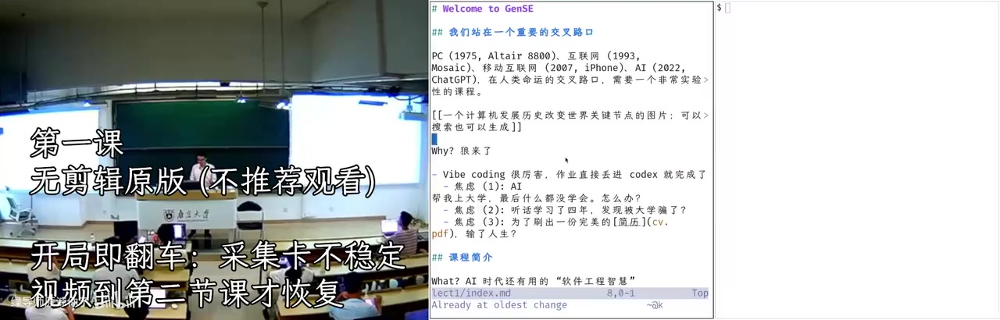

我我干了什么呢？我在我这是我的Neovim对吧？这是Neovim，呃，我按了F，然后打开了一个浏览器，我们就可以正式的开始上课了。那我们今天站在一个非常重要的呃交叉路口，你们是Computer Science的呃同学，我们在历史上就从你们刚开始进入学校开始啊，讲计算机发展历史。在计算机发展历史上，其实经历了很多次非常重要的变革。呃，我觉得最主要的是呃，把昂贵的能力变成了日用品。我们在一九七五年的时候有第一台PC Altair 8800在图片的左边，这个图片也是AI生成的对吧？你们可以看出有非常明显的呃AI味儿，而且它还不是一个应该不是一个特别强的模型。但没关系，呃，我我说过我上课是跟大家一个比较松散的讨论和交流的过程，然后我会呃在之后再把这个课程要重新再切片再整理啊整理一次。从PC到互联网，互联网连接了我们的所有人。我至今都

**00:01:00**

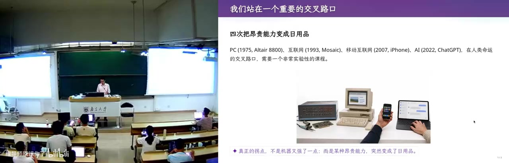

我还记得你们没有经历过这个时代，呃，我我那个时候可能是上小学，小学快毕业的时候，然后我装了一个软件叫做ICQ，啊，你们没有听说过这个名字，哎，ICQ叫ICQ对吧？三个字母ICQ，然后那个时候腾讯的山寨版还叫OICQ，OICQ，然后后来腾讯把它改成了呃QQ，然后你你在那个时候可以随机的加一个世界上面另一端的人，然后那时候你加到就是native speaker，就是他是跟你说英语的，然后你你哪怕一下子发很多英语打的非常快，然后你你完全无法理解这个呃他在跟你说什么，然后因为那因为那个时候可能我们刚学一点点英语，只会hello good morning对吧？呃，从互联网，然后再到移动互联网，一夜之间，我我印象很深，就一夜之间所有的菜场卖菜的人都有支付宝和微信的二维码，就在很短的啊时间里改变，就一直在改变我们生活的呃方式，然后到二零二二年的时候是 ChatGPT。

**00:02:00**

说AI是人类历史上增长最快的呃产品啊，我们在这样人类命运的交叉路口，我觉得呃我们上课的方式，我们该学什么，其实我们都需要思考呃思考思考一下。然后就在这样的一个背景下，呃我决定还是应该嗯开这样的一门Vibe Coding的呃呃课程。为什么呢？呃前两天的时候，不是前两天，有有一段时间之前，大家有一个说法叫AI替我上大学。哎，我觉得这个说法很对。你想吗？呃，老师用豆包出题，大家用豆包做作业，然后在这个整个的闭环过程当中，只有学生没有受到训练，对吧？现在Vibe Coding很厉害，呃所有的作业直接对吧我的操作系统曾经这个操作系统的作业折磨大家，然后呃大家在痛苦的折磨中获得提升。现在不一样了，现在你直接把那个作业的链接丢到Codex里，对吧？你都不需要你都不需要有复制粘贴的过程，你只要把那个链接在

**00:03:00**

甚至你都不需要告给他链接，你直接说那个蒋老师的操作系统课第八个实验能不能去帮我实现啊？好，就就结束了。呃，对，所以在这样的时代，我们应该我们还怎么办，对吧？还还到到底应不应该学学这些编程啊这样的东西？那答案肯定是既应该也不应该。呃，有些能力你还是需要的，然后但应该怎么做，我们啊我们不知道。所以我看到的其实大家都在一种啊非常焦虑的状态，呃状态上，呃，第一个AI帮我上大学了，那上完以后我最后走什么都没学会，对吧？我每门课都很好，如果假设每门课都开卷考试，呃，那走都是AI答题，嗯，我全都答对了，但我我出来以后我发现我被AI第一个就被AI取取代了，对吧？这是第一种焦虑。然后第二种焦虑是，呃，我相信这边还有另外的同学，呃，可能延续了你中学的时候啊很听老师话的这个状态，老师说什么。

**00:04:00**

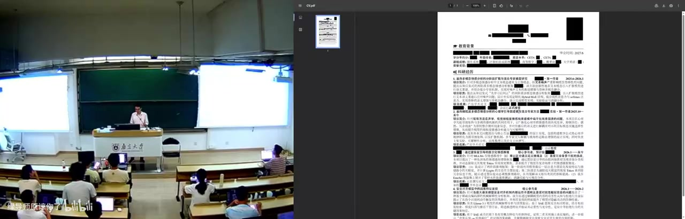

就做什么？老师上课每一堂课你都认真的去听，然后每一次作业你都认真的做，然后做完了以后，你发现四年毕业的时候你被大学骗了。你你确实学会了一点什么，但是你学会的东西AI都会做，对吧？然后那你也很迷茫。然后这个时候，呃，当然你你，我觉得同学们最切实的，你们现在呃的最痛苦的事情就是保研，对吧？你们投了很多的简历，呃，给海投很多的地方的简历。然后我其实也也收到了很多这样的呃简历，我我觉得我觉得很糟糕啊！这个这是一个呃，这这是一个简历。我我我用首先所有这一切都是AI做的，我没有我没有干任何事儿。我我我我就告诉他有一份简历，然后我现在需要在上课的时候展示一下。那我需要把他个人信息给去掉。那么这这是这是他把他字符替换成Unicode的方块。如果复制。

**00:05:00**

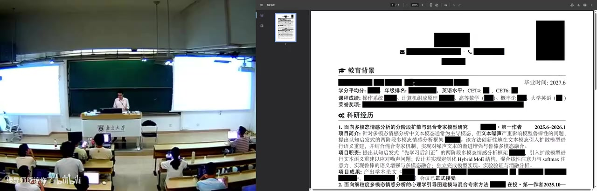

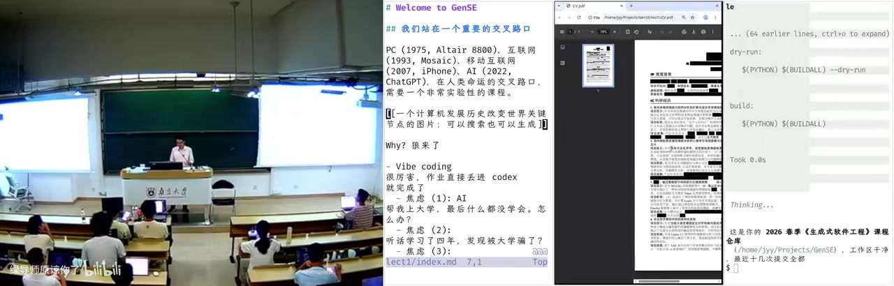

粘贴的话，你会看到这是一个黑色的方，就是方块的呃字符，呃，OK，希望他希望他把把这个隐私都都隐掉了。然后就这样的一份简历，嗯，就非常完美的简历啊，一个CCF期刊列列表上面的论文，然后accepted，然后又这个当然大家都说再投就等于不存在，对吧？因为你你看不到，呃，但这个简历对我来说是一个零分的简历，呃，因为没有没有额外的信息，它甚至没有一个GitHub的链接，没有一个个人的主页，没有一篇这个东西有print，这是这这是一个呃，我我我不知道这位同学发生了什么，但是呃，对我来说这样的一份简历非常的呃非常的糟糕。然后更糟糕的是，我收到过无数份这样的简历，然后可能。

**00:06:00**

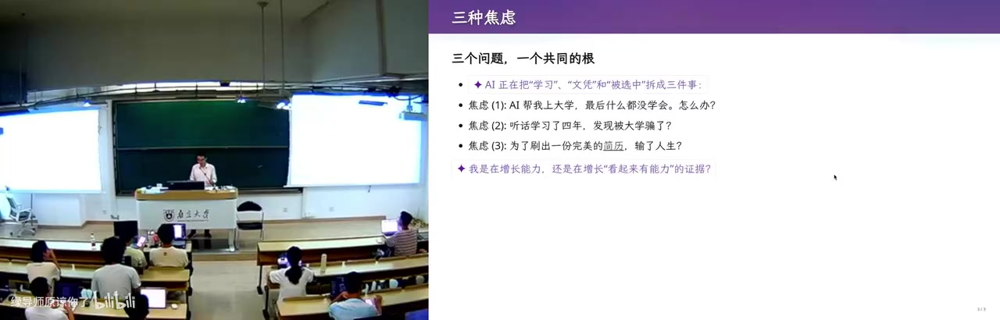

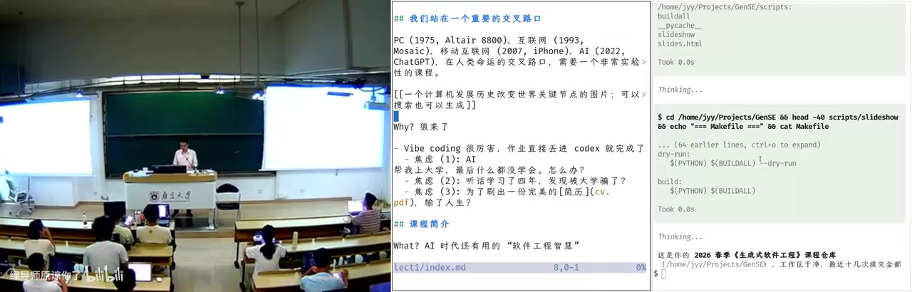

你们的简历多多少少也是长长这个样子的，呃，然后这个时候就你发现你和你的竞争者已经无法区分了，所有人都是我有一大堆实习、一大堆奖项、一大堆论文、一大堆在投，那是什么能让你从这些简历里面脱颖而出？对，就如果刚才那份简历都被我认为是零分的简历，你你们你们应该怎么样向你的未来的导师去展示你自己？对吧？然后所以，所以我我相信这个在座同学都非常的呃焦虑，但是好消息是，我觉得我我希望用呃这一门课来缓解一下大家这样的焦虑的情绪，更多的是在大家觉得还原一种快乐，Vibe Coding的快乐，因为我觉得在Vibe Coding中我得到了很多的呃快乐，然后在这个快乐当中，你们又能呃一定程度上呃去理解，比如说软件工程是怎么工作的，然后能做出呃做出一些有趣的东西，然后能让你的简历写的呃写的写的更好看。对，呃对我来说，其实我觉得你有一篇发表

**00:07:00**

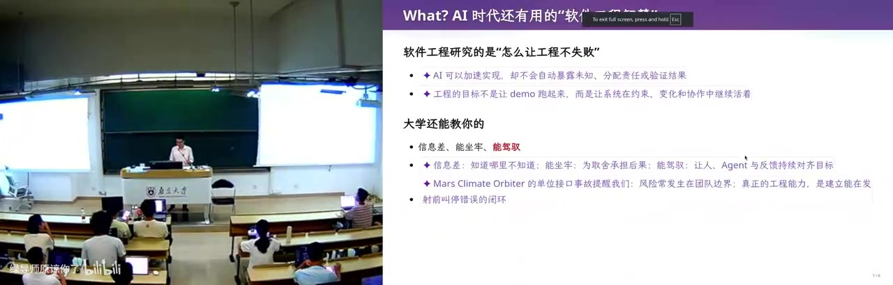

写论文可能是一个简简单项，那可能对对对很多其他人来说可能还还还不是的。OK，所以我讲了为什么我我要来上呃这门课，然后那我们来讲讲这门课呃到底打算讲什么啊？这门课的题目叫生成式软件工程，所以我其实是是一门软件工程课。软件工程做什么呢？软件工程做的事情很简单，怎么样让软件工程不失败？就怎么样造出一个呃一个软件来？呃，那我们经常听说的说你你们作为人和AI比，你的优势在哪里？你可以做到AI不能。对啊，呃，实际上我觉得大学里面能能教你的呃有呃或者说能OK你你作为人吧，或者说你在大学毕业的时候你能拥有的能力呃比较重要的第一个是信息差，这是一直人这是人类社会比较呃也也不能说可悲吧，它人类社会要要进步必须的呃必须有的事情。你你你你有信息差，你有别人不知道的信息，你才能。

**00:08:00**

做别人做不到的事儿，呃，所以所以在学校里面多多少少里面会有这种恶性竞争，对吧？假以假想一个情况，你拥有一个往年试卷，然后这个往年试卷别人都没有，然后对吧？那你真你你就可以在竞争当中胜出，这是一种种你们身边的信息差，呃，当然还有很多其他的这个不能说的信息差，呃，在社会上面广泛的呃存在。除了信息差以外，你你作为一个人的优势是你可以做到。但是大学里面真正教你的，是怎么样成为一个更好的人，就是你能够驾驭别人驾驭不了的东西。你在大学毕业的时候，你可以说哦，OK，我是一个更好的人，然后呃，我有一个别人没有的能力，呃，所以可能呃这门课试着试着去帮大家呃建立驾驭人工智能的呃能力。OK，所以这门课怎么上呢？怎么上？我希望呃用一个案例为主的、一个比较松散的组织。所以如果你们有有有兴趣来，比如说想跟我讨论一下的同学，就想想想要参与，我说也这个老师。

**00:09:00**

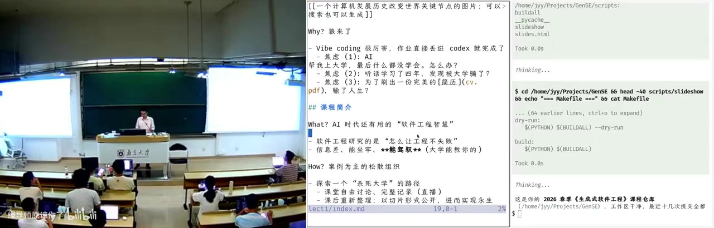

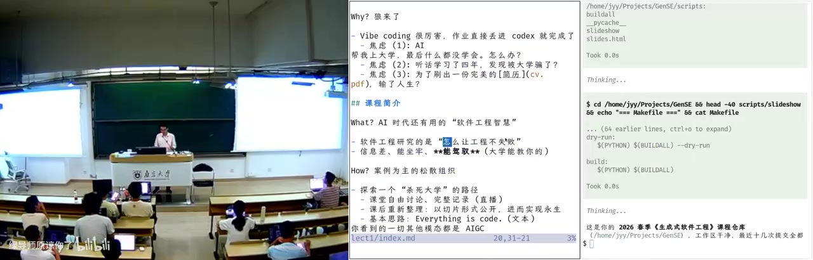

你你这样做不对，呃，那那就欢迎大家来线下，呃，然后如果你是一个听课型的同学，就是你你希望从这门课里面呃获取知识，呃，那我我是完全建议大家就既不用到课，也不用看直播，因为我我我这呃我今年也想想做一个呃非常有趣的尝试。你已经看到了，这是我的呃slides对吧？这是这是我的slides，呃，然后我f的时候可以播放，然后你可以看到这个f播放的slides和刚才那个markdown有点不一样。我把它关掉。左边是我上课之前写的讲义，就相当于我我我会先想好，我我今天上课的时候大概在在这个时间应该讲什么，举什么样的例子，相当于我要约约束好AI做什么。然后当你看到f播放这个slides的时候，有这个紫色的部分，紫色的部分就是GPT-5.6 所给我添油加醋加上去的部分。我

**00:10:00**

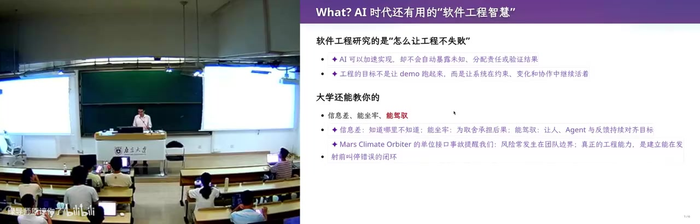

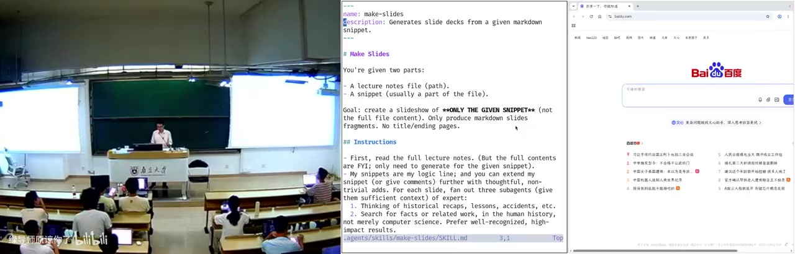

我有一个呃提示词，一会儿呃我现在应该就可以给大家看一下啊。对，有有一个提示词，大概是嗯是这样的，就一个呃一个skill叫叫make slides，然后我就可以从一个呃我我的一个markdown就我写好的那个演讲稿里面，让它添油加醋的去去去做一点有趣的事情，比如说呃比如说我有一个类似于我的AI梗同学的呃skill，我会我会出让它生成三个sub agent，然后给他们赋予不同的personality，这个这个这个非常有效果，他们就有有的agent会干这个，有的agent会干那个，他在隔离的上下文里，然后最后我的主agent会回来汇总，这样我就可以通过算力来换智力，我付出更多的算力，我就有更多的智力，所以所以，我我是其实经过对比了，我我我我换了几个版本的提示词，然后。

**00:11:00**

每一个版本其实我都会重新生成一次，然后我最终会有一个review。另外一个别的模型，呃，在盲评到底哪一个生成的slides呃质量比较高？然后我我基本上我就调到了一个可能相对来说啊质量比较高的这个这个slides。所以你看到，比如说图片都是全部都是生成的，所有的图片都是生成的。对，呃，所以我希望的是探索一条能够真正杀死大学所有人的呃路径。我认为啊，如果你是来学习的，那更高效的方法，比如说我做一个老师，我我应该思考的是怎么样把知识以更好的方式呈现给大家。而我的答案是，我应该在上课的时候，呃，上课是一种表演嘛，对吧？所以我我说我是一个演员，要调动大家的情绪，然后我上课的时候跟大家交流，然后根据我的预先设定好的剧本去做一场演出，然后在演出完。

**00:12:00**

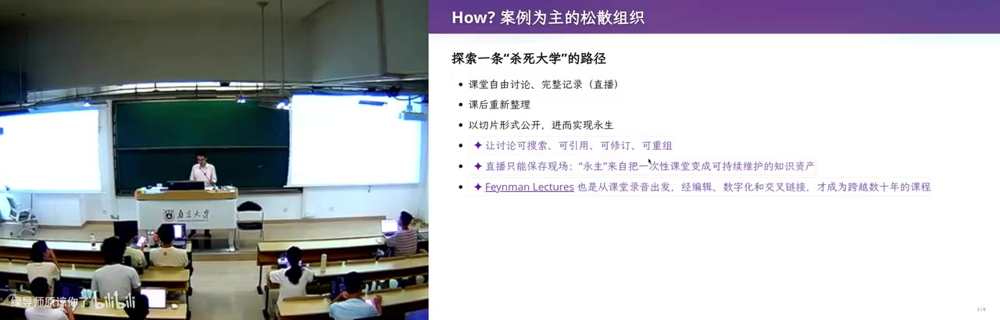

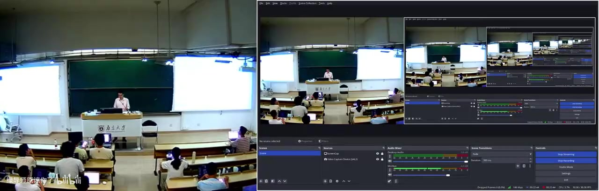

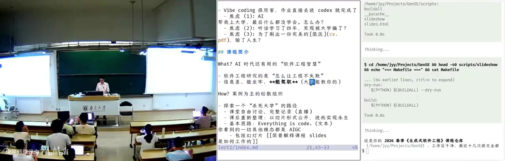

以后我需要做一件很重要的事儿，是我要review我今天的表演，因为我有的时候我今天举这个例子可能不是特别的恰当，或者在我回回过头来的时候，我想到也许我讲另外一个案例，大家能够更加的感同身受，因为你看到我在上课的时候有些部分是即兴的，但即兴就意味着其实不完美的，而我在课后我会把我的课程，因为我我录像了，对吧？大家看到这边有录像，我可以把课程的录像切片重新整理成片段，因为我是从这样的contentis code来的，everything is code，对吧？everything is code，呃，我就可以把我上课的那个录像，就这次的表演，重新回到这个code上，把它变得更丰富，然后我不就实现数字数字永生了嘛，对吧？我就实现了一个课程的呃数字数字永生，呃，对，然后你看到就是我我的这

**00:13:00**

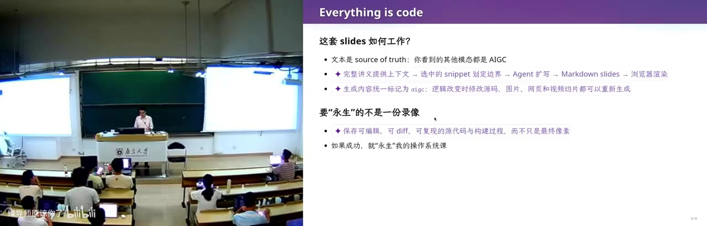

这套 slides 是怎么工作的？我的这个流程是怎么做的？ Everything is code。呃，你能看到这个世界里面的一切都可以用代码来来生成，包括这个桌子对吧？ Computer aided design C A D。这个桌子、椅子、电脑。那这个 slides 是怎么工作的呢？刚才你看那个 Markdown 是是 source of truth。然后你看到的所有的其他东西，图片、幻灯片，全部都是呃 A I G C。然后我我会我会把这个选中的 snippet 由 agent 去扩写，变成Markdown slides，再到浏览器里面啊渲渲染出来。然后呃，我希望的是能够切片的方式得到一个完美的。比如说我我今天要讲生成式软件工程，它的呃要点是什么？逻辑是什么？第一节课应该怎么上？沉淀成一个程序。然后这个程序也许也许现在是由我维护的，也许比如说有一天我不维护了，我操作系统课我现在不上了，我会把操作系统课我的 B 站的录像整理成

**00:14:00**

这样的切片，然后可以由全世界的人来维护它，对吧？你想要定制一个什么样的我的操心，我肯定可以把它定制成成什么样子。然后这不就把所有的这个大学教课的方式给颠覆了嘛？我觉得这是一个可能实现的路线，所以我会在这门课上做一个比较轻的尝试。也欢迎大家在随时可以给予到我呃反馈。呃，OK，好，呃，所以我这门课的policy是，呃，我希望重新找回同学们心中在大学的时候那种上课耽误学习的感觉。就虽然可能你们还是要上课，但是我推荐大家第一个，你们可能可以不要上课，然后你们可以去在这门课上呃实践。我会带着大家实践，我后面有很多真正实践的案例，呃，然后让你们知道在AI的时代，你们学习的方式变了，你们工作的方式也变了，你们可以尽快的适应这样的一个呃非常有趣的时。

**00:15:00**

代，然后我的要求是禁止古法编程，就是我我相信你们各个都是古法编程的好手，因为你们要考试，对吧？马上你们要保研要机试了，要机试的时候就把你们一关小黑屋一关，对吧？你们看过我以前出的题，然后就吓尿了，对吧？然后赶快再去LeetCode上再刷刷一下。但嗯，我觉得总有一天这个这个事情会会会改变的。呃，可能从上而下传导不会那么快，对吧？就是你要改变一个体系很难。但是呃，我我非常想要撕开一个小的小的口子，对。然后有几个policy，第一个呃token自费，因为本来本来我是想去拉一些token的赞助的啊，想拉一些赞助token，然后但但是我当我看到那个选课的学生呃的时候数量的时候，我就想还是算了，我对吧？我我没有必要再去这个跟他们呃拉着脸去要要好多好多的token，也比较麻烦。呃，首先我有个个人观点，就是如果你们手上没有token、没有付费token的同学，应该立即退。

**00:16:00**

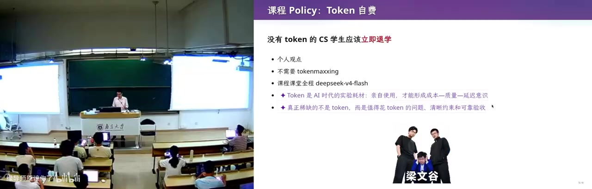

学，然后因为你你可能确实不需要token maxing，就就在在硅谷，它有一种这个你要死命的烧token，你你你你没有必要。我我的课上，我所有的我在课上做的演示，就是除了我的这个slides的生成是用一个更聪明的模型，我觉得呃它能给我更好的质量以外，你看到的这个幻灯片，你看到的整个这个这里的lecture的里面的东西，呃，包括这些生成的这些ess，全部都是DeepSeek Vision Flash。也就是说，我在这门课上会用一个足够便宜但是智能相对有一些的模型来带大家完成呃完成这些事情。然后我也知道大家喜欢，大家都是夜猫子对吧？大家是computer science的学生，你们喜欢在夜里工作，然后在夜里工作DeepSeek是比较便宜的对吧？我建议大家在凉文谷的时间，这个对啊，因为你看白天要看懂figure嘛，这个呃在白天。

**00:17:00**

你们要上课正好是梁文峰时间，对吧？然后等你们回去回去做作业的时候，就是这个梁文峰的啊时间。所以token 非常重要。你们每一个同学就你们去 DC 个充一百块，这个这个好像还还 OK。然后呃，对还还 OK。啊，如果实在 token 有呃有困难的同学，可能可以联系我来帮助大家啊，想一点办法。对 OK。然后还有还有一个很重要的 policy。呃，我希望用一个通过或者不通过来 evaluation 这个课程。所以我在我在申请这门课程的时候，呃，我的考核方式就填的是通过和不通过。但根据教务的反馈是专业选修课，大家是不是不会做成这样？一般来说都是什么形式与政策这样的课是通过和和和不通过。呃，但因为我我们现在我觉得还不知道这个评判标准是什么，对吧？你你你你可能用更好的模型，你就可以有更好的质量，对吧？同一个任务，你让Claude 飞过来做，就是比 Deep Vision 来是要做的好。这个

**00:18:00**

做的又快又好，没办法。那我们没有办法限制大家用什么样的模型，对吧？那怎么评判？尤其是这样的一个Vibe Coding，我们是做Project的呃课程。我我大概我会我会有一些建议的，像就说呃我我我我我我我回头会更新课程网站上面会告诉大家。OK，我建议你们呃实现一个自己的Email的管理系统，然后可以回我的Email，然后可能我会用一个指定邮箱给你发邮件，然后你可以把邮件回回来，对吧？可以做一个尝试Vibe Code的一个这样的服务，跑在你宿舍的一个一直常开的小电脑上。OK，这这就是一个比较不错的实验。你们有的同学可能会做的复杂一点，有的同学做的简单一点。我可能会用我的邮箱去发跟大家呃发邮件通信。OK，呃，但到底什么叫做的好，什么叫做的不好？到底该给多少分？我觉得在这个时代，分数已经变得不那么重要了，而真正重要的就是在你最后找工作或者在你保研的那一刻，投出那个简历上面有。

**00:19:00**

的东西，然后其实对你们来说就只有那一个考试。当然，我觉得呃比较糟糕的是，你为了能够走到那一个，你还需要有一个比较好的GPA，对吧？你还得去reward hacking，还得去去去overfit那个考试的题目。但最终呃检验你呃大学阶段的是你那个交出去的简历，它能不能带你到下一个更高的平台，对吧？你你你敢不敢给BP一个投简历？对吧？他们那个bar还是比较呃比较高的。所以所以，我最终希望是这门课大家能够最后在简历里面写一个我在生成式软件工程里面实现了这个ABCD E，然后有很多链接，然后它是一个，然后每一个东西都是都做的非常漂亮。它这然后你你你你每一个都说你你完成了设计实现，然后它这里面了不起的地方啊地方是什么？啊，我觉得最终有可能的是，呃，如果每一个人的电脑上面都在安装一个监控，那我就知道你大学四年干的所有的事情，然后我的AI就可以评判。

**00:20:00**

你大学四年到底度过了一个怎么样的大学四年？当然，这是一个非常恐怖的，对吧？这是一个非常非常恐怖的事情，因为你每摸的每一个鱼，你看的每一个不想让别人知道的小电影，这个对吧？它都都在你的电脑上发生，所以都都都知道。嗯，我我们不知道什么时候人类社会会演进到那个程度，但是呃，保持open，对，这是我们的呃课程的policy。好，大概是我课程开了一个啊，开了一个头。好，好，接下来我就可以进入技术性的内容了。首先讲一讲呃什么是大元模型。好，我我今天不讲什么是大元模型。大元模型就是一个概率分布，跟你们在概率统计课上面学的那个抛硬币，对吧？我知道这个我抛了六次硬币加起来是四十，然后你问你第一次抛出一的概率是多少？你们在概率课上都做过类似的题目，没有任何的区别。它是一个学到的概率分布，它给一个很长的文。

**00:21:00**

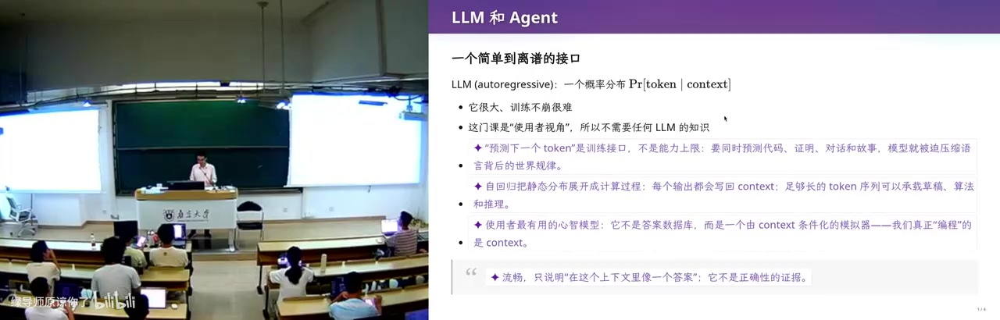

文本，对吧？就给你给你一本书，OK，我带了带了一本书，好，它它随便就就是好多好多文本，呃，给你一个一本书，当然可以是文本，也可能是可以是图像啊，一本书，然后这本书到最后就结束了，但你可以在这个书的后面再写几个字，比如说能不能帮我总结一下这本书啊？结束啊，然后接下来大语言模型就会不断的预测它的下一个token的概率，每次输出你可以理解成输出一个字，一个字，一个字，一个字，然后这个模型很大，它见过世界上所有东西，然后训练它很难，呃，所以这是为什么现在大语言模型这么牛逼，呃，但这门课是站在使用者的视角上，也就是说你们只要知道存在一个东西叫大语言模型，你可以打开DeepSeek的网页API，我现在哦我要登录，那我就不登录，打开网页API，什么是大语言模型？我怎么样体验它？然后它会告诉你现在就在体验大语言模型，对吧？好，所以你不需要任何大语言模型的知识，啊。

**00:22:00**

然后，大语言模型是怎么样进入我们的世界的？我第一次被大语言模型按在地上打，是给我五岁的孩子，二零二三年的时候，GPT四的时代，GPT四这个幻觉非常严重的模型，给我五岁的孩子解释什么是呃扫描电子显微镜。然后我大概有个这样的prompt，那个时候我们就玩prompt engineering，呃，说我希望用朴素的语言打一个合适的比方，帮助他理解这个事儿。就有一天我给我的五岁的孩子讲一个什么故事的时候，不知道为什么讲到了这个扫描电子显微镜，我讲不下去了。然后我讲不下去以后，GPT四给了我一个比方，他说他比这个打这个比方打的还好，这个比方这是GPT-5.6四号给的，我让他让他写了，呃，他说嗯，你现在有一个山，这个山的形状你看不到，你你闭着眼睛看不到，但你又想要知道那个山是什么形状的，那怎么办呢？你就对对那个山扔球扔石头。

**00:23:00**

闭着眼睛扔石头，然后你你扔石头的时候，有的时候你石头就扔，你对着这个方向扔，这个石头就穿过去了；对着这个方向扔，石头就弹回来了，弹回来你能听到声音，然后你就能通过这个哪些地方穿过去了，哪些地方没有穿过去，像 ray tracing 一样的，你就可以推测出这个山的形状。小朋友大概听懂了，我我当时小朋友也不可能百分之百听懂，但是他打了一个就是让我觉得非常震震惊的比方，就首先他有他有这个知识，第二他我后来还特意去查了资料，他他这个比方打的是打的是对的。然后你看 G P 五点六，他给的更严谨的一个一个答案，而且他他因为有 reasoning，所以呃，所以他还给了更好的这个对更更好的解解释。G P 四的时代，然后我们用 G P 四这个模型就去生成奇怪的东西，就一个 prompt 的可以给 G P C L B M 找到一百五十个 bar。然后在今天，你你这个工作就完全。

**00:24:00**

就在G P五点六的时代，就是一句话的事情，就真的是一句话，不需要再做任何的呃为G P T的特别的调整。然后从G P T就从一个能预测下一个token的概率分布，随着大家发现模型可以输出越来越长的文本，也接受越来越长的上下文的时候，呃，agent就就出现了，对吧？它有了推理的模型，有了推理的模型，然后有了coding React式的agent，agent有了agent就是刚才那个语言的模型，语言的模型它可以输出下一个token，那我就可以让它输出一个特殊的token，说能不能呃调用一个bash程序，对吧？然后这个bash程序会运行，运行和bash程序的结果会重新送回到这个agent loop里，这样agent就可以自主运行了，对吧？你就可以给它一个呃比较复杂的任务，它可以不断的尝试尝试尝试尝试，呃。

**00:25:00**

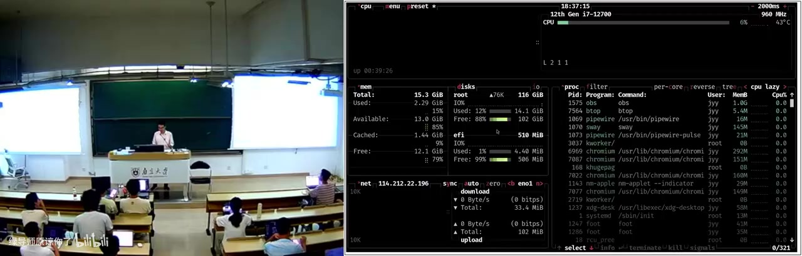

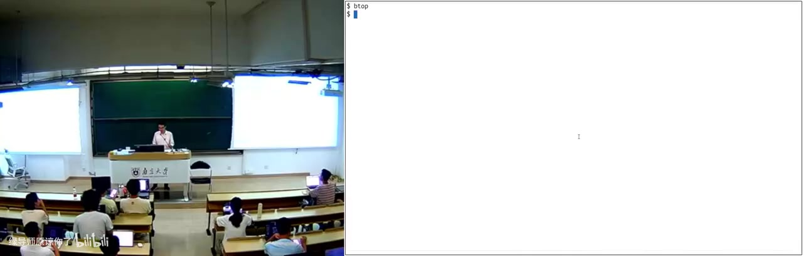

你们看到的，比如说，呃，我我我还是做了一些配置的。你们看到，呃，我配置了一个Sway的窗口管理器，然后这个Sway窗口管理器为课堂展示做了优化，对吧？它的对比度比较高，然后它我得把什么顶栏什么全部都去掉了，这样你们在上课的时候可以看得更清楚。然后我还做了一些，比如说，呃，你们你们都喜欢用top这个命令来查看系统里的进程。如果你不做定制，你看到的就是一个比较土的top，对吧？但是我但是我我想让我这有一个更更fancy的top，让你们看到我的OBS在呃OBS还在吗？对，好，OBS还在浪费我的呃算力，然后我的内存还有还有还有多少多少这样。然后我把它配置成了一个相对来说比较现代的终端，对吧？比如说你们看到你们看到我在ls的时候，我用的不是ls，对吧？这个细节大家刚。

**00:26:00**

有没有注意到？我在 ls 的时候自动把 ls 换成了呃 E G A 这个命令，然后当当我要 find 的时候，它也自动帮我换成了 fd。fd 的行为和 find 稍微有点有点不一样。然后你看到我 ls 的这个输出里面又有，哎，这还是很fancy 的，对吧？没，这是一个目录，这是一个 Markdown，这是一个 Makefile，还有这特殊显示的效果。然后我所有的这些配置都是用 agent，呃，都是用 agent 配置的。我只有一个 prompt，说你你能不能帮我把我现在的命令行终端，帮我把我的系统 sway 都配置成这个呃现代的样子，比较好用的样子。结束了。Deepseek Base Flash 没有更好的模型，所以所以在今天就是有了 React 这种类型的 agent 以后，它就不停的去 conversion 里面去改改改，它也它错了以后，它会去试试别的方法，然后最后它把任务能呃能能完成。所以就在大概去年的时候。

**00:27:00**

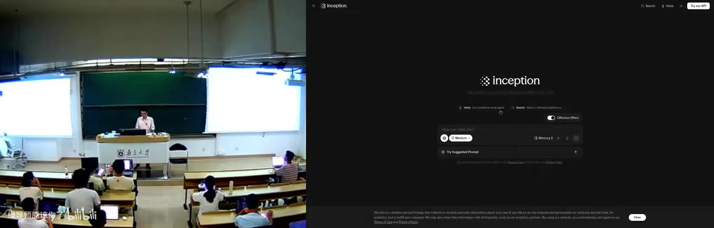

我我前就我去年的时候上呃操系统的时候，那个agent还不怎么能用，就各种各种出错，然后任务完成不了，它就停下来了。但是到今年我上操系统课的时候，这个agent就非常非常呃能用了。到到现在你看到agent产品爆发，到处铺天盖地都是work buddy的广告，对吧？呃，像work buddy豆包的那个agent就是呃这样的react类型的agent。呃，但这其实也就你们这当然这这个好像岔开了岔开了这个呃话题了。这个故事其实远远没有结束。今天你们已经感受到agent非常强，但是我认为agent的能力还远远没有被释放出来。我们next tokenprediction其实是一个我觉得这个效率很低的呃模型。比如说这里有一个呃diffusion model一个diffusion

**00:28:00**

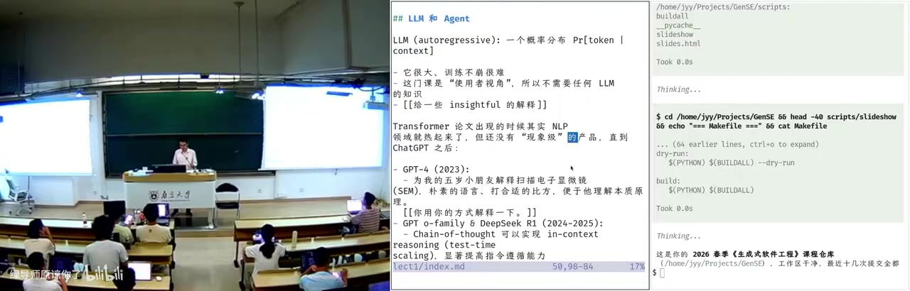

我比如说，我可以说 write a i slog log，我可以让他给我写一个什么样的 a i slog。你观看它的过程，你看它是一个从一个随机的噪声开始，就像就像 diffusion 那个图片一样，一点一点一点一点，就生成了一个很长的东西。它可以生成一个很长的，像人做梦一样，就你在你的梦境当中，一点一点把一个东西想的看得越来越清楚，越来越清楚，越来越来越清楚。我们有很多呃，我们有很多可未来的未来的可能性，对吧？这种 diffusion类型的语言模型，然后甚至是我不是 predict 呃 predict next token，我可以把上下文回过去改，随时可以把一个很长的上下文裁短，对吧？这些都是今天呃很多很多人在研究的研究的东西。呃，现在的模型已经非常强了。

**00:29:00**

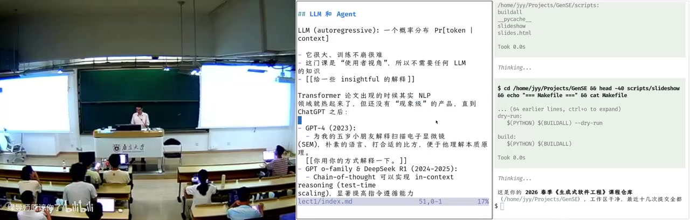

如果我们三个月以后又有一个新的突破，模型变得更强，一年以后模型又突破了，又变得更强，整个AI的research大家都在赌这件事情要发生，摩尔定律还在。那我我现在很难想，就是未来会变成什么，对吧？我我我我不能预测未来到底哪一条路线会会胜出，对吧？是哪一种模型会胜出？但是你可以预见的是，这个世界肯定会变得非常的不一样。那在这个世界上，我们应该呃应该怎么办？是每一个同学我觉得都都值得好好考虑一下的，呃，好好考虑一下的问题。好，吓唬人的事情说完了，我们可以吸一口气。呃，我可以真的告诉大家，应该怎么样呃怎么样来实际操作我们的。

**00:30:00**

agent了，对吧？这还是这门课主要要要讲的。所以，我首先站在普通人的视角来给大家科普一下。就我先假设大家其实不会用agent，不太会用agent。就就除了什么帮我把这个作业做了以外，从我我上个学期看改大家那个期末考试题的感觉，好像就是因为我期末考试就是考了一个呃，如果你要用agent给给我的课出期末考试出一个卷子，这个应该应该怎么办，对吧？然后我我发现大家用agent的呃方式，可能可能需要我来稍微解锁解锁一下，也可以跟大家一起探讨。如果有大家有特别好的想法，呃，就可以随时打断我来说。呃，首先agent作为AI AI native的一代人，你们要知道，就是给他一个合适的呃指令，他就可以把这个指令完成。OK，呃，我我我在课上选的是啊，Python，对吧？

**00:31:00**

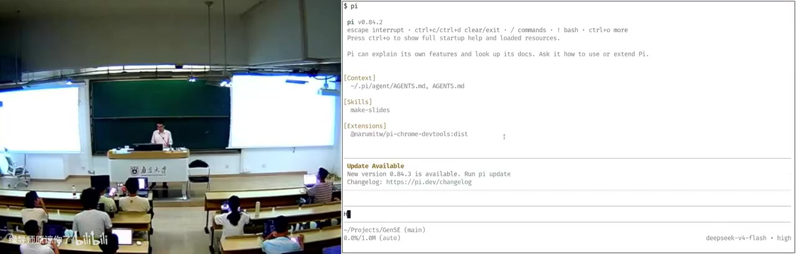

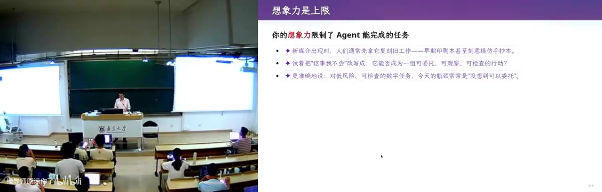

你只要跟他说就可以了，然后并且你可以写一些配置文件，比如说 agent 点 md，对吧？你可以问他你是谁，然后你看他，他还说他是生成式软件工程的教学辅助 agent，那你可以问他，你不就是个模型吗？为什么还知道生成式软件工程？对吧？你可以你可以自由任意的呃啊，他回答不啊，对，他回答了。你看他现在看到的是，之所以知道这门课这个仓仓库 agent 点 md 的配置，这部分是临时的，所以使用 agent 的第一个原则，呃，开始现在就开始用。第二个原则，随时问他。OK，嗯，这是最小的第一个原则。好，然后在这个意义上，其实是

**00:32:00**

你的想象力限制了你的agent的呃上限，所以呃正好一会儿课间的时候，大家可以想一想，你们用agent做的最酷的一件事情啊是什么？想象力是你们的上限。我的第一个例子是我我今天上课的这个系统，刚才我给大家展示了，我也说了，所有的配置安装都是由AI完成的。我要在U盘上，呃，这一直以来是我上操作系统课的一个特色，我会带一个U盘，然后这个U盘里面装一个Linux操作系统，然后这个Linux操作系统可以直接插在教室的电脑上就启动。啊，所以你看到我我现在我在这儿，呃，我你可以看到我这是我的U盘，然后这是呃电脑的硬盘，我我在有一年的操作系统课上把这个硬盘给抹掉了，然后抹掉以后下一个上课老师就教学事故了，这个嗯，对对，就教学事故。然后为用为此我来展示这个操作系统。

**00:33:00**

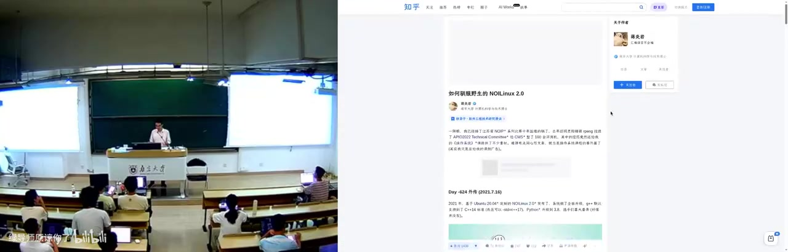

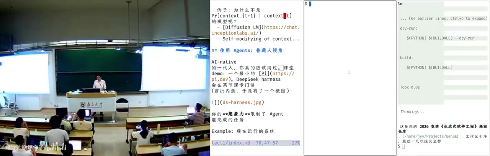

的呃原理，装机是一个很痛苦的事情，呃，我我曾经是装机先人，对吧？这里这里有个支付链接，这个是Prem的时代，你看二零二一年七月，呃，Prem的时代，我我各种各种定制，各种定制系统，装机装机先人，呃，装机先人现在已经呃彻底被啊不好意思，装机先人已经彻底被A A I取代了，因为我只用了一句话，我说你去Mirrors点N G U点E D U点C N上找一个Debian十三的镜像，把它装到我的U盘上，这时候U盘插在里面，然后确保这个U盘可以启动，然后用模拟器验证，点金之笔是这个用模拟器验证，它就装完了，就我我我我，当然我是有脑力，所以我知道它是怎么完成这个安装的，它装完了，装完了以后。

**00:34:00**

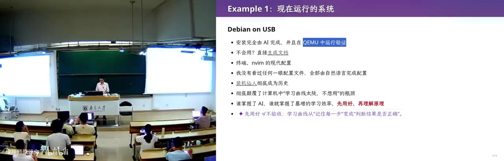

它真的在Q Email里面启动，然后去去看到的那个登录界面，告诉我确实可以登录了，它登录成功了。我我刚才我要创建一个用户，用户用户名是什么，密码是什么？呃，它全部都做好，验证完成给我。然后然后然后完了以后，我就就进，我就启动了这个USB的镜像。然后启启动了以后，我说我要装一个这个Tile basedWindow Manager，就说你就就你看到我我现在操作是是很顺滑的，比如说我按这个Windows加回车，它就产生了一个新的窗口在在右边，对吧？和你们用窗口的方式不太一样。当然我可以比如说Windows加空格把它把它给挪出来。好，不会用怎么办？对吧？你可能听说过在某一个呃B站的直播间里面看到有一个同学他用的很酷的东西，不会用怎么办？我直接让DeepSeek VS Flash给我生成了一个呃文档。

**00:35:00**

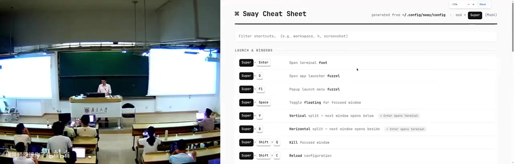

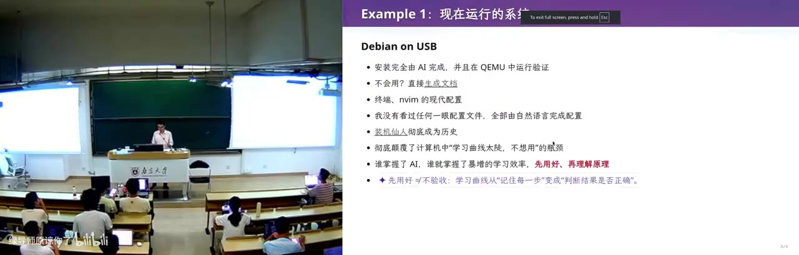

说，哎，你能不能看一下我系统现在的设置里面？我要做各种事情，怎么办？对吧？他告诉我，super加enter是打开terminal啊，super加d是打开一个app launcher。所以，比如说，嗯，比如说我啊，Windows加d，我就可以打开一个 OBS或者Chrome browser。所有的文档，包括你看到的终端Neovim的现代配置，我没有看过任何一眼配置文件，所有的一切都是用自然语言完成的。我只只是让它保证交付，我要什么，你帮我再检查一下，就全部都完成了。所以我觉得，我我毕生的修炼，对吧？我我作为一个呃教computer science的老师，呃，我我我记得我大四的时候，就跟你可能跟你们一样大的时候，就在看那个英特尔的那个几千页的那个CPU的specification，然后去去看那个每一个CPU的feature是干什么用的，然后我就突然。

**00:36:00**

觉得在这个时间点，有一个人，他可以跟我沟通，他把这些东西全看了，都懂，能做对。而我现在需要的是解锁他的能力。所以你看到，我们在今天，你学习知识的方式变了，你更多的时候你需要知道他能做什么，你感知到他能做什么，能做到什么程度，然后你带着他去做一件更大的他做不到的事情。所以人现在唯一的功能就是带着AI做AI现在做不到的事情。一旦如果你没有这个能力，你就立即已经被淘汰了，对吧？所以你没有token，你就可以立即退役了。这个这是我自己的啊自己的观点。首先，Agent彻底颠覆了计算机ComputerScience里面学习曲线太陡、不想用的瓶颈。你想想，你们都配置过那个漂亮终端吧？你们看那个终端花里胡哨的那个，你们B站上面那些人用的花里胡哨终端，你就想搞一个，搞一个以后你改一点点，他就给你出错。

**00:37:00**

对吧？改一个配置文件，.zshrc，一改就出错，一改就出错，非常的痛苦。有 agent 了，一点不痛苦。它不仅可以给你改，还能事无巨细的解释为什么要这样改。你有什么新的想法，一提他就说好好好，还可以给你提供情绪价值，对吧？我我我我前前几天在小红书上发一个解说，为什么 token 比学生好用？是因为可以骂他，他不会还嘴。这个我就就就是因为我我我肯定不能骂学生嘛，对吧？但是但是我可以骂这个呃这个 agent。所以谁掌握了 AI agent，谁就掌握了暴增的学习效率。你现在现在的学习方式，你先用好它，先把东西搞出来，再回头去复盘理解。这个效率会比你从零开始一点一点搭积木要要高很多。但这里面危险是你你你的理解可能和那个比较好的理解会有会有差距。其中呢我们不知道，但是呃，但是这是一个非常不一样的事情。好。

**00:38:00**

呃，第二个，收发邮件写草稿。呃，我有一个自己的skill，但是我我就我就不展示了。呃，它我的我的数据库里面有我历史上回过的所有的邮件，所以每当我收到一封邮件的时候，它会自动把它变成一个已读的状态，然后自动自动帮我写好回复的草稿，用我的口吻。虽然我现在觉得它做的还不够好，呃，除了一些简单的routine性质的东西可以直接用它的回复以外，大部分时候我还得呃呃还得还得去改。但是我得到了AI的bot，然后它会把重要的，就是比如说邮件里面呃的附件，比如说呃如果我要我我我收到一张发票，它就会把我的发票呃自动保存到一个指定的归档的位置。当然，这都是我写好的instructions。呃，我我可以干一件什么事呢？我我可以像跟你们的那个Open Cloud或者Remus一样，呃，但我用的是我自己Apple的Rem。

**00:39:00**

Reminders，我可以，我可以找到我的手机，在我的备忘录里加一个说，帮我把今天的发票打印出来，对吧？我我觉得我现在就可以做这件事儿，也就是打，也就是浪费一张打印机的这个纸。我在我在一个叫Bot的现，你看现在是空的，我在这个Bot的地方加一个，把我收到的上一个发票打印出来。好，我我只要点勾，它就commit，我就多了一个todo的事项，就跟你们在Telegram里跟你的那个Bot聊天是是一样的。然后只要等就行了，它后在后台会会处理，等到弄好了以后，它会重新给我一个呃推送的通知，然后这个通知会会通过我的手表送到我的，就就通过Reminder然后送到我的手表上，然后我的手表会知道，它会告诉我OK打一码。然后我所有的日常的事物都可以交给他来，他来处理，前提是我我我我我放心的。

**00:40:00**

啊，放放心的事情，yes，呃，我觉得是比Telegram聊天框要好，而且这个流程会不断的进步。你就在OpenCLow之前我就这样，然后在OpenCLow，呃，我觉得OpenCLow或者RMS不是那个呃个人agent产品的呃个人agent产品的终极形态，这个产品还可以做的更好，所以未来还有很多的呃空间。还有，呃，你们还还在读书吗？你们还看书吗？看，你们还看论文吗？看看论文痛苦吗？痛苦，痛苦吗？不痛苦。大家在笑，呃，我我我是一个很喜欢看书的人，我我我在我在你们这么大的时候，每年都教科书就要看几十本，还会看很多闲书。那我今天已经呃不看书了，我现在已经不看书了。

**00:41:00**

呃，但是我还是买了一本，对吧？因为我要上这个呃，甚至是软件工程的课，所以我又买了一些，我带了几本来。就我，我，就这都是我读书的时候就仔细仔细看过，甚至看过不止一遍的一遍的书。这个是那个这个FreFre Brooks的那个《Mystical Man Month》人月神话。这个标题起的就非常misleading。首先，什么是人月？你们想到的是就你想到是那个人和月亮吗？就是每每到月亮出来的时候就会变成狼的人吗？这个呃，这就这个呃，Man Month对吧？这这是一个Man Month就很很好理解的，就是但是人力对吧？人力神话。然后这神话也不对，神话你们想到神话什么是什么盘古开天地对吧？是有这种美好的这种历史这种这种神话。其实这个书应该叫《人月鬼话》对吧？就是人月是一个对这这是一个是一个鬼话，Mystical呃，美呃The Mystical ManMonth。还有一些像这个呃。

**00:42:00**

呃，对这个John Ostrad的的这个的The Philosophy of Software Design，这个这个书非常的紧凑，感觉比我当年看的英文版要要紧凑一些。呃，里面有很多软件工程的呃真正的软件工程的智慧，啊非常好。那个，然后然后我就读了，我又重温了一下当年读书的感觉，读了第一章，然后我读完了第一章以后，Agent启动。呃，我我我我会怎么样读书呢？对吧？我我会怎么样读书呢？呃，我比GPT-5.6So的呃做的要更好一点。大概在这个Skill里的这个部分，我当我的呃我的那个AI梗同学会比会比他更强一点，会比他更harsh一些。呃，我我在这里为了为了做每一页slide，我都会让GPT-5.6首先去回看人类的历史，人类历史。

**00:43:00**

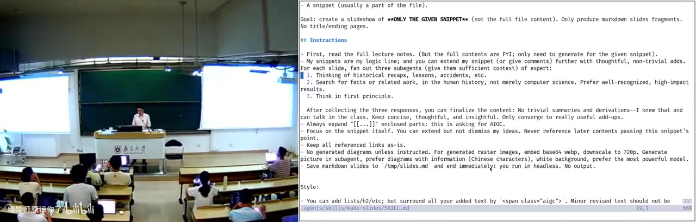

和我这些相关的这些案例里面有没有一些 lessons，一些重要的案例，呃，能够得到启发和印证的？第二个，根据我我我的这个讲的这这这个东西，呃，能不能找一些相关工作？不仅是在 computer science 里，然后我会让他 prefer 这些 very recognized high impact resources。当然，这是因为是我要上课，所以我我我我会希望跟大家讲这个经典的东西。还有一个，比如说 thinking first principle，在我的 AI 等同学里面，我有更多的这样的 personality。然后还有随机性会抽卡，然后抽完了以后他们会讨论，他们会有分歧的观点，讨论以后我的主 agent 会再把这个分歧的观点再送给他们回来讨论，直到收敛为止。所以，我我我我有一个算力换智力的loop，然后这样我就可以去审稿那些论文。我会明确的要知道，呃，我大概是这样读的：就如果我要 review一篇论文或者读一篇论文，我会说，你从人类已有的知识开始，假设人类已有的。

**00:44:00**

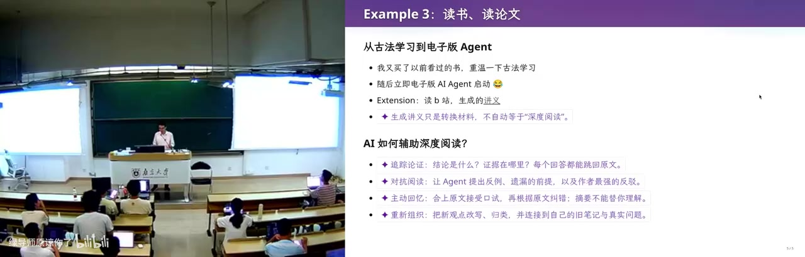

所有的东西都已经是固定下来的，都是trivial的，都都都不能说trivial，就是说都是已知的。然后我要把这篇论文里面新的东西、最少的东西，一给剥离出来。然后这个时候，一篇十二页的论文基本上就没有剩下多少了，就就会变得非常非常短。所以我现在读论文的效率非常高。呃，我而且我会跟他chat，我会拿着论文的原文，拿着这个总结，拿着分层次的总结，我跟他chat。所以我现在读一篇论文的效率会比我以前呃高得多。我我仍然是读论文的，所以我不是那种呃只看微信公众号的老登啊。我我我现在可能我不是我不是看微信公众号学习的那种。哎，呃，我的我的发票已经已经打印好了。这个呃，在看到我有一个收到一条通知，对吧？叫发票发票已已打印，然后我只要回去到那个打印机上就就就就拿走就可以了。所以它可以干任何事。Literally，就我那台电脑能干的事情，所有的都能干。呃，我我很想，如果我有时间的话，对对吧？如果我就就大学导

**00:45:00**

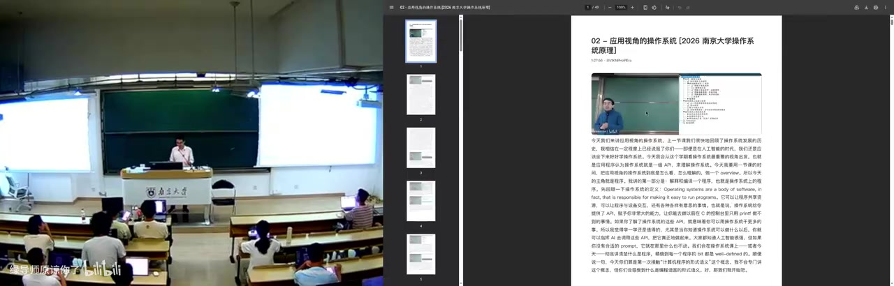

闭了我就我就弄一个机械手，让它能够做更多的事情。我现在现在还还还还做不到，但是它可以操纵我的呃我的打印机。OK，呃，AI AI耿同学在这里。然后我不仅用AI读书读论文，我还用AI上B站。那当然的，这个剥夺了你们娱乐的，对吧？如果你是要娱乐看一个什么滑翔买瓜的这个衍生视频，那就不要用AI读了。呃，我是怎么读的？我我可以就一个BVID给我一个BVID，比如说这是我我上上学期的课程，给一个BVID，一个小时二十七分钟。一般来说我会读什么呢？就读这个Podcast，比如说这个Michael Cook又又发了一个什么他的什么软件工程实践。其实我觉得他也挺神棍的，这个有有些有有些经验可能不太完不完全适合我们的呃我们的课程。然后我会。

**00:46:00**

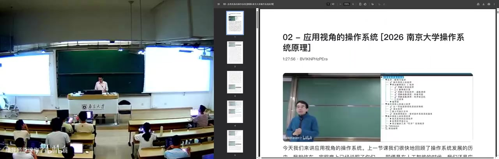

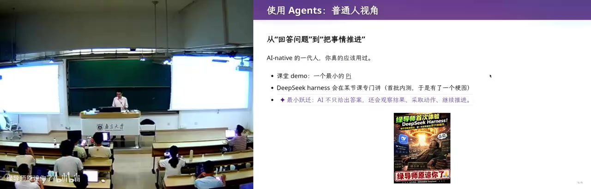

把它总结成一个自动的图文的时间轴，然后你看这是整理过的，就是呃整理过的，这个这个文本的质量还是可以的，比字幕的比比字幕的质量要要高一些。这就是全文，呃，这个图文版的图片会稍微少一些，实际上我的截图的密度会更大一些。就是当我两帧图片之间的呃间隔大到一定程度的时候，我就会截图，我就得到了这个视频所有的ground truth。这个时候AI梗同学就可以上线了，对吧？AI梗同学会去消化，会为我消化这个一个多小时的视频，把因为它有我的记忆，把我认为不需要看就trivial的东西，对吧？比如说这里面所有东西都是我我非常清楚的东西，那么呃我我就我就不需要看它，那么呃去掉，我就可以在几分钟的时间里面看完一个两个小时的视频，而且。

**00:47:00**

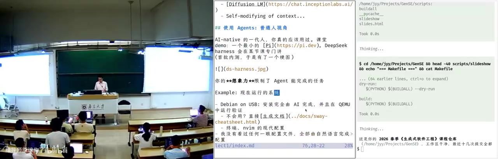

且我基本上确信，呃，我我还是很好的知道了那里面不一样的呃东西，所以这是一个非常可怕的事情。在AIagent的时代，会用agent学习的人和不会用agent学习的人，他学习的效率差距是十倍、一百倍。那么你、你们、你们坐在这儿，你们怎么和一个十倍、一百倍的，怎么和一个十倍、一百倍的人竞争？对吧？你、你、你就就就回到我一开始的那个问题，那个简历，如果所有的人的简历都是一样的，那你接下来会想，那个没有给你看到的那个学习效率是你一百倍的人，他的简历是长什么样的？对吧？这是一个呃非常可怕的呃事情，而更可怕的还在下一节课。所以我们课间休息一会儿，你们你们可以想一想啊，呃，因为，我我还没有公公开这个我我下面的内容，还还要给大家留一点惊喜。呃，下一节课，呃，我再来讲更可怕的。你刚

**00:48:00**

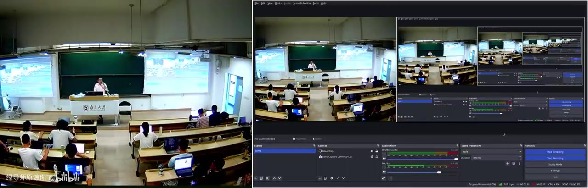

才更可怕！所以为什么我要说这个大学完了，这个人类完了，对吧？对吧？人你们总觉得我神棍，这个，但我我我我我就是我就这样想的，而且我非常确信的是，世界上肯定有人做比我更好，对吧？因为我我是是一个上有老下有小的人，我没办法，我就是没办法，我上有老下有小。我我比如说我我上学期我为了上操作系统课，我就花去很多的时间，那那些时间本来如果我我不上这课，我就可以用来探索那个我应该怎么怎么更好的去。我们回来，刚才有一个非常好的案例，呃，在直播的时候，我的USB的摄像头卡了。它教室里面大概是这样的，它有一个采集卡，然后那个视频的采集卡会可能是从网络或者什么，因为这边还有好几台机器。呃，我不知道为什么学校里面用了一个成本那么大的方案，我觉得我可能用五百到一千块应该就能解决解决整整个问题了。呃，一个成本很高的方案。

**00:49:00**

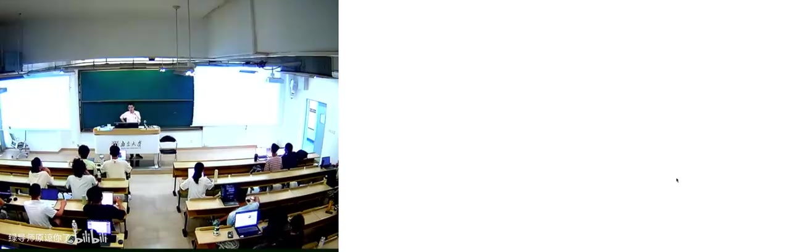

然后它有一个采集卡进来，但是那个采集卡的USB断开了，所以所以大家看到现在我用左边这个我挥挥手，它是在在动的，但是呃USB就就就就断断掉了，不知道为什么断掉了。然后断掉了以后，呃，我刚才就立即让agent呃修了一下，对吧？对，刚才我是让agent帮我修的，我直接一就就是一个prompt对吧，在在这里，呃呃，他说我先看看系统的USB设备的情况，找出设备呃呃对这这里，说我的呃USB有有问题，能不能呃reconnect？这是DeepSeek Voice Flash，它用你们前所未见的Linux命令，就有些其实我有概念，但是我也不知道它具体是怎么工作的，呃。

**00:50:00**

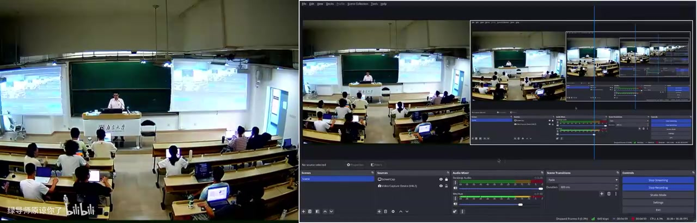

反正就是他，呃，用软件的方式把那个U U S B的采集卡拔出来又插进去了，因为我我是碰不到那个接口，那个接口在机器的后面，我我我碰不到。然后他帮我拔了一下，插了一下，然后就就好了。OK，现在现在这个视频还是呃没有啊没有问题了。如果如果视频再有问题的话，就请大家打断我，我我再来再来重置一下。好，我刚才说了，还不是AI的真正的形态。作为普通人，刚才刚才我给大家展示的，是一个白板的派，什么也没有。就是你你在那个派的那个那个官方网站上把它安装下来，你配置一个DeepSeek V四Flash的API Key，你立即就可以得到刚才所有的那些那些东西，多么可怕的一件事，对吧？但是Agent远不止于此，Agent用了一个完整的生态系统。所以，当你有一个领域

**00:51:00**

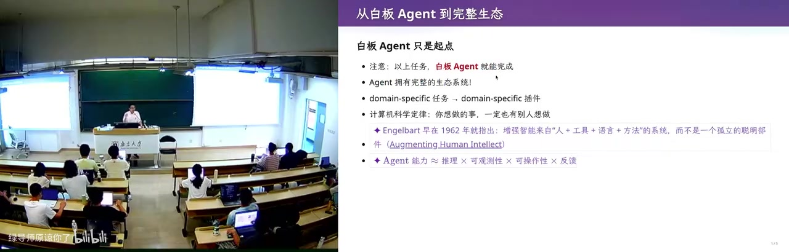

特定的任务的时候，根据计算机科学的定律，我上课的时候一直会说这个computer science的定律。如果有一件事情它是合理的，并且你想做，那么百分之百一定也有别人会想做，对吧？那在这个pre AI的时代，那么开源社区呃多多少少就会呃来公开一些脚本，对吧？哎，我今天又发布了一个新的脚本，可以干这件事儿到GitHub上，然后你把它拉下来，可以做自己的事儿。在AI时代，做这件事情复用别人的能力变得前所未有的轻松。我可以往Skill Hub上面发一个Skill，然后你可以在Py的插件生态上面找到一个呃插件生态。所以你们想到应该下一步做一个普通人，你应该做什么？应该用插件把浏览器管控起来，用应该用插件把电脑管控起来。浏览器是一个非常好的。

**00:52:00**

呃，工程产品，我们我们用的是呃是是Chrome浏览器，是一个非常好的呃工程产品，它呃可以说是人类软件工程史上的奇迹之一，非常的复杂，看起来就是个浏览器显示网页的，它的代码量甚至远超操作系统内核，因为它要和用户打交道，它是大量的，比如说图形战对吧，还有这个显示相关的东西，性能优化等等，呃，而浏览器是为开发就就是一个软件工程奇迹，所以它是有一个接口是专为开发者设计的，叫Chrome Dev Tools，Chrome Dev Tools你们应该是用过的对吧？比如说呃你们打开Chrome啊，然后你们按那个呃F十二，OK我把它做的全屏，好的，对吧？你你们都都都改过对吧？你比如说你很讨厌这个东西对吧？你很讨厌。

**00:53:00**

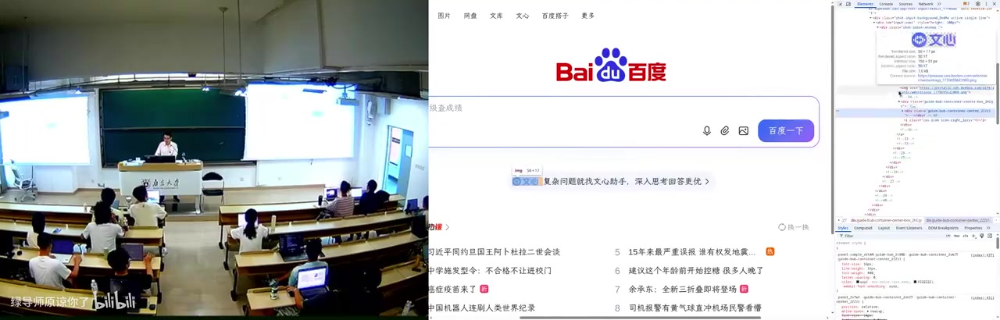

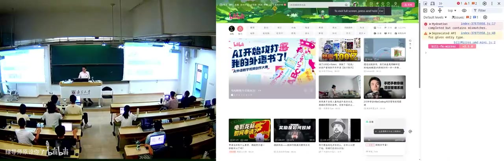

是是有点讨厌，好，讨厌就 delete 把删了，对吧？它就没有了。呃，好，呃，你你当然你你这里是可以调试它的，对吧？所以呃，一般来说网站都会在这个 console 上面嵌入招聘广告，招聘广告，呃，这个同学们应该也是也是也是发现过的吧？比如说你们上 B 站，然后 F 十二，呃，哎，它它没有招聘广告了吗？我记得 B 站也是也是有的。Anyway，在这里你可以你可以看到很多的信息，比如说你可以找到这里面的 HTTP 的头啊，呃等等，呃，然后你可以你可以把这个链接的，比如说这个链接 copy 把可以把它的命令给 copy 出来，这样你就可以在浏览器里呃带着它的浏览器的带着这个 cookie 带着所有的状态呃用用 curl 这个命令去请求请求，这样你就可以可以可以可以得到列表。这都是以前就是在

**00:54:00**

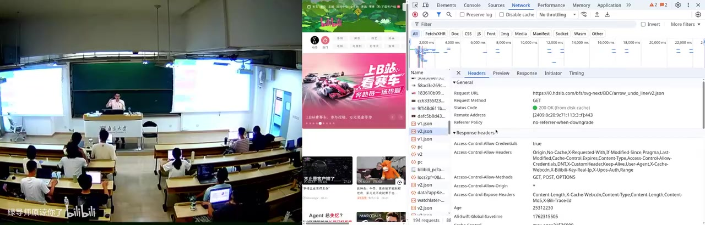

在pre-LLM 时代，开发者呃做做做的事情，但是在LLM 时代变了，普通人也可以享受到Chrome DevTools的所有的呃厉害的地方。我记得我我记得我们在二零二零年的时候，我们做过非常疯狂的project，就是我我大家都知道Android是呃应用是可以用Java写的，我们假设是一个Java的应用，然后呃Java或者这个Kotlin都编译到Java虚拟机，然后我们就可以在OpenJDK上运行一个Android App，然后这个运行Android App的时候，会把所有的界面上面的按钮，比如说这个按钮的bounding box，就是那个它的坐标都算出来，然后上面的文本也知道，但是我不走Android的那套渲染，我直接在浏览器里面，就你可以在那个Chrome里面，你在Chrome里面可以看到一个计算器，然后那个计算器里面每一个按钮都在，上面的字也是对的，然后你可以点点了以后，那个计算器的状态就变了，我可以在在本机执行一个Android App，所以这是一个非常非常powerful的呃工具，但我今天不讲这个。

**00:55:00**

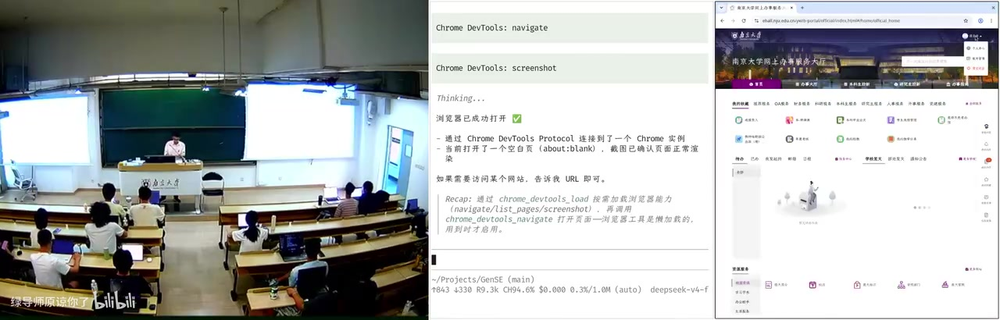

让我们来干干一件什么事呢？你们都讨厌教务系统吧？呃，我也很讨厌这个。我一会儿会讲的，就是我当我讲到软件工程的时候，我还会特别讲讲到这个教务系统是一个软件工程的非常反面的例子。呃，来啊，哎，我的手机好，让我让我扫个码啊。你你们不要扫，你们不要扫。确认好，呃，您应该不会暴露隐私啊，希望不要暴露隐私。我可以稍微稍微放大一点。好，呃，比如说我现在的教学周历是是空的。呃，现在啊，你看啊，其实我刚才在派里面说帮我打开浏览器，这个浏览器是属于派的。

**00:56:00**

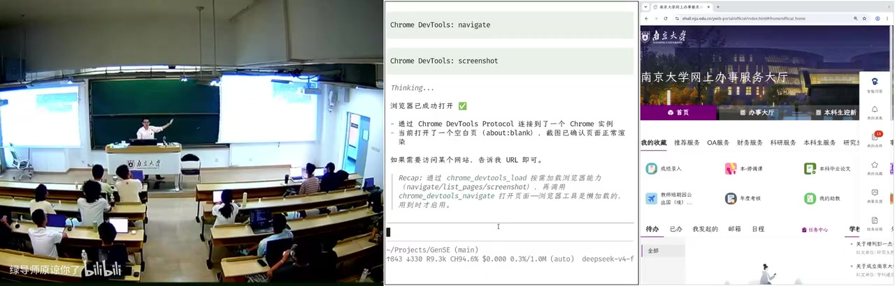

所以你们可以干什么呢？比如说，我很讨厌动不动叫我们填东西，所以我说，呃，那这时候你看豆包输入法的含金量又提升了，对吧？我我我在我在做这些日常任务的时候，我就会摁一个键，然后打开豆包输入法和它对话。当然，当然在这里我的Linux没有没有豆包输入法，而且我我我好像没有配置这个语音输入，因为输它的声音输入可能会会有点麻烦。呃，填写现在教学周历是空的，帮我用随便什么AI stuff填写，不要看任何东西，对，因为因为他会他会他如果他如果知道这门课就现在的目录是这门课的repo的话，他其实会读我的什么lecture notes啊这些，我不要不要不要。啊，你看他还在干这个事儿。

**00:57:00**

对吧？我我我我就是想让他去填，应该知道。你看他，他就是不听指令。这是 DCVSS Flash 的嘛？如果是Codex，它它它会知道。就这就是 DCVSS Flash 的问题，它不看。啊，翻车也是也是经常有的。所以就是模型其实还在不断的能力增长中。就是如果我用最最一线的模型，呃，它。

**00:58:00**

他就会做起来，做起来更好。呃，我用Flash还有个原因就是他在课上，呃，会更快，在课上会更快，所以，没关系，他会能，这就是Agent，就你看到他的过程，呃，你看他会不断的反思他做的这件事情合不合理，然后他能够找到应该怎么办，对吧？看起来翻车就是他刚开始在尝试，然后刚开始在尝试以后，呃，他找到正确的方式，所以说Chrome Dev Tools是一个非常强大的工具，他最终发现他用那些。

**00:59:00**

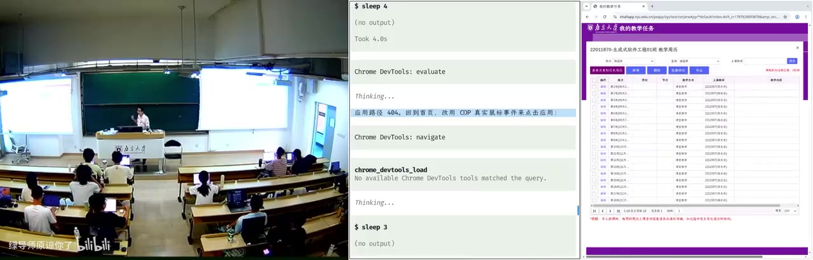

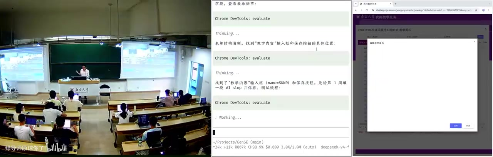

呃，比如说直接注入一个事件的方式不行的，但是点鼠标是可以的。然后这意味着什么呢？你看，它已经开始可以填写AI stuff，我完全可以无不需要值守，对吧？让它随便给我填点什么AI stuff，Anyway，doesn't matter。呃，能力真正的边界在哪里？当它走通过一次以后，这个session里面的东西会留下来，我可以把它沉淀成确定性的脚本，对吧？它可以形成记忆，就是说说这条路径应该怎么走，什么能成功，什么能失败。它也可以把这个走过的这些网页全部变成脚本，你就得到了一个自动选课抢课的系统。所以，所以这是多么恐怖的一件事，对吧？你不需要有任何的，不需要有任何的知识，对吧？它就在这里帮我填写AI AI stuff。如果我要对付，对吧？对付这个本科生院。

**01:00:00**

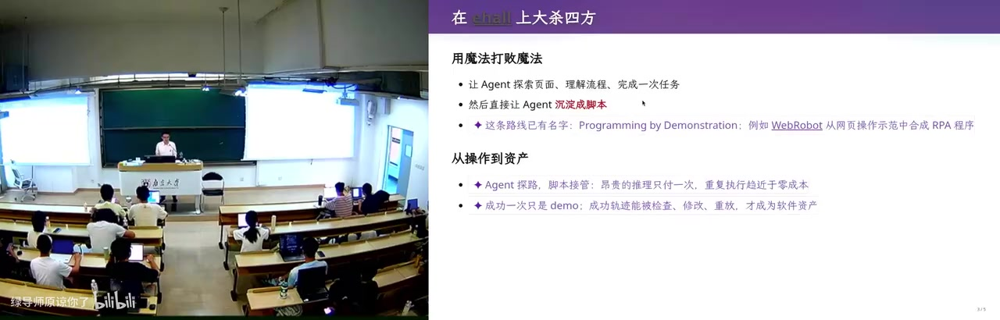

一定要我填的话，我就用用这个方式来来来来处理。OK，呃，对吧？而这其实是一整个生态，它不是，就是说，你你们会觉得OK好，这是一个又是一个很funny的案例，对吧？我今天讲了好多，哎，我可以这样用，这样用，这样这样这样，每一个都很厉害。而因为我是教操作系统嘛，操作系统上面的应用程序Unix的philosophy，它能成立的原因就是那个管道能实现所有程序的自由组合和无限复用，一加一是可以大于二的。而刚才我说的所有东西，比如说从一个浏览，就是一个上下文里面提取这个记忆和脚本的能skill，和我刚才那个浏览器的skill，和我比如说我又有一个。

**01:01:00**

呃，什么是在网网网页上面怎么浏览的一个skill？它们是可以加在一起互相调用的，所以呃，现在这个AIagent的这个呃生态其实已经达到了一个临界点，马上你就会看到呃这些东西的互相组合可以成百倍、成千倍的放大个人的能力。真正对于一个一般人来说，呃，他可以做的，他可以去找到世界上各种各样的信息源，对吧？我不知道你们有没有订阅那个什么《居家的AI早报》，对吧？然后每天早上起起来这刷牙的时候就就听一下，反正它也是AI生生成的，但它是有RSS的，它是有这个推送源的，然后你有这个B站的推送，你有Archive的推送，你有Hackers News的推送，然后这些东西都我都可以做一次沉淀成skill或者沉淀成脚本，然后它就会进入，对吧？

**01:02:00**

它我就我我就可以做了一个这样的信息处理的系统，我有大量的这个信息源，然后这个信息源会进入一个处理系统，然后这个处理系统最终会产生有用的知识，然后这里面就是由各种各样的skill构成的，都是自然语言，所有东西一行代码都不用写，但是它可以复用，你会不断的调整这个工作流，然后它就会不断的产生对你有用的知识，你的飞轮就转起来了，然后你想象一个呃拥有这样飞飞轮的飞轮的人，你你在这个飞轮上，呃没有飞飞轮上，这是一个多么可怕的呃可怕的事情，对吧？所以这时候你可以理解为什么Open，Cloud和Emerson是一个现象级的产品，对吧？为什么他们能能给人这么惊喜，对吧？比如说一个自我进化的能力，呃虽然啊虽然说我我作为一个CS professional，我我其实不惊讶，而尤其是我我其实挺讨厌，比如说说他去总结。

**01:03:00**

一个memory的，因为它有它的提示词，然后它会把一些它我不想让它记住的东西记住，我想让它记住的东西不记记住。所以，我更多的时候是我调用我自己的流程，把把我我我我说把这个东西写到我的数据库里，然后AI会会会做会做这些事儿。呃，但也许只是有一天，就这是因为这个现在产品还不够成熟，模型可能还不够强。当有一天模型过了那个临界点的时候，我就是我现在就比AI多一点点，我比AI多的那一点点也被AI取代以后，我就消我我我就我就我也被消灭了，对吧？呃，我也被消灭。然后在这个意义上，你能想到很多很多呃更有趣的事儿，比如说我刚才说的录屏，对吧？你就录屏一天，让AI自动改进你的流程。你就问AI，我这一天干的这些事儿，你觉得我还有没有提升空间了？很有可能，就尤其是大家在初学者的阶段，就还有很大的提升空间。所以你们是对吧？你们是这一代人在。

**01:04:00**

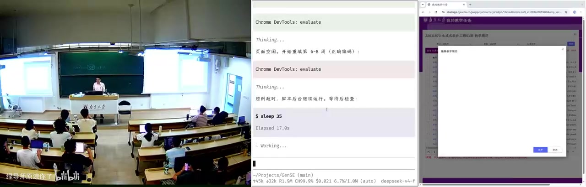

AI native下长大，你们这一代人才是未来才有才有出路。像我现在已经被迫的，对吧？被迫要处理很多事务性的事情，我已经没有这个没有这个机会了。对，所以呃，虽然现在还没有完全的准备好，但我真的是很难理解为什么有些旧人类，尤其是老登们，这个为什么还要心安理得的每天去做这个重复的事情，对吧？当他他为什么要我啊？感觉除除了一些除了一些小问题，但是呃，doesn't matter， doesn't matter。呃，我我我只要让他对吧？我我只要让他修修修就行了。这个呃，这个不重要。显然显然，这个这个我需要一个更更好的模型。但是就是我我我不理解，就是为什么为什么这些人不意识到，那可能公众号就公众号的消息和真正你第一手用过的。

**01:05:00**

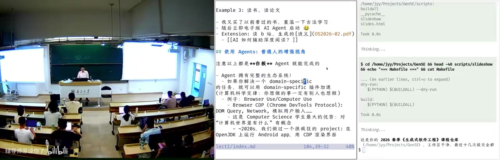

人他的感受，呃，是是是很不一样的。但这个时代来了，所以我们需要呃认真的思考思考这个问题。好，这是普通人的视角。那那接下来是我的这个CS作为一个computer science的从业人员的呃的视角，就是如果你们只是用agent Codex出来帮把操作系统作业做了，那你们真的是太小看它了。呃，我我们是computer science的人，我们非常知道编程的能力界限在哪里。这就是我们和和其他的一般人，对吧？一般人他很容易提出一个需求，然后这个需求agent可能做不好，做不了。然后或者说他不知道应该怎么样prom的这个agent能够确定性快速的完成。但我们有，呃，我们知道的是，我们是怎么可以把需求编译成就像刚才这个里边的东西编译成什么东西可以复用，什么东西应该以代码的形式复用，什么东西应该以skill的形式复用。我们会呃我们会非常的呃清。

**01:06:00**

我举一个例子，呃，这件事情如果是一般人和AI协作，就会呃就会稍微呃，可能现在AI还做不到。我改卷子，改完以后我要统分。那一般来说，这个呃任务就是给助教的，对吧？好，助教你你去把这个分加了吧。然后助教就掏出一个计算器，这个呃十二加十三加十四加十五加十六，呃，然后再再仔仔细核一遍。呃，所以我觉得我对我的学生太好了，这个这个也也也不行。呃，我今年尝试了这样的流水线，呃，我基本上就是我第一遍我先是Y就是Y不code让他出脚本测试，然后测试流流完了以后我就一遍头把它跑完。我我的流程大概是这样的：我在办公桌上有一个从顶向下的摄像头，然后那个摄像头会拍到那个试卷的一个固定的位置，把它先调好。然后调好了以后，我按一个回车，它就会拍一张照。拍一张照以后，我我它就会回头去offline去生成，去去用提问去。

**01:07:00**

识别这个姓名、学号、小分，就每一个小分，然后他会写一行到一个文本文件里。所以我就我就是一张卷子按一个回车，一张卷子按一个回车。我是两只手的，我两只手都没都没写下。然后如果我这张卷子比如说没有摆好，我就可以调整一下，然后再再再来。然后第一个阶段完了以后，第二个阶段按照反序，我还是以回车键。这时候我左右手就换了，我左手摁回车，右手拿笔，我摁回车以后，我的自然就是我会用语音来播报谁谁谁学号是什么二四一二二零几几几，然后他把每一个小分都报出来，十一加十二加十三加十四加十五。他一边报我一边要检查，因为OCR会有错，我不信任他，我要对我的班上的每一个同学负责。然后我检查过没问题以后，我就会把他报的那个最终的分数给抄写到卷面上。这个这个分数是用脚本算，就就Excel算出来的，所以他。

**01:08:00**

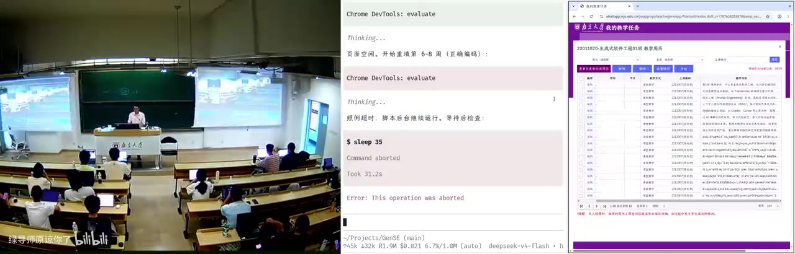

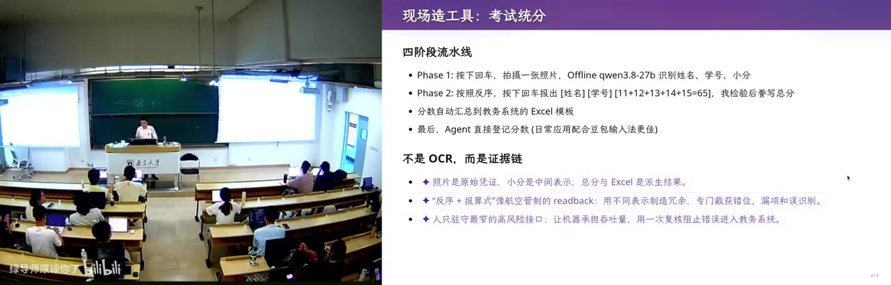

是不会错，它不会因为大语言模型的幻觉算错。我没有让大模型做加法，所以我我我对所有同学是负责的，就是每一个分数我都呃我我都看过的。然后最后分数会自动汇总到教务处的那个Excel的呃模板上，然后最后我可以用这个东西，对吧？我可以用这个方式把那个Excel文件上传，然后我再抽样检查，确保没有问题以后，呃，再再再来提交。所以看到确实是配合一个豆包输入法增加，但因为我是一个CS professional，所以我知道边界在哪里，对吧？我知道我的本地有一个二十七B的千万三点八，然后我拉马可以用，然后我知道应该用这样的流程，一个最舒服的流程，减轻我和Agent之间同步的代价。而这些东西都是呃，如果一般人只如果你可以试一下，回头比如说你哪怕是跟最好的模型说，呃。

**01:09:00**

我现在我现在改了一百四十张卷子，改好了，小分都已经写上去了。呃，我要统分，帮我实现它，到不了一个这么快的收敛的呃方案。对，这是所以有有些时候，现在我还需要这个呃人和AI要共建，但我也赌有一天AI的能力能够强到它能够感知我的一切，然后能帮我做一个完美的东西。好，那我们就可以回到软件工程的话题了。呃，毕竟这是生成式软件工程，我们来做一个小的软件工程的产品吧。呃，就这，因为我选它正好是就是有一天，就前几天，它一个星期左右的时间里，有一个我们在群里面突然闲聊说：“哎呀，机器被管控了，很讨厌。”然后我们就想有没有可能？你你假设假设你现在在一个金融公司里，然后这个金融公司数据是可以带进去的，但是数据是出不来的。就是你，比如说你插一个U盘，然后你可以把一个Word的。

**01:10:00**

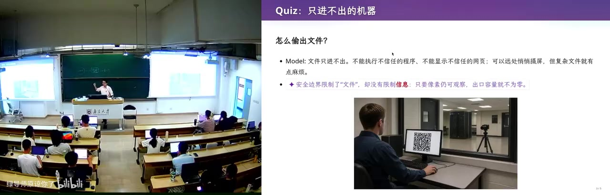

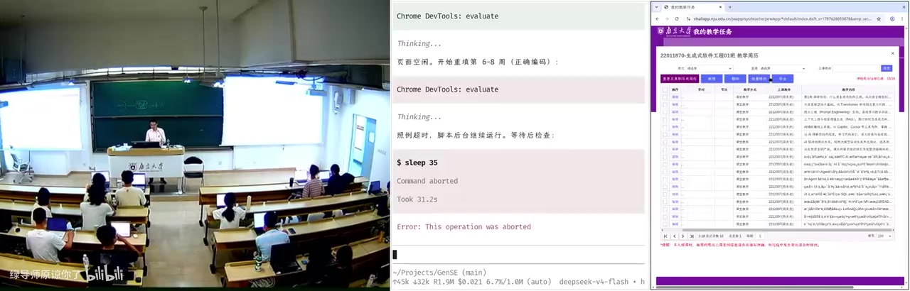

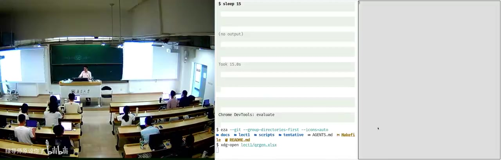

为了Excel考进去，然后为了Excel考进去以后，他就进去了。但是没有任何文件可以考到外考出来。好，呃，机器做了管控，然后它不能执行任何不信任的程序，不能显示任何不信任的网页。你唯一能做的就是在远处可以悄悄射屏，但是你想把一个很大的文件给偷出来，你怎么办？对吧？这就是computer science的人才能想到的这个呃想到的事情。我我我干了这样一件事啊，这个得去掉。嗯，我做了这样的一个程序。OK，我可以叫它程序嘛？对，可以叫它程序。嗯，这是一个典型的软件工程任务。这是一个二维码。然后呢，我可以把任何一个文件的内容，文件内容，比如说我我现在文件内容就是hello world，可以啊。好，好，好。

**01:11:00**

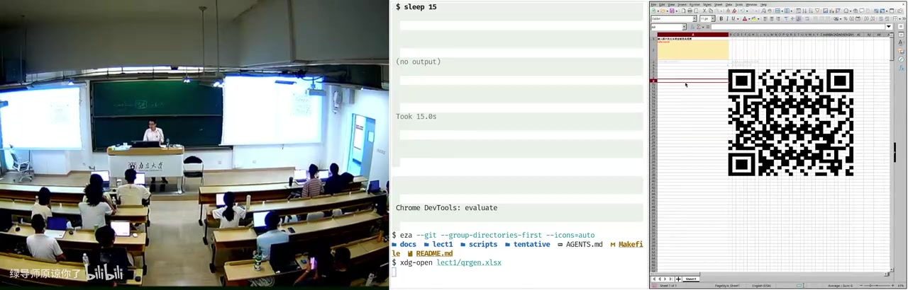

Hello World，World完了以后，你看这个二维码就变了。你们可以扫，扫一下，我也扫一下。这这个二维码没有没有危害，应该不会封号吧？对，呃，扫出来是一个Base64编码的字符串，然后它是零零零一，Base64编码的字符串。然后，然后我这是可以是一个非常非常长的字符串。比如说，我有一个很长的Hello World，好，呃，这个很长的Hello World，我就可以编码成一个二维码的动画。你看这里有一个，这里有一个呃，这里有个真号。这是我摁住F九刷新，六七，这就是一个二维码动画。也就是说，你只要偷偷的摄屏，然后你把所有的每一帧，它是循环播放的，你把每一帧都拍到。

**01:12:00**

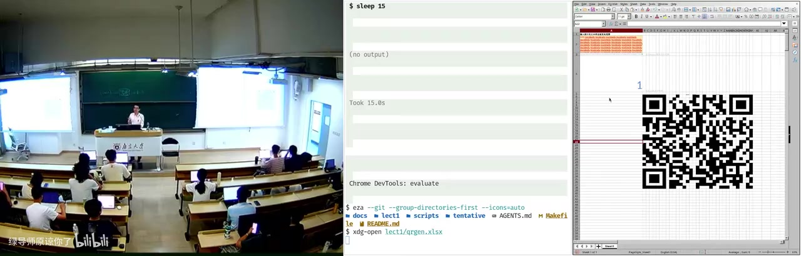

你就把这里的数据给偷走了，所以，我用完全合法的方式，注意，这是Excel，Excel是合法的。然后我用了所有的东西都是公式，大家可以看一下，公式在这里，就全部都是Excel的，就是就是Excel的公式，那都是都是合法的Excel公式，而且是二零一九Excel之前Excel都兼容的公式。然后把这个二维码偷出来，这这个是是没没什么，就是一个就是一个例子。然后你作为这个CS professional，你可以用这个方式偷数据出来，你也可以，如果如果能在那个机器里面装EXE的话，当然一般是不行的。呃，你可以用抖鼠标的方式，对吧？你可以在上下维度抖鼠标就是零，左右维度抖鼠标就是一。然后你用一个远程桌面连进去，然后你就可以可以往里面传输数据，然后你用二维码的动画就可以往外面送数据。这样你只要有一个远

**01:13:00**

远程桌面，你就可以在那里面做一个虚拟网卡。你可以把远程桌面变成虚拟网卡，然后你就可以和它连起来。然后你是Computer Science的学生，你知道你上过操作系统，上过计算机网络，你知道这里面需要的组件是什么，你就可以把它外扩出来，对吧？这这是一个呃，就A A I agent，呃，可以可以可以可以做到，可以做到。好，所以呃，对吧？当当然，就这个有意思的例子，我我我我刚才我这个Excel是用是用A I生成的，A I生成生成的。你你的想象力限制了你能做什么？就这个，对吧？我我我们总结一下，我们作为一般人，一般人可以啊学习，对吧？看书，呃，可以做总结，然后可以实现一个这样的信息处理的闭环，还可以操作，对吧？用Computer Use Browser Use去做任何你平时日常里面做的做。

**01:14:00**

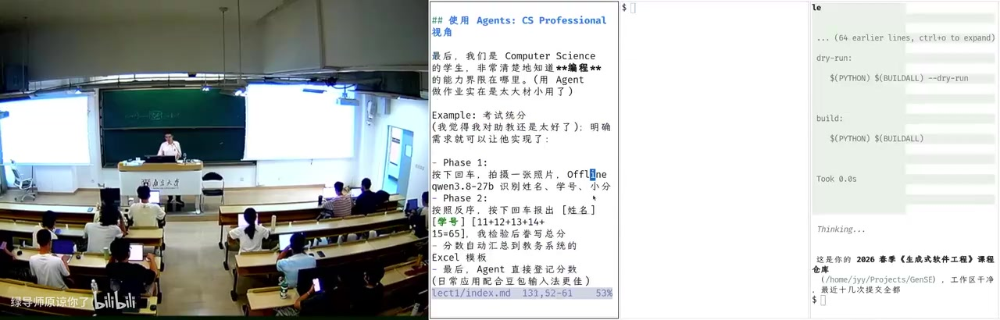

事情，同时因为 everything is code，我可以用 AI 生成你能看到的所有的东西，视频、论文、东西。我们在做，呃，我我在和一个同学做一个叫 WebFab 的项目，用一个自然语言，我三 D 打印机可以打印一个东西出来，真的东西也是 code，也是 Python 代码，生成是 Python 代码，所以能够实现这个从 bit 到 atoms。这个未来已经来了，我们看到它只会 AI 的能力只会变强不会变弱。那么下一个问题就是它什么时候来，以及我们应该怎么面对它。好，那关于面对，我们就可以进入这个生成式软件工程最重要的内容了，对吧？刚才我们就建建建立了一个思路哦，三观尽毁了，时代的车轮来了，我已经被压在车车底下了，不。

**01:15:00**

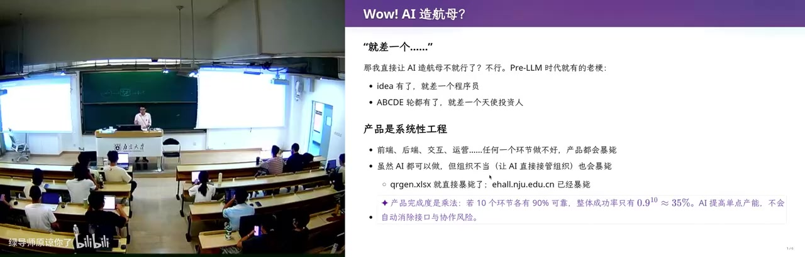

高级，AI也不是完全完美的。在 LLM 之前的时代，就有一个老梗说：“哎呀，idea都有了，我们是商学院的这个，不知道你们商学院同学有没有跟你们说过这个idea都有了，就差一个程序员了，我们就挣一个亿吧，对吧？然后ABCD轮也都有了，就差一个天使投资人了，没有人投资投资我们。呃，没有那么简单。就是AI首先AI很强，我我展示AI可以做什么，但是产品是一个系统性的工程。你你你如果要做一个呃什么外卖对吧？就是你想做一个什么外卖网站，你要做前端、后端、交互、运营，整个流程上面任何一个环节做不好，产品都是直接暴毙的。虽然AI都可以做，每一个对吧？AI学AI也能设计前端，也能做后端，也能交互，也能运营。他看过世界上所有的书，他什么都知道。但是如果你组织的不好，直接也是立即立即就暴毙。实际上。

**01:16:00**

实际上，这个呃，我的QR Code Excel，我做了一个实验，让A I去做，A I生成了完全不可维护的代码。我马上就会讲到这个软件工程内容。然后一号点、九点、一点些难用吗？难用吧，始终是。然后每年学校都会花巨额的钱让这个公司维护这份代码，就是因为他要添一个功能。打个比方，呃，我因为因为我在用这个BrowserUse的时候，我还稍微Hack了一下这个呃系统，我发现有些隐藏的字段，比如说呃，你能够看到一个学生的校区，在之在苏州校区建成之前，这个系统里面是不需要这个字段的。然后为了兼容这个苏州校区，你们写过软件的人都知道，你们对吧？你们在设计需求设计的时候，你没有想到学校竟然还有校区这个东西，数据库里就没有这个东西。然后突然有一天，你的产品经理说。

**01:17:00**

哎呀，我们两个校区选课要分开的时候，呃，对吧？当然，你你你现在是没问题，就是因为你是产品经理，就是AI说好，好，哎呀，现在你你原来系统是可以用了。我现在多了一个校区，苏州校区，我要我要把校区分开，然后AI就开始写代码，对吧？但是，但是，呃，还是很容易失败的，这就是非常典型的软件工程的失败。所以我可以讲一下刚才那个QR Gen的暴毙，它是AI是怎么暴毙的？它这个非常明确的需求，我要一个QR code的Excel，然后我只使用这个Excel二零一九兼容的公式，把输入的任意一个字符串，呃，先用Base64编码，然后转成QR code动画，每帧是什么什么什么什么什么。然后当然，我为了，呃，我我我我开始让AI做的时候，还发现这个任务经常它做着做着停下来问我，然后我说不要，这个很容易失败，然后你你不要问我了，必须把它做成，呃，做成为止。但是很遗憾，AI对这个需求的

**01:18:00**

理解是不到位的，就我说清楚了，就确实我就是要做这个东西，但是这是GPT-5.6啊，GPT-5.6依然误解了我到底要一个什么东西。GPT-5.6说说的对，就因为它看到了我的完整的slide，啊，但我没有告诉他我是怎么做的，所以他认为AI哪里容易犯错呢？AI容易在小corner case上犯错。GPT-5.6第一秒钟就被带歪了，他希望做一个对于任意的S都满足正确性的东西，这就已经错了。不是的，软件工程的第一步，不要扩大，做最简单的东西不会失败。他没有理解理解这一点，是这样这样的。呃，我我后来做了一个受控的实验，就因为第一个版本是我带着AI做的，外部团队做的，所以做的还比较顺利。然后后来我就直接把这个 speccification就这个。

**01:19:00**

告诉AI，然后AI G M五点三第一次思考了二十五分钟，然后开始疯狂的输出，写了超过三十二K的outputtoken，然后直接我的cloud cost就干爆了。他说你你直接就说我已经已经超过了默认的output的限制了，然后被截断了，然后然后他再再跑，总共跑了我我没有监管，跑了六个小时才跑完，但是对的。所以G M他一直说他他自己厉害的地方是他可以做龙华AI写的任务，是对的，他他就是后训练先人，这个五点三在这个龙华AI任务上真的做的做的很好。然后DeepSeek V四Pro也是晚上放着跑的，他已经没有办法遵循指令了。我第二天早上，因为我晚上在跑嘛，我第二天早上看的时候，他给了一个Base64是硬编码的，就是就是他用Python算了一个Base64，这这明显就不符合这个指令嘛，对吧？把一个输入的任意字符串先用六十四编码，这肯定是对吧？正常人的理解应该是。

**01:20:00**

Base64密码是用Excel公式来来编码，他已经不听指令了，他是用Python算了一个Base64，贴到那个公式框里。如果我的那个字符串改了，他的Base64是不会改的。然后我，然后我就骂他了。我骂完以后，他那个Charles说了一句说，呃，This is probably the most obvious thing。啊，不管怎么样，就是他们两个最终都完成了任务，所以Agent完成任务能力很强。呃，但他们生成的都是没有办法继续维护下面下来的AI AI系统。它和一号点九点一九七年的死法是完全一样的，就是软件工程里面最经典的死法。上来我知道需求了，我把这个需求实现了就就就好了，直接就陷入了维护的泥潭。他们没有想一个好的软件的架构，使得这个软件能够对吧有有有一个比较呃夸张的说法说，我们能不能做一个软件生存一百年？对吧？一百年在一百年时间里面，软件会发生很大的变化，对吧？你想过去的没有一百年，五十年操作系统发生了什么样的变化？

**01:21:00**

图形界面发生了什么样的变化？叫用户界面对吧？应用程序发生了什么样的变化？有没有一个软件能生存一百年？还呃还不知道。但是你看，它GPT-5.6还都不知道，还不知道。其实我们需要一个好的架构才能完成这个任务。嗯，我是怎么办到的呢？你们可以想一下，如果你们要对吧一个Quick Quiz，如果你们要实现这个Q R键，你们会怎么写？怎么prompt AI？对吧？我我我实际上是只用了少量的prompt。G M五点三在两百K上下文里面就完成了第一个正确的版本。我我就当时是我升级的G M五点三，我就想测试一下它的能力。我干了这样的一件事儿，我让它设计一个各种各样的Python类，就有点像编译器一样。比如说，我要设计一个Python的函数叫XOR，一个符号系统。比如说，因为因为这里面是叫位运算。

**01:22:00**

然后这个东西既可以翻译成Py，就既可以在Python里面直接执行，又可以翻译成Excel。也就是说，我做了一个基础设施，像编译器一样的基础设施。然后我我有什么XOR什么Concat，也就是说，我我我做了一个中间语言，有点像如果你们今天做这个AI infer的话，你们不需要一个TensorFlow这样的中间的语言。我让它先设计一个中间语言，这个中间语言既对Python友好，也对Excel友好。然后我只需要验证的是，我的每一个翻译都是正确到Excel到Excel正确翻译是正确的，到Python的结果是正确的。然后我可以在Python世界里面验证我的Base64编码算的对不对，我的二维码的每个像素算的对不对。然后我再单独验证每一个东西和Excel的翻译公式翻译的正确性、兼容性。最后一把头生成就直接正确，代码非常的干净，也不长，就可能长，但是维护性远比你们大。

**01:23:00**

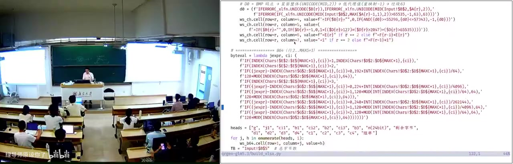

可以看一下这个，呃，看一下看一下AI stuff啊，呃，GM五点三的这个build build一下，就我真的觉得AI还是很厉害的，无穷多的硬件嘛，这就这样啊，就这么说，呃，我我我们可以看一下啊，我我我我没有我没有我没有没有把它的一些呃check进来，没事，然后再看一下这个Deep Deep Seek，呃，不同的方不同的Road Map，但是，嗯，对，反正不同的Road Map，但是呃一样的思路，就就这么说，这两份代码，我让他们把那个工作区从一个位置移动到另外一个位置，它都得修两个小时。

**01:24:00**

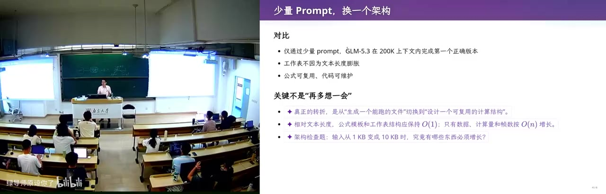

就是他不停的错，不停的错，不停的错，他不是就他，对吧？因为他所有东西都是硬件嘛，他只要改错一点点地方，他他的 verification 就通不过，他得再再想 A G N 的那样修。他确实可能能修完，但是这个是软件工程，所以在今天你还需要生成式软件工程，需要需要这门课。所以我基本上就是把我我作为一个软工人，对吧？我我其实是做软件工程的，呃，把我的毕生所学，这个虽然我觉得 A I 应该也懂的，但是我不知道为什么，就是可能是因为后训练的原因，是 A I 这个上手解决问题的这个欲欲望太强了，导致了呃，好像对我觉得可能做的还不是特别的好。好，那这里面核心的问题是什么呢？是这个世界上有有三个，就当我们要用 A I 解决问题的时候，我们有三个空间。第一个空间叫 intention，具的意图，就是你脑子里面想的是什么，比如说老板。

**01:25:00**

说我要做一个国民级的应用，对吧？这这它intention，或者说我要我要做一个小程序给我挣一个亿，对吧？这是这是那个intention。然后这个小程序它可能有些想法呀，这个这个同学们点外卖不方便，我要做一个点外卖的小程序，对吧？然后挣一个亿就可以挣一个亿了。然后这个在intention space里面，这这个是这个是是是是这已经很大了，对吧？你有有的人有的人想想做外卖，有的人就想做这个AI读论文，对吧？AI各种同学。然后在这个intention space里面，每个intention都有很多种可能的实现，对吧？这这是specification。specification就是呃呃specification就是说这个这个程序的功能是什么？选用什么样的架构？选用呃呃甚至架构都都不是，就它要满足什么样的要求，对吧？它有几个界面，然后每个界面有什么功能？就比如说这个就是specification，对吧？

**01:26:00**

以这个例子，那个intention，那个intention是我要造一个能够偷出二维码、偷出数据的Excel，这是一个intention，对吧？相当于intention space每一个点，我要造一个Excel，然后这个 specc就是刚才说的一句话，然后你看到我的这个 specc，选用不同的架构，选用不同的实现方式，像刚才那种实现方式，就会带来巨大的差别，而满同样都是满足spec的，还有不同的implementation，对吧？就哪怕是满足同一个spec的，都有大量的implementation，所以软件工程它真正的gap就在于，就说这这些东西之间是有gap，都是有gap，因为你的

**01:27:00**

Intention space里面提需求的可能是你的老板，可能是你的甲方，他没有任何计算机的经验，他就说校校长说我们要一个教务系统，然后公司说我可以搞定，Intention就在这，我要教务系统要做学校里面所有同学相关事情的信息化，没有了就这一句话，然后在这个Specification space里面又有好多好多的选择，不同的方式对吧？这个界面到底怎么呈现？我觉得这个界面设计很糟糕。然后到这个界面完了以后，这个数据库的schema应该怎么定，对吧？到底应该是分哪几张表？每个表里面有哪些列？我到底要选择Key Value型的数据库还是关系型的数据库？每一个选择都会带来截然不同的呃结果，所以这是一个这是一个孩子题。哎，我看看这个这个图片怎么打？看看。嗯。

**01:28:00**

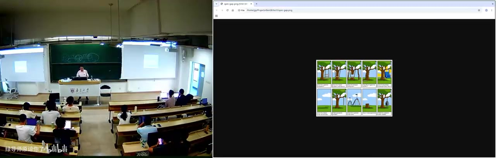

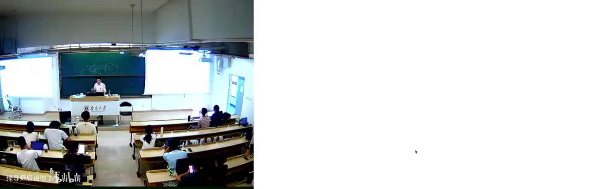

我看一下啊，这个图片，你再看一个，这是一个软件工程在很早的时候的一个梗图了，大概是，就说你，他讲的就是这个这个gap，就在各个维度上，比如说程序员所想的和这个产品经理所想的和客户所想的，它是完全不一样的，对吧？呃，这个客户是这样解释他的需求的，然后这个project leader是这样理解他的，然后分析的人又是这样想的，然后这个宣传的人又是这样宣传的，然后最后实际上这个customer要的是这个，但是最后造出来的是，对吧？造出来是这个，就这个这个这个这个这这梗图，而造成这个的根本原因，实际上就是这些space之间的这个这个gap，而当我们谈软件工程，不管是软件工程还是。

**01:29:00**

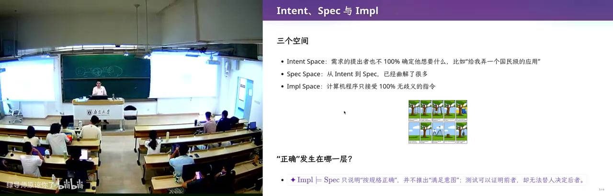

程式软件工程的时候，我们要做的事情就是补上补上这些gap，而今天这些gap是怎么补的呢？模型用的是猜，对吧？模型是猜，模型就说好，你你既然说了这句话，那我猜应该是这个吧，我就去实现。为什么呢？因为后训练的时候，模型是有reward的，我们每个人都是reward hacker，对吧？模型受到奖励，它如果任务做对了、做完了、测试通过了，就会得到奖励，所以它就会形成一种倾向，它会疯狂的立即上手去把这个任务尽可能快的完成，因为做的慢了你养不，对吧？然后它能够越来越多的做一些简单任务，这当然是好事儿，但是呃，和人我们人解决问题的方式还是不一样的。你看看我们作为计算机或者软件工程的学生，你们你们是怎么学习的？怎么弥补这个gap的？你到大一第一门课是什么？C语言程序设计，所以你先学的是这个东西里面有什么，对吧？你

**01:30:00**

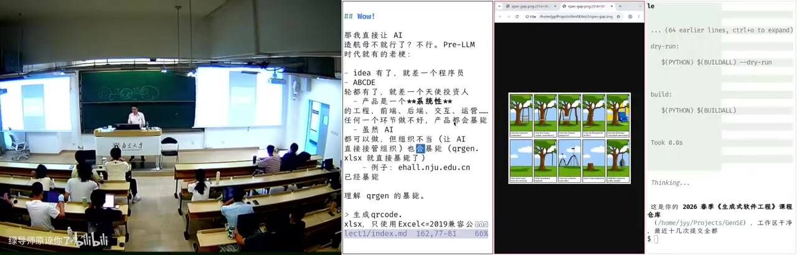

你跳出你你学习的框架，你现在学的是这个implementation space里面有什么东西，把这里的东西都弄得非常熟练了，哦，这个这个需求可以这样实现，这个需求可以这样实现，然后你再去上什么软件工程课，这样一点一点的把你对这件事情的任务给补全。但是在AI时代，这件事情当然是发生了变化，对吧？你既要阻止这个AI去乱猜，AI去乱猜，呃，你又要尽可能的发挥AI能够从A到B的能力。这个时候，呃，我想这就是我这个学期要讨论的，呃，讨论的问题，讨论的问题就是，呃，我们的生成式软件工程想要想要告诉大家，我开个头，对吧？呃，人猿神话The Mythical 9 Months，大型动物一旦陷入这个焦油坑就很难逃脱，对吧？它像泥潭一样的进去以后，而且濒死的动物又会引来各种掠食者，然后它们也进了。

**01:31:00**

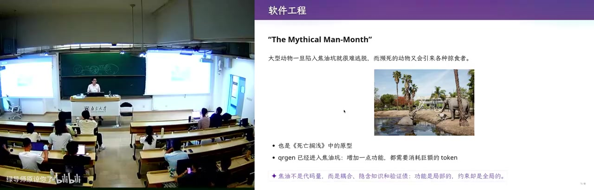

教育他们也，呃，也也出不去，也出不去。这里面有一个很经典的，呃，论断是：如果一个团队已经开始，或者一个软件产品已经开始失败了，你加进去更多的人，只会让它变得更失败，不会变得更成功。也就是说，就跟刚才那个Q R G一样，当一个产品已经开始，A I已经开始产生slope的时候，你投入更多的token，你也只会让它变得更失败。A I会不断的在它那个失败的东西上面再往上再浮起来一点，浮起来一点，浮起来一点，直到你再也付不起那个token为止。然后你看教务系统就是这样的，对吧？随着供它不断的每，我觉得每一年你打开那个教务系统，这个你都发现它增加了功能，你们也也发现了。然后，然后我的感受就是，学校又花了很多这个纳税人的钱，这个呃，anyway，这也许不是坏事，因为它促进了经济的发展。

**01:32:00**

对吧？呃，然后软件工程，软件工程研究的就是怎么样在这个 gap 实际存在的情况下，把一件足够大的事儿，就是一个真的，对吧？这刚才我们展示一个很小的事儿，教务系统是一个相对来说比较大的，就你真的去能够挣几百万、几千万的上市公司，对吧？那是上市公司，这个你是真的可以挣到很多钱的一个产业级的产品。然后再到你真的要做一个国民级的新的新的东西，它有一套方法论。然后这个方法论就是这些人在投入了billions of dollars 里面得到的教训，对吧？他管理了很多的人，每一个人都很聪明，结果陷入了呃教员坑。软件工程是有技术的，对吧？因为打个比方，呃，我我们南大有很多做软件工程的老师，比如说他做什么程序分析测试的，那他就是说，如果你生成了一个代已经在 implementation space 里面已经有一个代码了，我能不能自动的为他

**01:33:00**

生成更多的测试用例，或者生成一个代码的审查的东西，在这个代码不满足 specification 的时候，或者不满潜在的不满足 intention 的时候，我能够给你一个 warning，对吧？他就做了一件非常非常在这个 big picture 里面非常非常微小的事情。然后我们有的时候，比如说你们在课题组里面开始加入课题组做研究的时候，你们就看到那个非常微小的事情，忘记了这个 big picture 其实是这样，对吧？软件工程是一个有技术，也有人类学，也有社会学，也有管理学的部分。然后恰好我觉得在生成式软件工程里面，把他们变成了 AI，对吧？你你管一个一堆不会和你抬杠，只会 your apps do the right，对吧？我的 your apps do the right，呃，他会听你的话的，呃，人，在软件工程里面，他要研究这个人不听你话怎么办，对吧？你怎么样管管控这个团队的风险？这个人离职了怎么办？对吧？呃，跳槽了怎么办？到竞争对手去怎么办？

**01:34:00**

这这都是软件工程要研究的。然后，如果你去看，比如说一个软件工程研究领域的话，它也是一个非常广的，对吧？AI for S E S E for AI架构设计、可靠性、演化，这个软件能不能长期生存下去？Human social aspect需求，这个特别特别重要。因为越早的时候，这个gap是放大的。你在相对这是一个杠杆，你在这里微微小小的变异点，你会在这里产生巨大的变化。所以一般来说，这些大型的软件系统都是在这个点上面出错了，没有做好，导致了整体全部的呃崩盘。而这里面有一个呃，我觉得是我们现今教育体系的一个呃很大的问题。你们从高考过来到现在，你们所有的考试题都是分钟级能解决的，对吧？假设你到动物园也可以用豆包摸鱼，嗯，那你所有上了考场的题目都是，如果人五分钟解决不了，那这个题它一般来说就不会出了。所以你们长久以往，你们训练的

**01:35:00**

就是解决，就和你们训练的那个reward和Agent的训练那个reward是一样的。你能不能五分钟解决？Agent能不能五秒钟解决？最后是Agent，它有更多的数据，它有更明确的反馈信号，所以它做的比你好。你没有，如果你没有一种很强的去好奇心，想要知道这个世界是怎么运行的，对吧？一个产品到底是怎么开发的？你你你很有可能你没有这种self motivation，你就没有去训练自己去解决这种Long Horizon的问题。最后就是你解决Long Horizon的问题还不如Agent。哦，这是一个啊，当然我觉得所以软件工程挺好的，它有些课，你你我我知道有些软件工程同学在抱怨他们的课程，对吧？说说我上了文科，然后怎么怎么怎么。而且你回回过头来，在就如果你能把技术映射回这些文科的东西的时候，你会发现哦，其实软件工程还是就是就是这这就是一个文科嘛，就是一个管理学，这是一本管理学的书。呃，但它里面确实有很多呃真实的。

**01:36:00**

呃，有趣的，有趣的。实际上啊，在大语言模型的时代，软件工程失败的定义没有变，就是从intent到specification到这个implementation的翻译错了，对吧？要么就是intent和spec之间不满足，我我我做了一个东西，其实不是我要的，然后我又我做了一个实现，但是不满足我的specification，比如说正确性或者性能。哎，呃，但是今天模型模型，因为它有这种这个reinforcement learning，它对于这种真正的长程信号的reward还是做的不够好的，它更多还是在怎么样机械的完成任务。所以你会发现，不管是GPT、Cloud Fable还是这个我们现在用的，比如GLM 或者 DeepSeek，它在面对这个Excel问题的时候，它都不会去想让像我一样先去设计一个DSL，对吧？虽然这个模型有足够的智能。

**01:37:00**

可以设计一个非常好的中间语言，来把这个问题非常干净、漂亮、可维护的解决。但是AI的这个第一反应，就像大家一样，就是它已经被训练成做题家了。我们现在还没有，就现在现在我觉得还没有把这个呃AI怎么样变成一个好的设计者。就大家都说AI现在最缺是品味嘛，呃，这个好的工程品味给训练出来。但同时我也觉得，既然它能做做题家，它为什么不能有好的品味呢？我觉得可能是有的，所以我还是有危机感的。虽然就是说，我觉得这这门课我现在这么教，可能三个月以后，或者我这个这门课还没有结束的时候，我讲所有东西都已经没用了。这都是有可能发生的。就是我在上着上着上着上着这门课，所有东西就就不存在了。呃，因为我我我其实非常确信，对吧？它既然能解决数学问题，它既然能解决这种编程里面很细致的逻辑，它为什么不能？因为它都知道这些好的设计，它都见过，它为什么不能从它的记忆库里面找到？

**01:38:00**

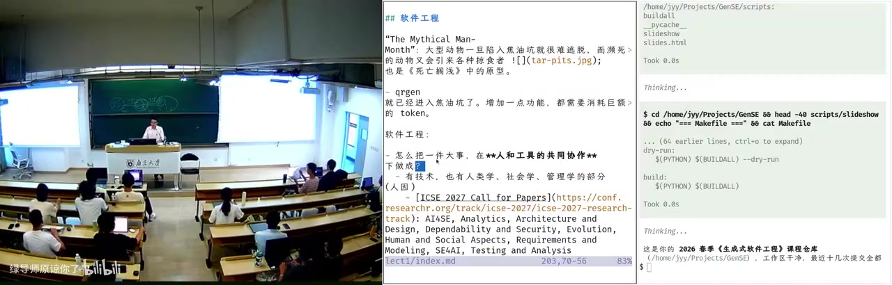

那个好的设计，然后来解决这个问题，我觉得是可以的，甚至甚至我有一些skills就能够朝这个方向来做。所以我觉得这是一个都值得我们深思的呃问题。你们可以回去想一想，对吧？怎么阻止主导PR的开发，然后怎么设计一号的人只有。但是可以告诉大家的是，GPT-5.6 所给我的答案非常糟糕，就是这两个设计都是一定会失败，就是他给的一定会失败的软件工程呃设计。然后我们可能会对我们的做一切的方式可能都会都会发生变化。我不知道，就如果AI连品味也学会以后，呃，会发生会发生什么？所以最后一页，首先，古法编程已经死了，对吧？呃，AI在完成一个单个任务上已经无人能敌了。这个软件工程暂时还没有死，但我希望每一个同学呃，经过这一门。

**01:39:00**

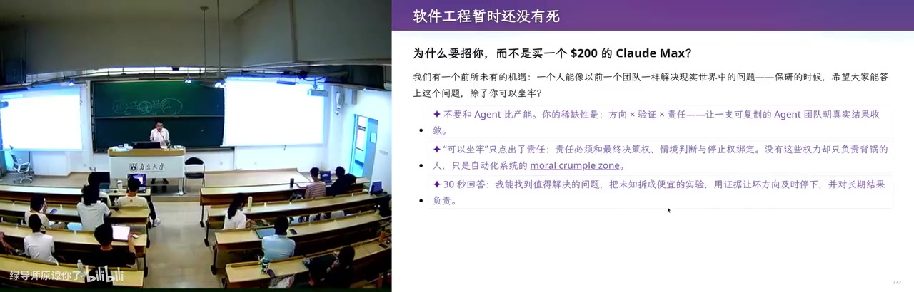

课的这个呃可以说是探讨吧，我也不能说我我我我做的对或者怎么样，呃，试图回答一个问题，在保研的时候你的导师问你，为什么我要招你而不是买一个两百刀的Claude Max，对吧？呃，怎么接住这个这个问题？我觉得这个这个问题上GPT-5.6回答的还挺好的，虽然虽然它做不到，对吧？他说，能找到能值得解决的问题，把未知拆成便宜的实验，呃，用证据让坏方向及时停下，并对长期结果负责，这这这个好的回答，呃，但是我发现GPT-5.6还是做不到，呃，很有意思。好，我今天课就到这儿，然后我会把这个今天的课程的那个内容重新切片、重新整理，但可能不会马上。呃，我应该会有一个这个生肉版，就是我我剪剪辑，就把我今天上课的流程剪一下，会会会发布一个版本，大家可以对比那个我我可能是精修过的版本。好，今天下课。

