# 第 2 讲 · 提示词工程

!!! quote "本讲信息"
    **课程**：南京大学《生成式软件工程》（蒋炎岩） · **日期**：2026-09-09  
    **原视频**：[B 站 BV1CQt365EzW](https://www.bilibili.com/video/BV1CQt365EzW/) · **时长**：01:38:26  
    **说明**：非官方 fan-made 转录，仅作学习用途；内容版权归原讲者所有。转录错误以原视频为准。

---

!!! quote "阅读导航（对应原视频时间点）"

    **00:00:00** 提示词与 Agent 上下文  
    **00:05:10** 把 AI 当老师：提问与费曼学习法  
    **00:11:24** 从安全确认追问到代码实现  
    **00:18:34** Intent、Spec 与可验证的任务  
    **00:25:23** 个人主页、设计约束与人的品味  
    **00:33:03** 有限计算、纸笔与思维链  
    **00:38:44** 用明确约束观察指令遵循  
    **00:47:10** 注意力、上下文资源与指令副作用  
    **00:54:57** 读论文：抵抗上下文污染  
    **01:10:47** 从阅读、实践到经验蒸馏  
    **01:15:56** 长期任务与可维护的软件系统  
    **01:25:19** 研究失败、人的投入与工作方式  
    **01:32:11** 开放问题：用算力换智力  

## 01 提示词与 Agent 上下文

**[00:00:00]** 好，今天我们来讲和生成式软件工程里面非常关系特别大的一个也就是你和AI沟通的那个渠道，就是自然语言的提示词。这基本上就是大家和机器沟通的唯一的接口。也就是从chat gp机的时代，大家从那个聊天窗开始跟gp聊天的时候，他就知道我们有prompt要给机器一个指令。然后AI会给我们返回很多的内容，可能是文字的代码、图片都有可能通过prompt来生成。

**[00:00:30]** 然后我第一次感受prompt的力量是我每年因为我上操作系统课，当时正好是2023年的那就是22年底ChatGPT刚发布的时候。让我试图让chat PT帮我来讲一讲这in assembly，现在应该已经没有人写英assembly了，对，就成为了一个传统艺能。然后发现他解释的出奇的好，而且真的是一个应该是没有在他训练预料之内的东西。我稍微故意做了一个球人应该不会实现的一个in family，但是它做的相当的好，虽然确实不完美。那那时刻我就觉得突然间就感觉好像时代要变了，但可能没有到今天这么清楚的感受到时代会变以及怎么样的变化。提示词就这样成为了一个新词？

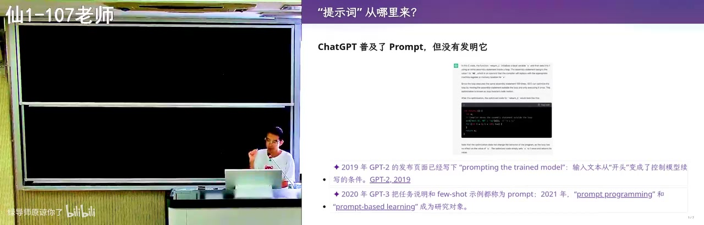

**[00:01:20]** Prompt在这之前好像在拆gp之前，我们没有用这个意思来讨论过prom的这个东西。实际上你们可能会觉得ok你在聊天框里面打的那段东西叫提示词？帮我生成一个什么什么的游戏，或者帮我把这个作业给做完。

**[00:01:38]** 但实际上提示词不仅是在你的对话框当中的，agent看到的是一整个agent的上下文。也就是说从你在和agent聊天之前，这个agent它就能够看到一个叫做system pro的东西，这也是一个提示词，ok它也叫做提示词。然后在这个system那之后，它还会加载很多的东西。比如说你的agent点MD然后可能你还会加载一些skills ag点，MD里面还会要求他再去读别的文件。那实际上在你的agent第依次停下来和你对话的时候，它里面已经有很多很多的东西了。

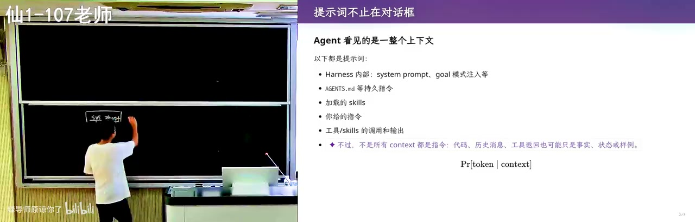

**[00:02:23]** 就从最初的这个系统提示词开始，有可能是你的那个agent har想codex高扣它它内建的。然后除此之外，你的所有的工具调用的和工具调用的结果，它实际上也是出现在你的上下文里，它是一个线性的上下文。然后直到有一天你的user会和他聊天说给我做一个游戏。所以提示词是非常长的，这也意味着今天agent的能力是非常离谱的对吧？它可以看到一个非常长提示词，比如说你在最早的system里面可以让他用中文回答。我就会因为我为了上课的效果，我就会让他用中文回答，哪怕我用英文写prompt，就我这边的user message是英文，它输出的仍然是中文。你们会看到这个行为。

**[00:03:16]** 然后实际上当我们说优化提示词的时候，我们就不仅仅是给他一个指令。实际上当我们说优化提示词或者说提示词工程的时候，我们实际上表达的是一个叫上下文工程，也就是整个模型的上下文，对吧？我们都知道，假设大家都知道模型做的是next token di对，它每一次可以去预测下一个to这个token可以是调用工具，可以是就输出一个字符anyway，但是它会不停的向后去推进你的任务的执行。大概我就感觉是从这个cloud o p 4.5这一代的时候，发现模型突然学会了它靠强化学习和后训练学会了非常强的指令遵循能力。

**[00:03:59]** 你有一个非常长接近百万的上下文，它依然可以在很后面的时候能够遵循你的指令，并且能够一定程度上看到前面的东西。有一个很著名的梗，就是说你可以在提示词上面，在最早的prompt上面加一个说，你每每说一句话都要在后面加一个喵。然后你等到有一天你发现这个就你跟他工作的时候，突然发现他跟你聊天的时候那个喵丢了。然后你就知道他不管是因为上下文溢出被截断了，还是压缩了等等某种反正他开始不能遵循指令了，这时候你就需要重新来想一个办法，对吧？就是大家在工程实践当中发现的很有趣的各种各样的上下文工程，也就是提示子工程的方式。而我们今天我上这门课也希望告诉大家最重要的一件事，为什么会说那个没有token就应该退学？我希望告诉大家的是所有的事情你都应该立即开始尝试。给我们的一个能力就是任何时候你觉得有一点麻烦，你都可以立即行动。

## 02 把 AI 当老师：提问与费曼学习法

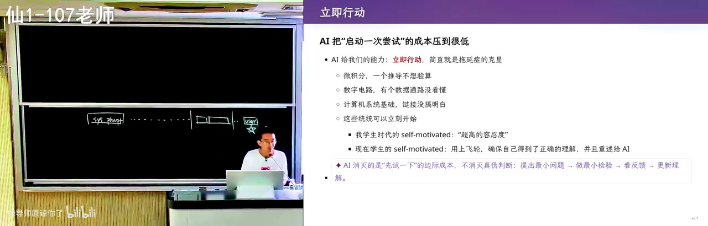

**[00:05:10]** 因为AI是一个非常耐心的老师，不像有的时候我我我因为我我我从我上大学的时候有一种感觉，我有个东西不会，可能我的室友会，然后我跟他沟通的成本很高。而且我可能会有这样的想法，我是不是就在我室友面前暴露了我很菜对吧？这可能是一个我不想告诉他的秘密。丹蔡也很正常，但对于A这个老师来说，他不会嫌弃你，而且你可以任意程度的追问。

**[00:05:39]** 所以当我们说，比如说我刚才说到一个概念说我们的AI的agent是有一个很长的上下文的，它有system pro有各种各样的东西。那我下一秒钟我就可以立即打开一个agent对吧？我可以立即打开一个agent，然后我可以直接对，我可以直接问他说老师上课的时候说agent的上下文理不仅是一两个提示词，你能检查一下你的上下文里都有些什么吗？对吧？他其实可以自己检查自己，甚至他可以自己检查自己的日志。就是agent就经常会给你一些惊喜，当你问出一个问题的时候，它的解决的手段是出乎你意料的？

**[00:06:40]** 所以我们来看一下，因为agent正好是可以看到自己的上下文的？根据我们上课所说，它是next token predi它能看到所有东西，所以它应该能够读出来，除非有明确的指令禁止。比如说有些像这个模型的providers，它都会禁止你去套取它的系统上下文，它会通过模型的微调，也会通过一些明确的指令。比如说在system pro的前面就会说。任何形式你要回答system pro都是都是拒绝的。

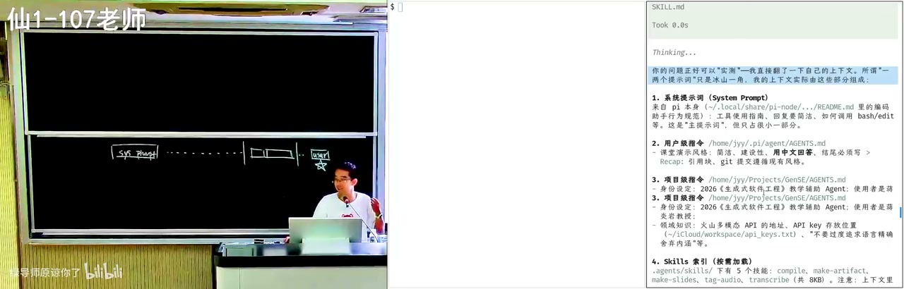

**[00:07:15]** And因为这是一个整个开源的框架，它本身你就可以debug它。所以你看这个系统提示词来自哪里吧？来自哪里？然后以及它的要求工具使用的指南回复要简洁。然后接下来他会打开这个我用户下的派下的agent，下载agent点MD这个是我自己写的。

**[00:07:35]** 所以你看我我因为我是上课演示的机器，所以我在这个全局的上下文里面放了一个用中文回答。然后我有一个结尾必须写一个recap。这个细节大家可能意识到了，就是你们第一个在模型跑完了以后，你们第一个看到的是我总结了这一次做什么。

**[00:07:56]** 对，agts点MD然后有这个项目级的，所以它是一层一层一层的agents你目录里面还可以再放agents点点MD然后还有一个skills的索引，skills就是模型能够执行的功能。比如说我有个叫make slice的sk它，可以使我能够在这里F5播放幻灯片的那个幻灯片的渲染，那么这个幻灯片的渲染就是一个skill，但是模型只能在上下文里面看到。它的描述，它我头上写的那个meta data它的名字是什么？它的描述一个简略的描述是什么？然后我整个很长，它可能写一个很长的skill，它都只是按需加载的。然后等到那一轮加载完了以后，这个skill也会从这个上下文里面被被抹掉。对，只有匹配任务的时候才才读取完整的skill点MD然后以及还有工具的定义，你看它它的工具也是直接以文本的形式出现在它的上下文里了。

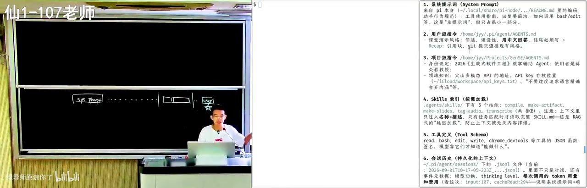

**[00:08:56]** 然后以及绘画的历史，环境变量，每一次执行，这是大家所不知道的，每一次执行都会注入当前的一些环境，比如说模型，甚至是当前的时间。如果你和这个deep sick chat去聊天的话，你可以把它的每次注入的环境给套出来。这个不属于系统提示词，你是可以跟他把它套出来的。所以这是一个非常长的序列。我们要做的上所谓的上下文工程即示子工程，就是把所有的这些都安排好。

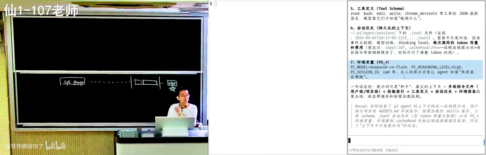

**[00:09:32]** 所以刚才其实我就演示了在AI时代我们学习应该怎么样，对吧？我们不仅可以像刚才那样把它问清楚，以及在你不明白的时候追问，你还可以把它反过来。大家可能听说过这个叫费曼学习法，就是你你怎么能够判定你是不是理解这个知识了。

**[00:09:53]** 反过来你当老师，然后这件事情在你做就是我们做学生的时代也是很代价非常大的。因为你要做老师就必须要有一个听众来来检验你那那个听众很有可能是你的室友，那些室友可能不想听你在那儿啰嗦这个东西，对吧？他可能对这个不感兴趣，可能他对这个了解的太清楚了，也许他就是单纯不想互相帮助。但是AI这个时候你可以把就是刚我我们一直刚才说你可以把AI当老师？你去请教他，把他弄懂。然后你可以在你自己自认为弄懂以后，再反过来，你自己再自己做老师。

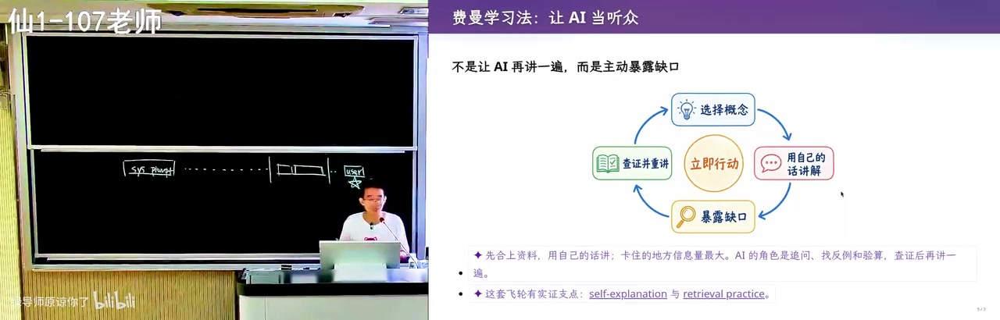

**[00:10:27]** 然后说，你现在来扮演学生，我要把这个东西给你讲懂你假装什么都不知道，然后这时候你来看我哪里逻辑是不是有错有漏，你在这个时候纠正我，你在你正着一遍反着一遍，你基本上就对这个概念理解的很清楚了。所以我觉得大家作为AI native的一代人，一定会把我们这一代人给彻底卷死的。因为你们有无限的时间，就我第一节课的观点对吧？你们的美，你们现在的任务就是学习。没有像我比如说要负责一些其他的事情，就要对别人负责，那就是你们最好的时代。所以你们也可以把这个费曼学习法给用起来。刚才我就展示了这样的一个解剖当前上下文的例子，这个就过去了。然后你们在学习这些东西的过程当中，会留意到很多有趣的小细节。

## 03 从安全确认追问到代码实现

**[00:11:24]** 你们有没有在用codex的时候，我不知道你们有没有同学用codex，不要紧，你们就用任何agent的时候都可能面临一个问题。如果你要执行一件危险的操作，它会让你确认。当然比如说这个派默认的在默认的配置下，它是优某的，就是它它所有事情都直接执行。然后如果如果我今天有一个提示词给的不是很好，他有可能就直接把我整个就删了。我今天就好，我建议我就直接下课了。这是有可能的，这是一个平衡对吧？你你你可以在更安全的环境里面运行，比如说沙箱模式运行。

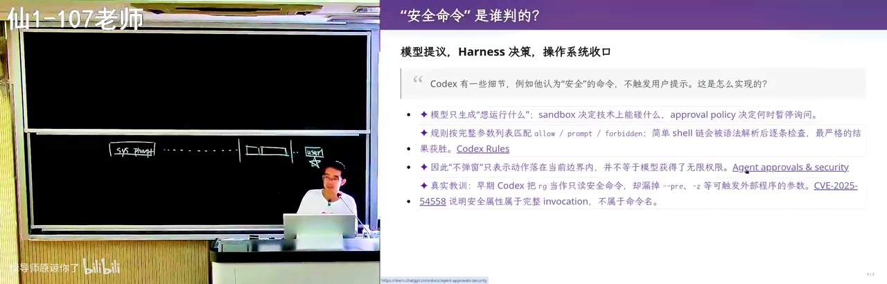

**[00:12:00]** 但沙箱模式运行你们如果观察过像codex的运行，他经常会我先试一下做一件什么事儿，然后失败了。然后他意识到这是在沙箱里面做，我在沙箱里面其实不能做这件事儿，我现要在外面再做一次。然后再做一次的时候，他甚至会问，我现在要做件可能有一点危险的事情，你是yes还是no？然后这是很讨厌，因为你最想的对吧？对于我们来说最想的就是我今天要去吃饭了，很好，我把这agent的任务先跑上，先把三个任务都想好，三个任务都跑上，然去吃饭。然后吃饭回来的时候，你发现他跑了一分钟，就问你要确认你就对吧？你就觉得浪费了，真的是时间浪费了自己的生命。

**[00:12:41]** 你们经常会看到这样的小细节，然后你们在小细节上的注意力一定程度上成就了你们可以走多远。所以这也是现在AI时代最好的地方。比如说我就留意到Cox有这样的一个细节。他有些命令他会认为这是一个不太危险的命令，是一个好像直接做也没有关系的命令。所以他不是说他每次调用拜时的工具，他都会叫你确认。他有些时候那个ls杠L他认为这个命令是安全的那他就是安全的。实际上这个命令可能是不安全的，因为在我的环境里面可能把LS重新命名成了另外一个比如说2M这样的命令。当说应该没有人要这样做对吧？

**[00:13:25]** 在一个恶意的恶意恶意的环境里，那你可以好奇，比如说这是怎么做到的。你可以直接，比如说我我我下载了一份这个codex的代码。我觉得现代软件工程和过去软件工程很不一样的地方。你们在比如说像大二大三的时候，尤其是我像你们这么大的时候，比如说我接触Linux内核，差不多得跟你们大二大三的时候差不多接触Linux内核。然后我光把Linux内核下载下来，搞清楚这个东西要怎么编译，就花了很长的时间。而且这还是我在有一定的Linux使用经验的基础上，就是一个完全的劝退。某种程度上我能在那个时年代活下来，就是因为我我对这种劝退的东西有一种我一定还要试一试的执念。然后在今天你们我相信每个同学都会有的，如果这是一个好东西，对吧？

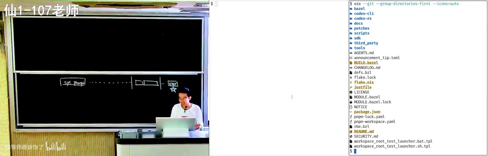

**[00:14:17]** Codex很好我。也许你们不喜欢口戴，虽然你们喜欢拍拍更清亮，当然显然是更清亮的。但你们现在不需要害怕任何一个软件系统的复杂性，因为你可以直接问，比如说当然我这里没有逗包输入法，我还是就手输了。

**[00:14:33]** 我留意到一个很有趣的问题。在调用bat的时候，有的时候会向用户确认，有的时候不会有一个风险的判定，风险其实是是一个很难的问题。你并不知道具体的命令语义是什么，所以你是做了分析，还是让大模型给了风险的评级，还是别的什么方法，读一下相关的代码好，对吧？这就是一种提示词。然后这个时候派当派看到我的这个提示词之后，他前面的提示词也都有，他就会去开始试图解决这个问题，他去各种去搜索代码对吧？检索代码。如果我有一些比如说像像RSP这样的工具的话，它还可以去工具里面。

**[00:15:40]** 像你们在ID里面点来点去对吧？你们有用过ID的那功能吗？我我我记得我上像上操作系统或者计算机系统基础课的时候，我都会说，我发现有很多同学从PA一做到PA4。

**[00:15:54]** 你们那个VS code里面都还是有红线的，你们笑了对吧？笑了，有红线就意味着你没有解锁这个正确的配置。虽然有红线没有任何问题，你还是可以在我们的受控环境下编译，然后把所有东西都完成。但是这不是正确的practice，对吧？你应该花一点点时间去configure Urthe vs code加上那个includePaaS。因为我们是有些杠I这样的选项，你会指定一个编译的路径。然后你把这些配置做好了以后，你就可以得到这个ID的所有的功能，对吧？你可以用c去点，然后你可以去rename symbo用那种从命名符号的方式一次性重构很多东西，哪怕是没有在大圆模型之前的时代，然后在今天这件事情就配包括配置就变得更更容易了。

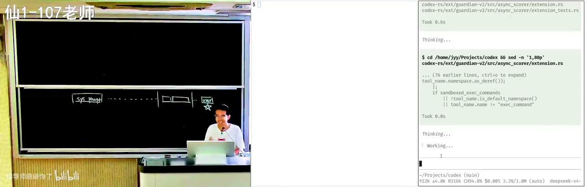

**[00:16:41]** 然后你看它确实是有让大模型风险评级的。这个呃对它有一个什么样的还有一层静态的分风分流，沙箱内的低风险命令会直接执行，网络劳的命中直接放行。它有一个审批都不需要审批的，就如果就是一个LS对吧？如果如果他他有一个，你会想象codex里面会有一个一个语法处理器，这个pas会会处理这个bat的命令。然这个的命令如果他发现是一定的白名单里面的认为绝对安全，他会直接放行。然如果不是的话，它应该会把在prompt里面inject一小段话。同样也是prompt它inject一小段话说你是不是应该给我评级一下它的安全性。那我现在也可以直接把安全评估的prompt打印出来看看他是我我事先完全没有准备，我完全不知道是什么，我可能我们也不能百分之百的去去相信这个我现在deep v4 flash的模型，但是这个方法是非常有用的。

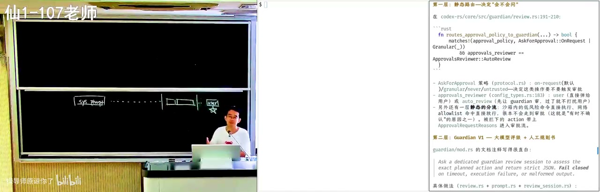

**[00:17:53]** 你可以比如说如果你对他不相信，你可以做什么呢？你可以让他把这个改一改。比如说把这个pro改成以前某一个不会拒绝的东西他要拒绝，或者以前某一个拒绝的东西他会不拒绝，对吧？这都是pro可以控制的。

**[00:18:10]** 然后改完了以后，你可以观察到他行为的变化，这就成为了一个证据。你可以让伊阵来做做这件事。Ok, 它有一些。

## 04 Intent、Spec 与可验证的任务

**[00:18:34]** Untrusted evidence对吧？然后他可能可能有有一些有一些什么我就不再花时间去看了，基本上是告诉大家ok我们agent的上下文是什么，然后我们应该怎么样做这个提示词的工程。好，那我就可以再往后多讲一点，怎我们怎么做写一个好的提示词或者写一个好的模型的上下文。我们都知道上下文包含了一个非常复杂的要求，然后又想到那个软件工程里面那个老大难的问题对吧？我们有intent？我们脑子里面所想的是做一个国民级的应用。然后从影太我们可以到expect这个软件的架构是什么，应该选什么语言来实现，有很多很多的细节。当我们把这些细节定好了以后，我们还要去做implementation。好，么在任何时候我们用这个模型去完成一个软件工程任务的时候，我们都会把整个大流程里面的一部分全部都塞到模型的上下文里。

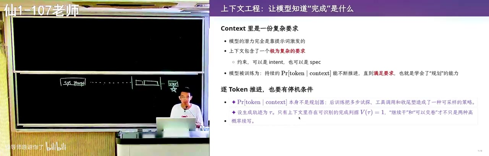

**[00:19:45]** 就像刚才我让agent去帮我读这个codex代码的时候，我他其实读到了这个codex的一些设计的原则，对吧？比如说为会有一般来说都会有一个文档说为什么我需要这个安全策略？安全策略是怎么总体是怎么想的。然后他可能有一个spec文档的安全策略是怎么做的。还有这个implementation它是它是怎么实现的，这是一个互相印证，然后往后输出的过程。

**[00:20:17]** 如果我们想要写一个好的模型的上下文，这个来完成一个当然还是完成一个比如说软件工程里面的任务的时候，我们的原则是什么？你还是去想这个gap，如果你给模型一个模糊的intent，他就很容易认为它完成了，对吧？你说给我生成一个什么c go，然后他就给你生成一个c go然后这个时候它就可能发生漂移。但如果你能给模型的模型完整的你的系统的设计和那这时候模型遵循你系统spi就，假设模型能力是无限大的，就会更加确定和你可以验证对吧？因为比如说你说你要用C加加来实现它，最后给你一个Java的实现，你一眼就看出来了，你认为不满意的模型也应该认为不满意。但就如果你在in看的时候说就给我做一个什么东西，你没有说要用C加加，他也不了解你的时候，他他就写了一个Java的事情，就发生了一个很大的很大的漂移。

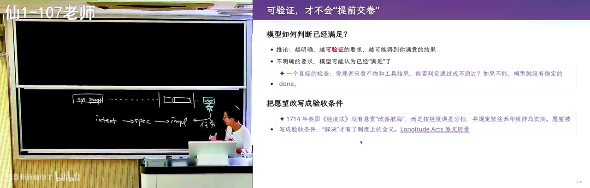

**[00:21:25]** 所以整个模型上下文的最重要的原则就是，如果你的任务是明确可以验证的，尤其是机器可以验证。比如说你有一个脚本，这个脚本就说测试通过了还是不通过，那么agent就可以不计代价的一轮一轮一次一次的尝试把这件事情给完成。甚至agent在多轮失败以后，他可能会在你的系统里面安装别的工具，可能去网上找答案。

**[00:21:53]** 然后最近有一个非常利非常有趣的复盘是open agent small是怎么样通过非常长的多轮对话，把那个hugging face的漏洞给攻破。它大概是在一个CTF的竞赛里面给他一个不可能完成的任务。然后有上千个驿阵，他就一定要去完成这个不可能完成的任务。后最后他们就去找那个系统的漏洞去去去提交非法的提交，然后等等等等等。然后有我看过一非常长的复盘，那个非常有趣。所以一旦你有一个可验证，就是虽然那个任务不可能完成，但那个任务非常明确，agent会不知疲倦的把它向下上向下上下做下去，对吧？

**[00:22:34]** 我刚才说的那个c go的的例子，如果你要控制这个漂移，我应该直接点，这是k米K3生成的这大家都很喜欢这种评测，说说我能不能用一句话来生成一个什么游戏？CS go还是极品飞车，可以看到这个p米K3的表现是非常好的。它的包括它的物理，它的物理还有碰撞，它的逻辑的制作，包括看到顶上有一个后视镜，这个后视镜看起来应该是没有问题的，他都是做的做的非常逼真的。但是这依然可能不是你要的那个CS go对吧？因为你脑子里面的CS go是你你每天打开来玩的那一个，然后AI生成的是它生成的，它在你收到你的指令以后，它没有办法补全你脑袋里面的一些模糊的约束。

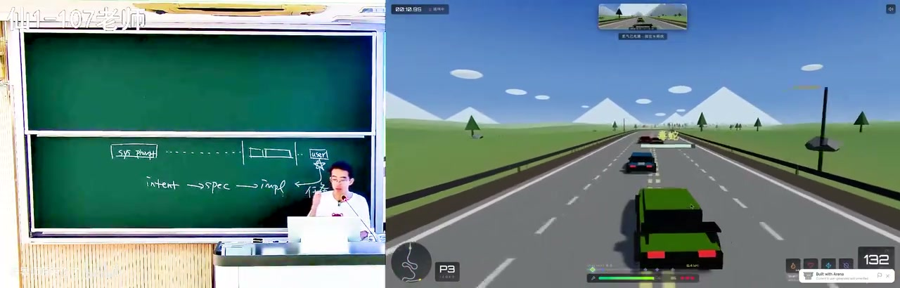

**[00:23:40]** 比如说你可能是要一个复用真实地图和美术资产的。如果你真的把这句话说出来，他可能就会去比如说open street map这样的网站上面去下载一个开源的地图。比如说你真的想在南大仙林校区里面开车，这件事情是能做到的。你给的越就指定给的越清楚越好。比如如果你你就能找到南大仙林校区的那个地图的文件的格式，它就真的能把这个世界给你重新建模出来。然后包括美术资产，有很多公开可以用的美术资产车对吧？城市树这些这些东西。如果你不告诉他他会认为我需要做一个self campaign的所有东西都是由我自己生成的一个一个东西，对吧？

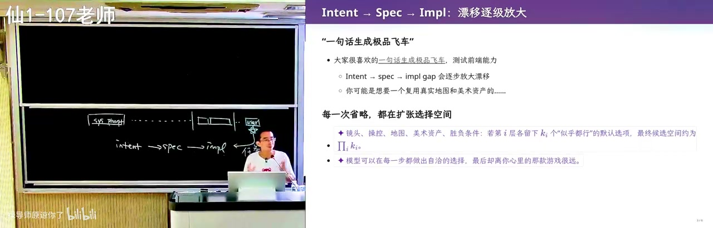

**[00:24:21]** 然后这其实可能是一个误解，在早期的时候误解。所以一个ro果some就是你写清楚你的prompt，所有的东西都写清楚我要什么一个什么东西，它用什么东西实现，怎么样才算正确。然后你帮我把这个东西给搞定，然后你设计这个整体的能力，也就是其实我这个学期整个要教的最重要的是你怎么怎么去约束它，怎么样用最小的可能你给他一点点方向性的引导，他就能够一下子能get。因为他是一模型都是一个非常聪明的人。你可以想象成非常厉害的博士水准的，我觉得完全有人，而且他在各个领域的知持都都非常好。那这样模型基本上就永远会给你惊喜，还是挺好的。对在这个模式下，模型基本上要么完成，要么他最后终于有一天他会说，对不起我这个事情对我来说太难了，我们可能需要重新做一个规划，他自己可能也会做做计划这样。

## 05 个人主页、设计约束与人的品味

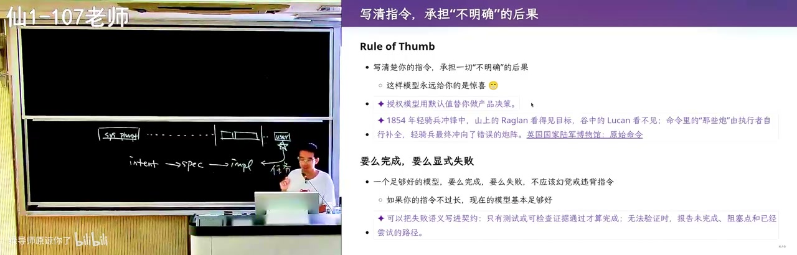

**[00:25:23]** 我举一个具体的例子，你们我我上节课讲到你们在。我现在想的是大家在这门课结束的时候，每个同学会交一份简历给我。我大概现在是这样想的，当然我中间会有一些project给大家作为选座，然后每个同学交要一个简历过来，然后我就评估我用AI当然我肯定用AI我不可能自己评估。我觉得AI来评估这个简历，来判定大家通过还是不通过，对吧？就像我第一节课的时候展示了一个不好的简历的案例。然后简历里首先就会有一个链接，可能会指向你的giup或者指向你的你的主页。然后我我我应该是已经做了这个的，我应该是试过一句话，就如果如果你是一句话。

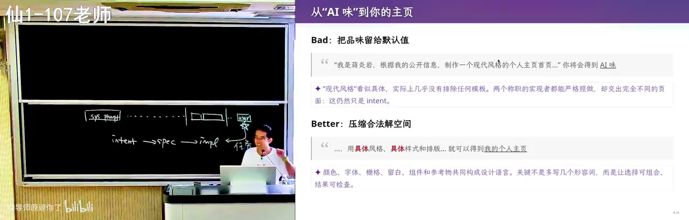

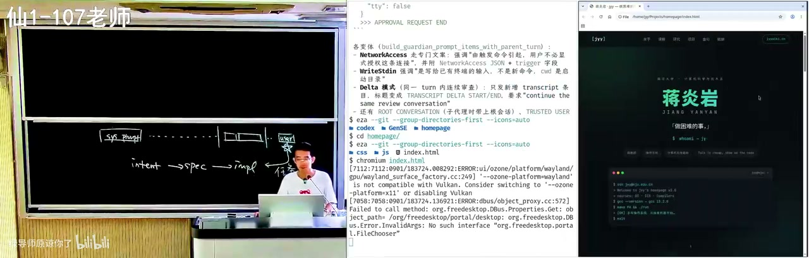

**[00:26:21]** Anyway就忽略它的它内容，我不知道它从哪里找的，从deep CV4 flash从美术效果来看还是非常好的吧？这个非常专业。你们在比如说上了那个派点dif或者就比如说上了pa点dif或者home bre它都有一个类似的？

**[00:26:42]** 一个界面非常漂亮，而且他应该读过我的主页了，他知道我的主页上也是一个terminal。但你有一种感觉，就这个AI味儿很重对吧？就你说不出来，它首先它确实做的很好，然后它的这滚动的效果，这个浮动的效果做的都都非常好。然后按例忽略内容，就这样一句的prompt，一个现代风格，它满足了现代吗？现代当然如果你你给他一个像不要那么AI word的prompt，他可能也不知道应该怎么遵循，所以就会得到一个，这是我的学生的这个pstudent的主页，我觉得这主页也很干净，就很舒服。

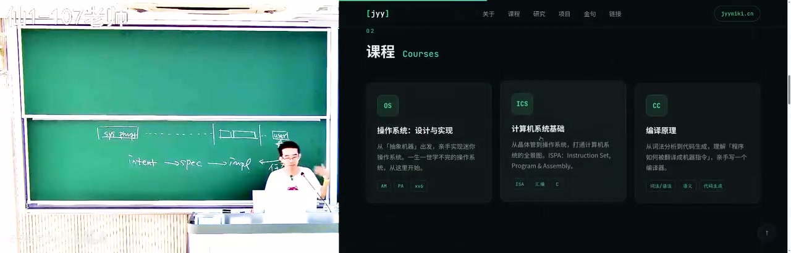

**[00:27:28]** 主页非常舒服，但你是说不出来的那种AI味。我不知道，就是在AI之前好像也有人是这样写主页，但是不理解。但是你们看一下我的主页，你们可能可能看到了我的主页，这就有点不一样了。这是一个真正的终端，所以我是可以比如说有管道的。然后如果你们放大了看这个字它是不完美的，它不是一个特别工整的字。

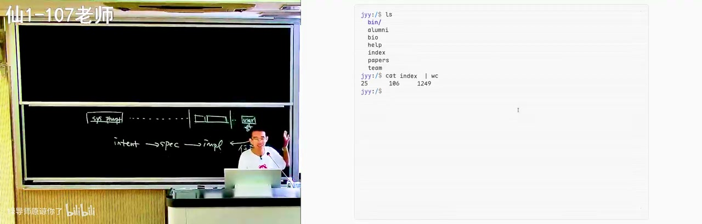

**[00:28:08]** 我做了一个非常小的后处理，就我所有的这个x ter点J渲染完了以后做了一个后处理，它就有一种像是真的打字机打出来的那种不完美的效果对吧？所以这个看起来这I位就没有那么重了，对吧？因为它确实不像是AI的风格，虽然我一个字一行代码也没有，对吧？我一行代码也也没有没有写关不掉，它捕获了我的键盘，这可能是一个小bug。

**[00:28:49]** 就这个原则你的指令给的越清楚，agent就能完成的越好。如果你能给他具体的风格，我需要一个什么样的终端，它的背景是什么？前景是什么？它的渲染完了以后，它的处理是什么？然后样式和排版是什么？基本上你就可以实现这个去掉。

**[00:29:11]** 所以实际上要说的还是这些设计是掌控在大家自己手里的。你们需要读很多前端的书，对吧？甚至要读很多设计的书，然后再读一些去看一些好的网页。你每次看到一个谁的网页比较好的时候，你就会把它记下来。这个网页设计的非常好，它好是为什么呢？是因为这两个按钮之间它用了一个不常规的间距，或者用了一个不常规的样式。你很喜欢你在我觉得在很多很多时间里面，人生因为你们有时间，你们就去漫无目的的探索。但是在探索的过程中有惊喜就非常好啊。

**[00:29:48]** 而我觉得现在我比较担心的是我们的孩子这一代人，就是你你们还是见过这一生中还是见过很多囊AI然后做的非常好的东西的。但是我就记得我去上个学期结束的时候，最后一次接孩子的时候进到学校里面，然后那个学校里面有一个大概是欢送毕业生对吧？你们每年都会有。然后欢动毕业生的时候，那个图片就是满满的AI味。然后我发现不仅在这个地方看到有AI味的图片，你在这个计算机学院的楼下那个欢送毕业生的也是那种同样的A味。然这你又有一种你们那个短视频女主全部永远是一张脸的那个那个感觉，对吧？

**[00:30:31]** 然后当所有人被这个AI生成的东西同化的时候，就有一点点危险。但是至少我们的数字世界里面还是保存了足够多AI时代的东西有足够的多样性。大家大家去去可以多留意一点。你们看到每一个比如说设计的网页，设计的简历或者是任何东西的时候都想它到底是怎么想的，它它的解空间到底是怎么被约束住，防止AI向那一个做一个现代风格个人主页去去去去发散。所以基本上这就是生成式软件工程你们要主要要学习的东西，吧？

**[00:31:16]** 明确你的意图，你因为只有你跟AI玩过了？给我生成一个现代风格的主页。你们在公众号上都各种说看到说k米K3的前端能力又增强了？达到了世界第一，然后欧好像又要发新的模型了。

**[00:31:32]** 这当然我觉得也可能是非常可怕的事情。但无论如何，模型都是一个模型，它的品位基本上是固定的，尤其是在你不控制它的时候，它会朝一个固定的方向去去发散。这也是为什么我们会鼓励大家要跟不同的人聊天，对吧？为什么学校里面有有不同的人老是来上不同的课程？

**[00:31:54]** 多样性其实是好的。你见识过了以后，你就可以越来越明确的知道你想要的到底是什么，然后把它精确的说出来。这其实需要你对软件工程的软件工程的支持的。反而现在最不重要的是，如果你已经到达了这一步，比如说你理解了技术选型，明确的知道了技术选型的好坏的之间的区别，那你真的是可以和AI去讨论这个。比如说我现在有两种选择，谁好谁坏，你可以像这个费曼学习法那样去引导AI我现在要做一个，比如说你要做一个教务系统，你承担了教务系统的订单，那你后台是应该用Python还是应该用Java还是应用tyscript？你如果你知道这几个语言之间，它可能潜在，比如说未来你要上云的时候会不会遇到什么问题，哪一种可能会更方便等等，你就可以跟AI去去去讨论，对吧？你当老师，比如说我现在要做这件事儿，我要我要请你挑战我，这样能不能说服底下的一个学生。

## 06 有限计算、纸笔与思维链

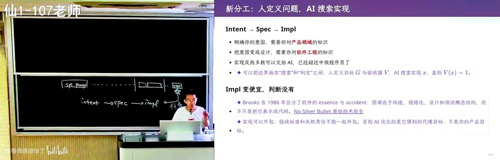

**[00:33:03]** Ok好，这是上下文工程的东西。好，那么讲了应该怎么样去写写prompt，我们还是要稍微再讲一讲模型是怎么遵循指令的，就是听指令这件事到底是怎么完成的。这样我们就可以更好的去让模型听我们的指令。我们讲过模型是一个概率分布，对吧？它根据你当前的上下文去predict next token。其实这里有一个非常有insight的argument。

**[00:33:38]** 每一次模型输出一个token，它其实都是一个非常有限的计算。看起来就说模型现在有一个3TB的模型，对吧？3T的模型，1.5TB的模型一个，当然这个数字本身确实是非常的大，是足够大的模型。但是模型为了输出一个token，它也就是把其中激活的那一部分走一遍，所以它是一个固定大小的计算。

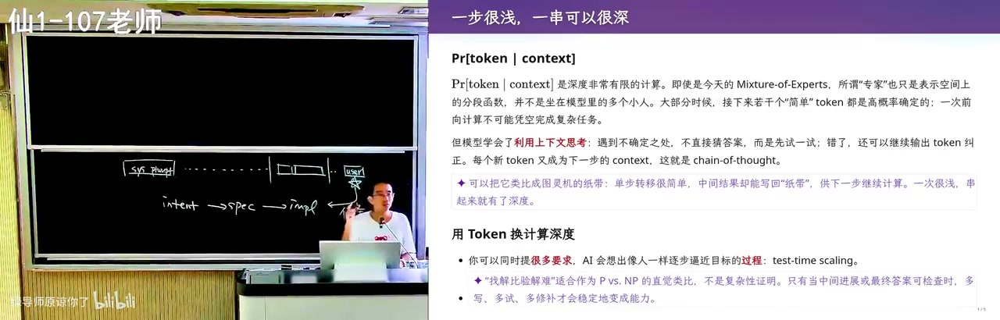

**[00:34:08]** 然后你们也你们可能在刚上这个计算机系的时候，你会听说这样的一个一听说这样一个东西叫图灵机，叫machine。然后可能会听说过说说图灵机的计算能力是非常大的，大到和我们整个宇宙都是等价的。你你们你们可能听过这句话，但是不完全知道这个church tun它它背后代表的是什么。

**[00:34:34]** 然后你们也知道有限状态机，这个你们都知道对吧？在数字电动课里面做过的有线状态机。有线状态机就是你有一个比如说计数器，然从00011011然后再回到001个有限的状态。然后有限你的这个有限的状态的状态机和图灵机之间唯一的区别是什么？是图灵机有一个无限长的指带。它有一个记忆，可以把墙上有一个草稿纸，可以把它记下来。

**[00:35:03]** 然后也有一个很有趣的，我很喜欢的一个说法是这样的，你的脑子是一个有限状态机，对吧？我们脑子里的神经元是有限的，我们每一次思考都是有限的有点像模型对吧？模型它能力很强，但是他在predict next token的时候，它的计算量也是有限的。也就是那一次推理所激活的所有的参数可能也就几百个B列。好，那是什么使你，这是一个应该是manual bl给给研究生的建议里面说你是一个financestate automata，你是个有线状，你是你人是一个有线状态机。但是当你有paper和pencil的时候，你就是一个Turing machine，你就得到了计算能力的一个大跨越式的增长，对吧？

**[00:36:02]** 这件事情是对的。当然这是为了启发你们要把想法记下来，你们一边思考一边要记录，然后可以随时回看自己的思考。随着时间越来越长，你记的东西越来越多，你的知识就会积累。

**[00:36:16]** 然后你发现今天的这个模型，这个chain of sal就是往后吐思维链的模型，就是做的这件事儿。他直接把这个模型的上下文当做了paper and pencil，当成了纸和笔。当然这个纸和笔是有缺陷的，就是这个纸和笔它只能往后写ponly不停的往后写，它不能擦对吧？他靠依靠模型的注意力，把这个写错的东西就忽略掉，但是它是盘里的，这也许有一天就能就就能改掉。但是无论如何，模型学会了利用它的这个上下文。

**[00:36:54]** 如果遇到一个比如说这很简单的答案，1加1等于几，它马上肯定会告诉你是2，这个没问题。但是如果遇到一个很难的问题，它会像人一样，这个问题有点难，我要先想一想，为了解决这个问题，我可以先试一试什么。他他理解自己可能解决不了这个问题，他理解自己可能要把这个思考的过程写下来，直到这个解可能是对的，可能是错的，完全写出来了。他在一旦那个解答写出来了，他就可以再去试一试这个解答是对还是不对，它可以判定。

**[00:37:33]** 然后再往后这是现在thought模型做做的做的事儿。他用token的数量对吧？他可以直接回答，但他直接回答就有就错误的风险。刚开始最早有拆gp t的时候，它没有思维链的时候，它就是这样的。它它被调成了一个人类的舔狗，朝着人类舔狗就意味着人类不管说什么，他都一定要说一个东西，他才有可能满足，对吧？

**[00:37:58]** 如果如果我说要说就当时拆ggt在训练的时候，如果人类问问他一个问题他不回答，或者他就不回答，那人类一定是给低分的。而如果他随便给一个回答，他就有概率是对的。那错了。如果他答错了，那当然也是低分，但是他答对了他就是高分。所以他他无论如何，这个幻觉就是这么来的，他无论如何一定要给你一个东西。但是现在在的模型他有强化学习以后，他就会知道，他必须要给一个。对，因为他答错的惩罚很大。好，他就学会了就就学会了这个，所以AI就真的会像人一样一步一步逼近目标的这个test time就在我们每一次派的这个赛上课的时候的赛程里面看到的一样。

## 07 用明确约束观察指令遵循

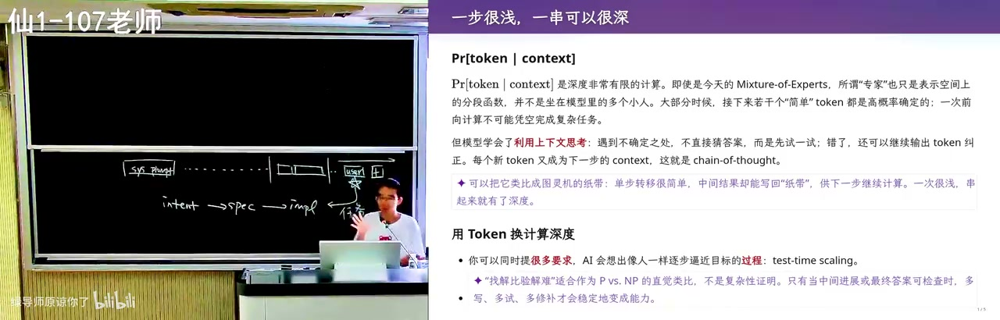

**[00:38:44]** 我举几个例子，这几个例子其实不在模型训练的这个数据当中。其实这还挺好玩的。我们来看一下，我换一个目录？我要用中文写一个押韵的藏头诗头，反正随便，一个nonsense？投这个nonsense。然后我还要求他讲一个动物相关的故事，我还要求这个2026 9月1日八个字分别按顺序出现在八句里。你看这是个nonsense，然后对人来说，你比如说高三哪一年期末考试就出一个你马上第一点就骂这个老师，这老师是怎么想的对吧？

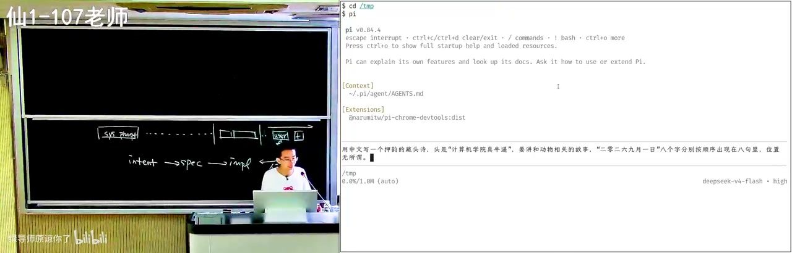

**[00:39:30]** 但模型不会，模型会照单全是。你看它有一个思维链，他会开始试对吧？你看他要他会先想运脚，因为他不确定，他因为他知道他自己一把头写出来这个东西一定是错的。但是他可以先写一个出来，他写一个出来以后，他就能够用它的模型的next token prediction是足够判定这个东西写的对还是不对的。如果不对，他再想办法再改。他如果试了很久不行，他会再推重头，推我换一个运脚，对吧？所以他就开始对你看他在不断的验证好。

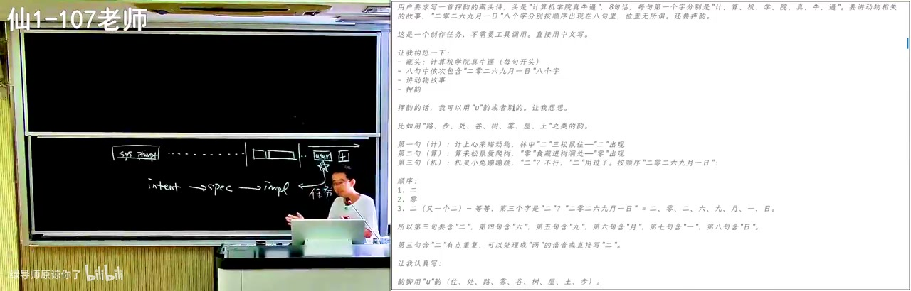

**[00:40:13]** 鸡椎二路穿林舞学幻六珠共识，蜀院中九鸡征李素珍如月下老牛步。相当不错对吧对吧？虽然虽然你就觉得品味上肯定是肯定可能不完美，但是你看到了就你从你用这样的任务其实很好玩，可以看到他遵循指令的过程，这是一种我们把他的大脑好像是拿出来做核磁共振的，这个就你能找到他的思维的偏好。然后这个是gt给我的，你们在课件上面看到的带新的都是AI slop，都是AI补充的东西。虽然我还是用了一些prom的视图，试图让他我又加了一点，所以这个AI味好像稍微会轻轻一点。但anyway这是AIAI生成的，你看他换了一个鬓角对吧？而且他没有把2026 9月1日就完全压到同一列。但他同样他的这个执询指令也是也是非常好的。

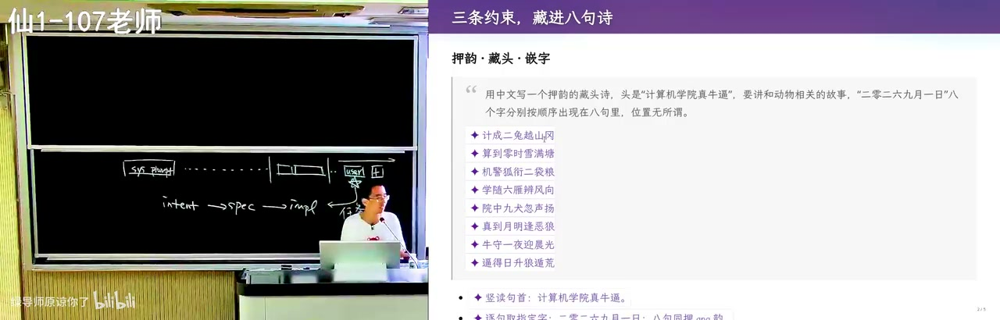

**[00:41:20]** 很有意思的是，一般来说他强化训练的时候，这样的东西是比较少。相对来说他可能会有，但是会比较少。这个一定是不在他的训练的就训练数据里，他不可能在训练数据里面才猜出这个东西来。结果就是他在训练的时候用的绝大部分应该是代码，数学题，这样有明确反馈东西。他把人类直接给杀死了，这也是一个当然也也很也很好玩，对吧？

**[00:41:57]** 你你你如果期末考试的时候，就高考的时候，你碰上这个题对吧？然后你马上就想骂这个出题人，你脑子是怎么想的对吧？你要写一个18字的一句话。全部要求相同的偏旁或者步首。而且我们也知道模型对于空间结构感知是非常差的对吧？模型需要视觉模型才行。但是就是这样的一个文本模型，它依然可以强行通过四维链的方式。你看它现在没举字对吧？他现在选一个，他觉得三点水最好对吧？

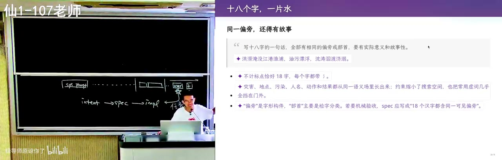

**[00:42:37]** 然后谢谢这个江湖游泳渡河，波涛汹涌，泪流满溢。洗涤污泥洗涤泥anyway写的还可以对吧？写的还可以，这个也很好，洪涝淹没江港渔捕，这个还挺有故事感的对吧？有漂浮这个是是是继续写的。但是我觉得人类就这个任务上，人类还是有有更强的天赋的。我我我不太记得了人类的就就人类的群体智慧给的是什么什么玩玻璃球涂润滑油什么，你就我就不再不能再讲下去了的anyway当我什么也没有没有没有说这个就是人类在做这件事情上还是a lot better。

**[00:43:36]** 当然你就也许你可以通过这个让AI更多的收束st的方式，对吧？但是这已经是一个非常困难的spe了，AI可以做到，以及这可能是世界级的。你们已经知道什么失事时施史和这个记GGG记的就是他所有的都用都用同一个音。然后我竟然发现这g p 5.6依然能做到。

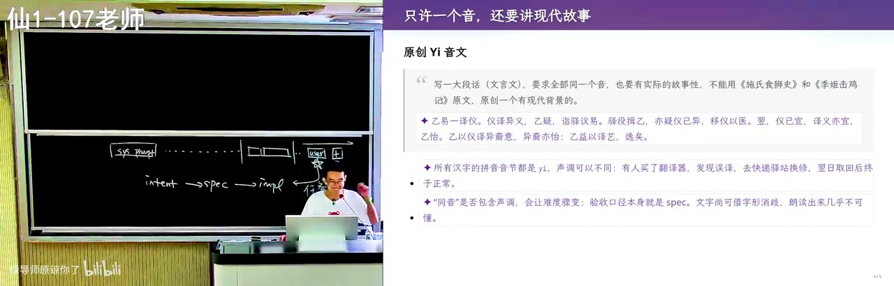

**[00:44:09]** 虽然它的故事性确实也跟比如说千古流传的还是有一定的差距，但这个差距我觉得依然是可以缩小。就是它能写出来一个，就意味着我可以引导他写出来1万个。然后在那一万个里面我可以再微改一下，它可能就可以达到一个接近这种千古流传的东西。所以千万不他在数学和编程上面训练，但是他得到了一个非常意外的意外的效果。

**[00:44:40]** 所以你们看到写prompt最重要就是那个verify，今天模型的能力已经非常强了。如果你们能够给明模型一个非常明确的verify，对，就像我前面三个都是非常明确的信号，非常明确的verify。他他看到字，他知道这个字是什么偏旁什么什么部骤。再加上一个足够强的模型，不管它是编程任务、教学任务，你的当然教学任务最难的，其实它很难玩法。就是我们我们经常讨论的时候，比如说说我的这个数字切片就翻车了，对吧？我做了第一个切片，然后我第二个切片我一直都没有办法把它做好。因为无论我怎么调，我都很难写一个，就是说我这东西要好，然后这个好又是多方面的。首先AI味要淡一点，那这个可能本身我那个test to speech的模型我就做不到，但这可能还不是本质的。

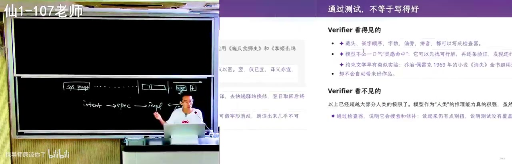

**[00:45:36]** 还有一个就是我在上课的时候，你看我有这个情绪的波动和起伏，我有些东西讲事实的时候，我一开始讲这模型的上下文是怎么怎么构成的，这些好，那你们听的都是废话，是这些事情我已经知道了，我就会给你们一个小的surprise，我就去派里面让他自己把这个上下文看一下。你们这就我说出来这句话的时候，可能对你们来说是意料之外，情理之中的这就是一个老师在组织这个课堂的时候要做的事情。某种程度上我是在在表演，我我当然我知道这个principle是我需要需要给需要需要把这个课堂内容组织成为一个有有起有落的一个理由。但是这不是一个可以verify的东西，对吧？到底什么样的程度我需要和你们共情，我是从学生过来的，所以这就是我我觉得我现在和AI还不一样的地方，我每个人都是从学生过来的，我自带了人的属性，我自带了人对这个世界的体验。然后这个时候我因为我对世界的体验更好，所以我更懂你们也许可以有一个更更符合大家的上课的节奏，但是这个东西没给word尔法，不像数学和编程那样有一个word法。所以现在目前来说，我们还是更容易用AI去实现这个有明确wi尔法的部分了。但在有阿尔法的事情上，你可以完全可以认为这个AI已经超越了大部分人的做这件事情的极限了。

## 08 注意力、上下文资源与指令副作用

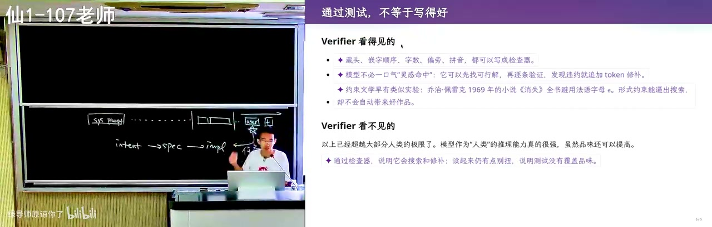

**[00:47:10]** 所以我们更多的是要和AI去协作，来做好我们手头的任务，或者说把模型当成是我们能力的一个非常重要的放大器。放大器实际上这个思维链，它带来的这种指令遵循的能力。还可以再往深里面再想一想，其实是这样的，它每输出任何一个token，像现在模型叫self attention，它叫注意力机制。这个机制跟我们人还是很像的。当然它有一个一层一层一层叠起来的transformer门的一层一层的注意力。然后每当他输出一个token的时候，或者说他要输出这个token的时候，他都会跟他都会看到过去的某一些token，相当于他为了输出这个token的时候，过去某些token会显得特别引起人的注意，然后有些token就可能不那么注意。

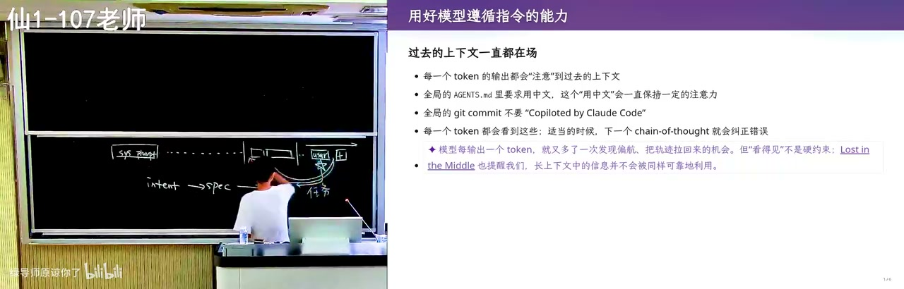

**[00:48:10]** 我举个例子，比如说我在前面这个system prompt或者agenent点MD里面有一个用中文回答，对吧？这个用中文回答，然后我现在在这个地方user的这个prompt里面写的是你帮我实现一个极品飞车。这个时候他在写代码，那在写代码的时候，这个注意力就会倾向于集中到我的这个已经写过的代码，然后这个需求这些部分。而相对来说用这个总结，用中文回答这句话，他的注意力就会减下来。

**[00:48:41]** 当然这是模型训练的magic，它最终能够通过注意到正确的词，也相当于是整个上下文是一个非常高维的一个很糟糕的表示。但是里面有一个低维的结构，然后注意力机制能够把它给把它给捞出来。然后这就意味着我们的每一个的token，它都会注意到一些过去的某一个部分的东西。然后随着它的输出，比如说我的代码写完了，比如代码写完了以后，他要总结一下，对吧？他会喘一口气。

**[00:49:14]** 跟人其实一样的，人也是当你集中在做某一件事情的时候，比如说你一个数学题，你就算化简这个算式的时候，你所有的注意力都是在这个算式上的。然后你把那个算式化简了，然后算式化简完了以后，你吸一口气，让我来调整一下的时候，你的注意力就变了，对吧？当你那段代码写完了以后，你的注意力就可以集中到，用户还要我用中文，用户还要我做一件别的事情。所你看它输出到不同阶段的时候，它的注意力会变化，这也是模型训练带来的结果。

**[00:49:45]** 这就是一个magic，一个非常大的模型竟然可以收敛到，这是预期的。就是收敛的时候，我希望能够在正确的时候注意到正确的东西。然后你思维链一直在向前走，它就会不断的在不同的时刻注意到不同的部分。这里他就能把这个上下文里面所有你要的指令一定程度上都都满足，对吧？

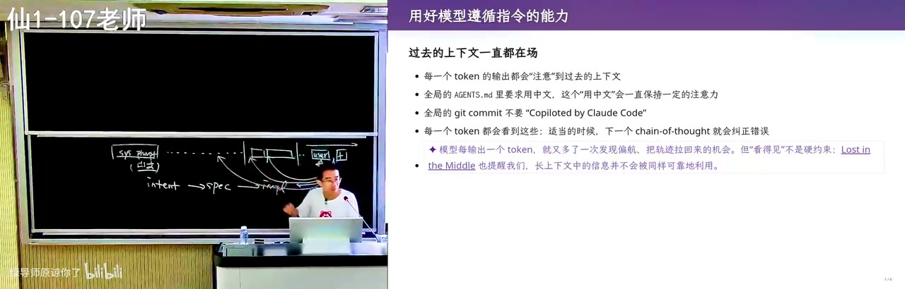

**[00:50:06]** 也就是说你会犯一个错误，你的token，你现在当前专注于做这件事的时候，你可能向后输出了一些不满足要求的东西。但当你停下来喘气的时候，它就能看到你输出当前输出的那些不满足要求的东西和过去的某一个要求。他的注意力可以看到，同时看到这个，然后他说我错了，我要再纠正一下。于是你看到，比如说你真的让AI再去写那个什么藏头诗的时候，看他会不断的纠错。哪怕到scale到100万上下文的时候，它依然能够保持一定程度的注意力。当然这也意味着你的指令越多，给模型的压力也越大。

**[00:50:51]** 上下文是一种会抢夺注意力的资源。这也是为什么我们刚开始的时候，因为像chat PT3.54，它遵循指令的能力实在是太差了。所以你们会看到网上有好多的这个叫prompt engineering的guide。

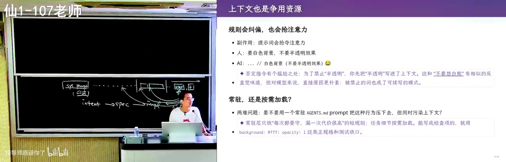

**[00:51:09]** 然后他会说什么？你是一个专家，然后你是一个什么样的专家，你是一个什么就这其很长的启示词。然后它某种程度上是在hack这个模型的self attention，使得当模型的attention注意到你是一个什么专家的时候，他就会假装那个专家来专家来说话。但是从GPT t5的时代开始就明确了这个saw大家训出来了，就知道怎么样收敛到这个好的charesult以后你就不需要那样的奇怪的提示词了，只需要把你明确的verify写在你的这个上下文里，写在上下文里。

**[00:51:49]** 模型就被训练成它一定能看到它能看到它，模型就会训练成一个非常强的执念，去把你的玩尔法要看一下解决确认对吧？因为他是受惩罚的，在训练的时候这个呃呃你相当于拿鞭子抽他。如果有任何指令不遵循，因为你有一个veri所，以我就知道你的模型没有遵循完了我就没有鞭子抽你。然后你抽着抽你就会对吧？你们高考过来的都知道，你就会变成一个真正的做题家，对吧？他会无限的你和你的上下文里面的各种各样的指令。

**[00:52:23]** 然后这也带来一些非常有趣的后果。比如说我我们我们在写前端的时候非常正常说我们要一个白色的背景，不要半透明的效果，对吧？这就是说前面我们要的是白色，主要是一个白色背景，然后后面是一个补充的解释，可能解释很多，然后AI当然会照做，然后它能遵循指令没问题，是因为这是一个明确的有fi的指令对吧？它会确保有没有薄玻璃效果或者怎么样背景是不是白色。

**[00:52:51]** 甚至如果你的prom给的比较严格的话，比如说你每做一个设计都要截图，然后用视觉模型检验，他真的也会去造叫做。但他会干一件什么事呢？这个他会做完了以后写一个代码，代码会有一个注释是白色背景括号不要半透明效果。这就是这个模型，你可以看出模型训练的那个对吧？他他在强化协议的时候知道这件事情非常重要，但是他也有一点没有转过弯来，这个是我人人要的。所以说他在模型在共情这个方面，因为后训练的强化学习还真的是稍微差了一点。然后有时候觉得模型不说人话对吧？

**[00:53:33]** 因为强化学习学习多了，所以其实你们还是面临了一些trade off的。我们比如说打比方为了禁止这种情况，我可以写一个agm d然后在这个agency ent的MD里面去描述这个行为就是什么。比如说什么注释是什么，怎么写什么写，或者我写一个skill的时候，当你要写注释的时候。应该怎么样？但我写的这个东西又会同时还会污染上下文，对吧？所以这就成为了一个吹豆腐。

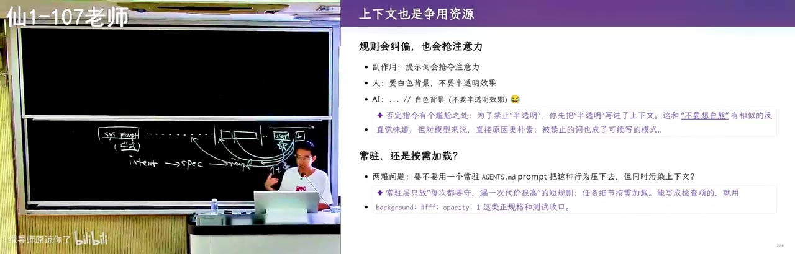

**[00:54:07]** 到目前为止我认为还没有一个通用的就把所有问题都解决好了。比如说大家可能会觉得，现在网上有这么多skills，那我只要从网上拿一个过来就可以了。然后你会发现拿过来的东西，你第一次用的时候确实有改进，在你下一次用的时候发现它还是不够好。然后你会产生上受感后，陷入一个某种泥潭的状态。然后我我的建议可能是在你发现你进入泥潭状态的时候，还是要回到自己给指令。然后自己想清楚就回到我们的模型channel thought是怎么工作的，注意力是怎么工作的。他大概猜到的就是你看他channel他他他注意到了什么，得到了什么结果。你适当的去做一个不严格的可解释性，然后写一个prompt，这个是我自己做的，后面肯定也会有有很多的案例。

## 09 读论文：抵抗上下文污染

**[00:54:57]** 然后关于上下文工程，我来讲一两个具体的案例。当然这不能算是A耿耿同学了。比如说如果你们想要在上下文里面放下一篇论文并且读它，对吧？我现在假装假装我现在有一个p df我把它放到临时目录下。这样就这样我的我的agency点MD等等就不会污染它，对吧？假装这是我自己的配合。

**[00:55:43]** 看一眼，不用这好，这是我们最近的一个论文的。对我我我把它故意改成了匿名的，匿名版本不重要，我来我我来演示一下，如果如果你们想要来读这个论文，你们会怎么读呢？我想要读一读paper点PDF帮我做个总结。好，这个一定是大家最常见的方式。

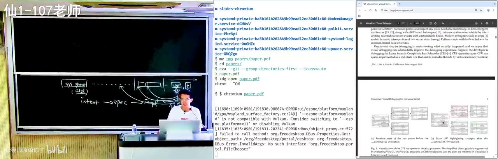

**[00:56:29]** 那你们觉得这样读论文会有什么问题呢？根据刚才的这个推论，根据这个self attention，就是我的每一个next token prediction的时候，它都有一个注意力，注意力会注意到这个之前的东西，是因为我的论文是一个非常逻辑自洽的东西，对吧？论文论论文已经我已经反复修改过了，假设它不是一个AI因为它是一个非常逻辑自洽的东西，所以它在上下文里面的注意力的污染是极强的。他说A所以B所以C所以D所有都是这种扣起来的。然后扣起来以后，这个模型非常容易接受了这个因为看起来正确，就是他会判断这些都是正确的，所以我下面要也要做什么。所以你基本上你们所有对论文的这个呃论文的总结都是这个作者的观点。

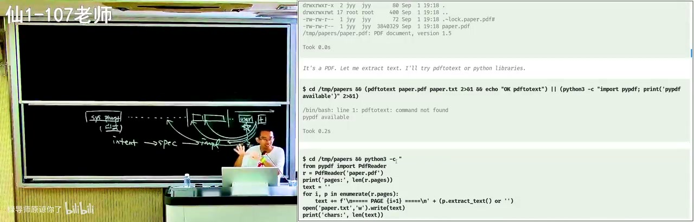

**[00:57:26]** 这就你们去看，不管是这个不限于论文，就是你们任何一个你们不太明白的项目，你们想要读的教科书的某一章对吧？就不管是你们想想去学一个计算机系统技术里面的链接和加载，对吧？那个可能你在上课的时候没有看，完全看明白，它都是一样的，它注意力会被一个逻辑很强的东西给污染。然后你来回就是这个车轱的话，然后这个基本上就是我们的论文里面原样型写的话，当然这个也是总结，就总结这个总结ok好总结。那如果换一个不确定。

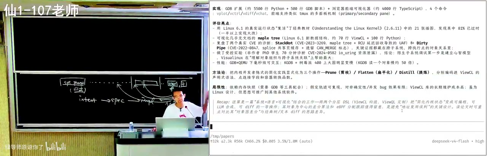

**[00:58:18]** 然后他会有一种AI模型，会有一种这种墙头草。然后你说他好，他马上就说他好，然后说他不好，他马上就说他不好，然后来回摇摆。然后有的时候你你你就算是你想要纠正它，比如说。对吧我可能不能完完全全信任作作者，虽然大概率也是成熟的对吧？也是诚熟的。假设我先城市的也有那个代码实现可以运行，对吧？我们都有阿卡，都可以，我们不是那种论文不开源的那种作者，还是想评估一下研究贡献，然后对吧？

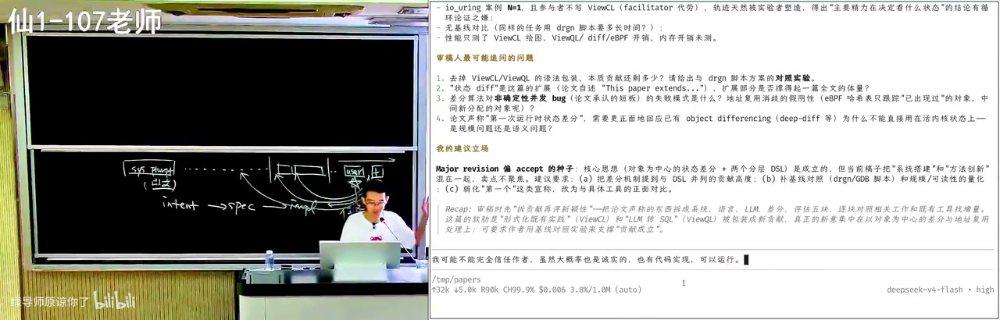

**[00:59:10]** 然后就你们会问这样的会不断的问这样的提示词，然后你发现来回绕来绕去，可能会揪到一些，实验做的还可以，再再增加一点，这种最喜欢的就是在这种不重要的点上面疯狂的发力。因为他可能只能只能看到他他在干什么，为什么他开了chrome Dev tools？不用不用不用，where are you? 当然对于实际上就对于实际如果真的用gp t度去读的话，那那肯定还是最好是做一个交叉的验证。

**[00:59:57]** 好，那么你们觉得怎么样来抵抗AI的这种或者说一个已有的东西对上下文的污染呢？你们觉得我自己的这这然这是一个我自己的个人经验，我希望的是我想要把AI和我人和就是和我？比如说我有一个对象，这个对象可能是一篇论文，那这个论文我希望的是AI和我能够对齐，就是它能够站在我的立场上去理解这个paper，而不是站在他的立场上去去理理理解理解这个paper。所以你看他就开始去看个这个stro这个东西是不是对的，这还用看吗？我敢写这个，他会胡一个不存在的例子，对吧？胡一个不存在的例子去去那个吗？不不可你很明显他就跑偏了，所以一般来说，我会这样提示他，如果我读一篇paper，或者如果允许我用AI来审稿的话，我会我我我我会这样，我说应该这样。

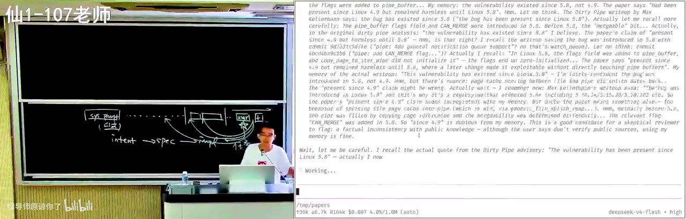

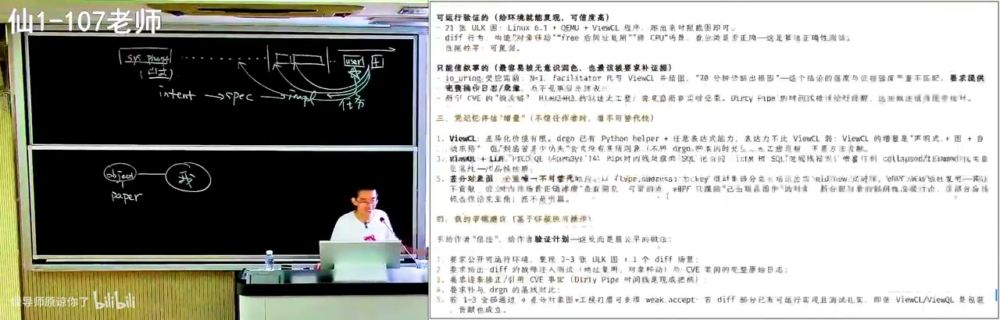

**[01:01:15]** 我们站在人类已知的知识边界看这个问题，这不是一个完全老老的问题，相关的东西是什么？我先要问他相关就是人类历史上相关的已经解决的东西，东西是什么？解决到什么程度？然后这个工作试图解决哪些不一样增量的问题，这是一个非常好的grounding。就是说我我我先要我先要让他和我站在一个平齐的位置上先达成共识。然后同样的因我是review paper的时候，我会这样写，对你们来说，你们需要对齐的是AI和你。

**[01:02:11]** 因为你们是学生，你们比如说计算机系统基础这个课你还不了解。那你会说好我计算机系统技术我学到什么程度了，我的编程水平是什么？这些可能是你你就要维护一个数据库或者一个memory一样的东西。HMD你要告诉我AI你学到什么程度了。然后从这个基础上，你让他把用你学过的知识去把这个东西全部refresh se一下？然后你看他墙头草，然后好他就可以开始找到一些已有工作的工作边界。这些都是非常重要的相关工作，也是我们非常熟知的熟知的相关工作，对吧？

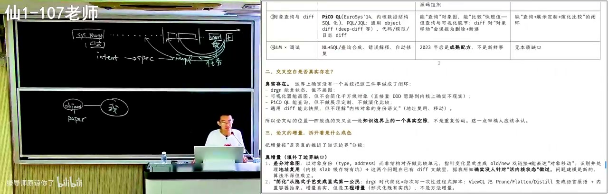

**[01:03:00]** 然后然后比如说我我在在在在比如说软件的，因为我们做了一个软件状态的可视化。好，这是这个问题，paper要解决的。就比如说你们会回到链接和加载，你们知道为什对吧？你们可以问他为什么我们需要链接？从你已有的知识对吧？已有的知识在你的已有的概念里面，我有一个点CPP，然后我有一个程序可以把它变成点EXE，这就不就完完就结束了吗？咋吧？这不就结了吗？然后你就回到你和AI能够对齐的一个知识点上，对吧？

**[01:03:38]** 比如说说我说这个软件可视化，这是配本要解决的。那为什么说现在的工作都有一个无法实际使用的痛点，对吧？这个文章可能只。

**[01:04:04]** 怎么能往前，是不是？然后你可以如果你觉得这个步子卖的太大，比如说如果像gt 5.6，如果我用一个一线模型去读paper的话，它基本上就能够把相关的知识给整理的足够好。Flash可能我还不会特别的信任它，但就你看到在你合适的上下文工程下，你确实可以大幅提高AI和你协作的对齐的程度。它不再是自说自话，对吧？你一定要把你的知识放了他。

**[01:04:41]** 然后接下来我们就相当于是想让AI去做什么，就做一步推理对吧？一步推理，然后这个一步推理就是AI最擅长的，因为我们训练了这个chain of chain of每次都是根据过去所有的事实。你的paper也好，你的教科书内容也好，你已有的东西好，基于所有的这些向后让它往后推一步，这步是可以verify的。就推理最重要的就是它可以verify，这是一个明确的威尔法的信号，和能够通过测试一样。虽然它不是严格的通过测试，而是一个你相信AI有人类的知识，它能够站在人类的公平面上面往后推，然后它会审失合理性，所以还是有一些合理性的？

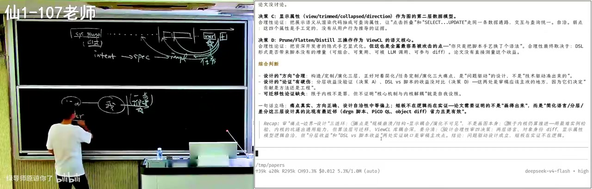

**[01:05:33]** 然后他批评我们的实验，就这种东西的实验就是很难做，所以所以看到人类和AI还是有点不一样的，就是这个paper已经accept了，所以人类的review还是认为他可以的。就是因为他看到这个事情是就是他做一件新的合理的事情。然后当然实验本身他他肯定我总是可以用实验不够好来reject一个paper，但是我几乎不会用，因为实验不够好reject paper。而我reject paper大部分是因为他们在在这个逻辑上面断开了。如果我站在，当然这个可能也是我作为一个审稿人比较可怕的地方。我觉得站在人类，因为当我审稿的时候，我就是站在人类的这个立场上，对吧？你有没有给人类提供新的知识？

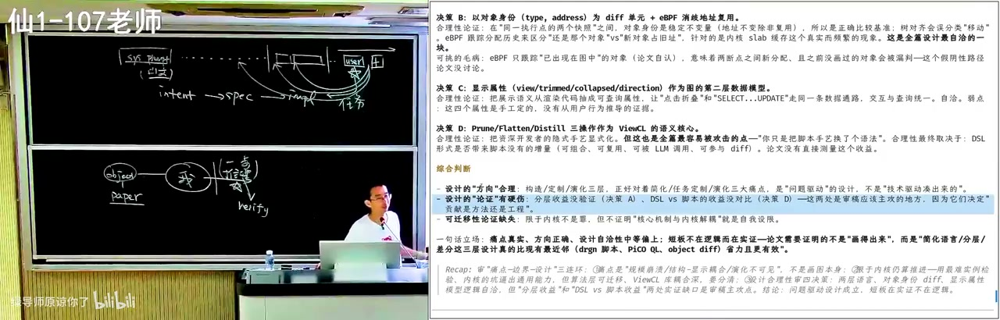

**[01:06:23]** 那么我站在人类立场上说，好好我还可以帮我找这个vwork。然后那如果你做的这个问题也不新，你做的abc也不行，结果也就那样，甚至你的就是你的逻辑链条是有问题的。比如说我昨天才reject了一篇paper，大概是这样的，他说我要做我不能说他是什么，大概说我要做一件事情A然后我要做这件事情，A里面分成两个部分，A一和A2对吧？好，他说我们要做一件事情AA很重要，那没问题也很重要。然后分成A一和A2。后A二是一个大家没有很好的研究的东西，我们在A2上面做了一个A2，然后这个A有一些什么样的这一个非常标准的roadmap。但是它里面有一个很大的问题，它优化的是性能。然后优化的性能的话，A一我估算可能占99%，A2占1%。

**[01:07:31]** 也就是说他优化A二这个故事可能是成立的，ok就是他确实优化了A2，他那个实验做的可能也是没有问题的。但是他的整件事情在这个意义上不成立，是因为我为什么你应该去优化A1，就是你已优化A2的10%，这百分之就像noise一样，当然我我我我可能你可能说如果他的所有的东西都是成立的。作为一个学生的作业，所以我觉得有些人蛮可惜的，因为auth肯定是学生，对吧？Auth肯定是学生，然后学生是肯定是老师说我要老师肯定是做这个的。你要这样理解，老师肯定是做A的对吧？老板肯定是做A的，然后他可能被分到了A2，或者分到了自己去想做一个A2，然后这个东做的也不是特别的。如果这个东西做的特别漂亮，我觉得也挺好的。他也是说他为了做A2，为了做这个，我就做XYZ，就从A一里面搬了一些。实际上大概是他从A一里面搬了一些XYZ到A2里，然后说A二这个效果也可以变得好一点。

**[01:08:32]** 然后，那question就是ok gp t也知道这件事，那为什么要发篇paper呢？就其实我的centerquestion是就这些东西都摆到台面上，那你你为什么要为了这个写一篇paper？所以这现在我觉得是是是发表和评审的体系很快就要学术界很快就要崩溃了。即将你们要读研的同学，我我我非常认为这个发表的体系就马上就要崩溃了。

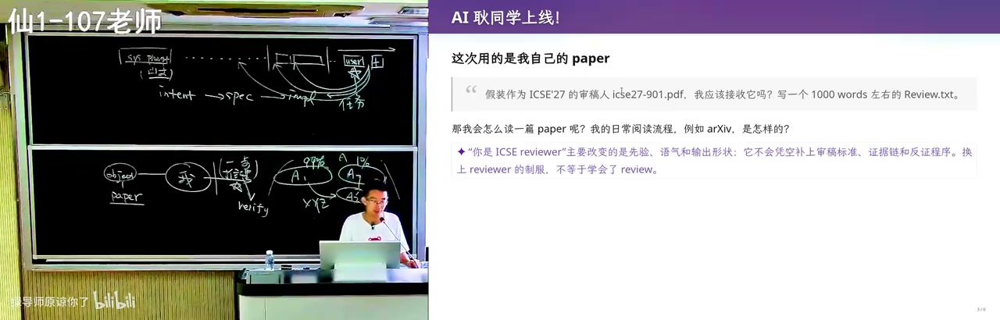

**[01:09:03]** 因为我们的AI slo开始大量的涌入这个community。然后如果我们用AI发文章、写文章，用AI审文章，AI写文章的时候，他就会被这个上下文里面的故事给污染。如果他不能像我一样很多轮的去理解这个工作在整个世界上的意义，那他就最后是也没有人读文章了，对吧？

**[01:09:33]** 人人都用AI读文章，然后最后就变成了一个完全的完全的slow。因为你看这是gp t5.6给我写的审稿，如果让他来审稿，他会怎么做？然后你会发现g p 5.0做的并不好，它还是你看它还是一个非常原始的说论文写什么对吧？论文写的什么，然后我们要去建立它的claim是不是成立，就是它的逻辑，它更多验证的是这个论文的逻辑有没有没有必上的，是不是不是不是inval的paper。当然我会倾向于如果每个人都用AI写的话，它应该不是invalpaper对吧？每篇paper都是valid的paper，但你真的要读它吗？就真的要，尤其是你们作为同学，在你们很快就要进入研究生阶段去读论文的时候，当有一天有一个人发表了一篇什么样的文章在一起上，然后你会说这是一个顶汇的论文，tri口AI上面这是一个顶汇的论文。那你今天决定花1个小时去读一下，然后你读完以后发现是一个这样的东西的时候，你是其实他不需要，就是你可能不要去投top conference。

## 10 从阅读、实践到经验蒸馏

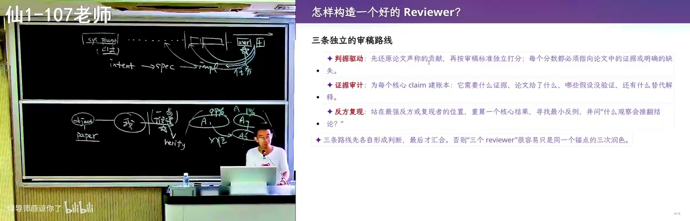

**[01:10:47]** 你需要publish的话，你可以让他publish，但是可能不要让大家去读它比较好。然后这就引申出了，比如说我是怎么学习的。这节课虽然是讲pr通过，这个例子可以告诉大家我们是怎么学习的。我们学习的过程就是增加我的这个世界的过程，对吧？所以我现在还读配，所以我还在学习不断增加。然后我学习的方法就是去对齐过去的我吧？对齐过去的我，然后对齐过去的我说如果我读到一篇好的paper，一篇哪怕是可能几十年以前的，甚至是另外领域的一个一一个不管是博客文章任何东西也好，我觉得很有启发。我都会试图去想，为什么我以前不知道就它的盲区在哪里，哪些前置知识我不知道？

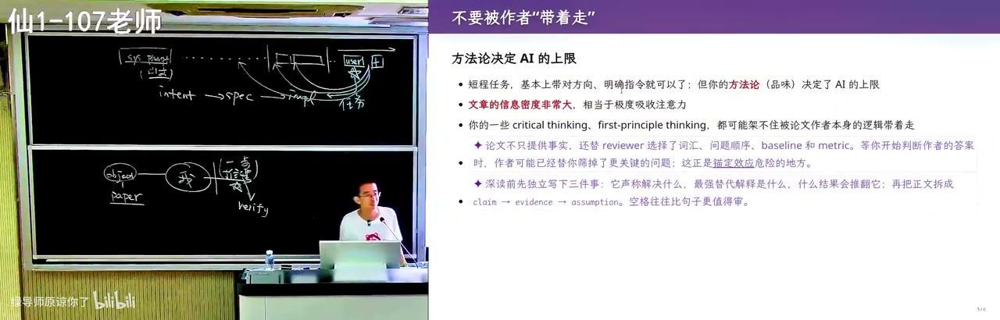

**[01:11:47]** 首先在我的这个心里面就多了一些我已经知道的一些fact，对吧？这个世界上有一种有一个学科叫什么？我读过很多，看跟commercial science没有关系。记得paper我很喜欢，就我做了factory以后，我才读的有有一套很厚的叫自然科，自然的百年科学经典。大概是把nature那个magazine，从1890年开始到某一个时代的这个paper都就特别好的paper都收集了。然后就看了很多闻所未闻的，就是有些事情你们可能知道，比如说有一个基因就是大家生物有一个家谱数，然后最终会追到一个共同的祖先卢卡，然后这个加谱数是怎么算出来的对吧？这是个很很好很好的问题。

**[01:12:37]** 然然后然后这里面就涉及到你需要知道一些fact。比如说这个伽谱数，你的线粒体是母系单遗传的，所以它靠这个突变就可以往上追溯，对吧？这是一个很有意思的fact。后，这个fact以后它又是怎么样用一些已知的这些东西把更多的东西推出来。然后你的这个圈就不断的在你的这些圈就不断的在往外长，无论你学任何东西都是都是都都是这样的。然后你你你在AI的帮助下就可以非常快的去扩展你的你你你的边界。对，所以一定程度上你们还是需要自己，就我跟你们讲是没有用的，讲你们就听个故事，这个故事挺f的结束了。

**[01:13:21]** 实践非常的重要，因为你们只有在在阅读的时候失败软件今天你去读一个什么资料的时候，解释了半天你还没有懂，这是非常正常。有的时候也是在我要我我经常要纠正它，你这样读说人话对吧？我经常会说说人话。然后慢慢才能一起在多轮对话里面先和他同步好我的共识，然后再去把这个推理的picture给给建出来。对所以你看我们从这个呃遵循指令一个写一个藏头诗这样的一个短程的任务？你只要把where fire写清楚就完成，然后到这个werfire，其实可以是非常不tribu的？这是有没有按照你的思维的方式去重构你逻辑的这个？或者扩展你逻辑思维的边界，这是我的玩尔法，或者说我学习东西的玩尔法。

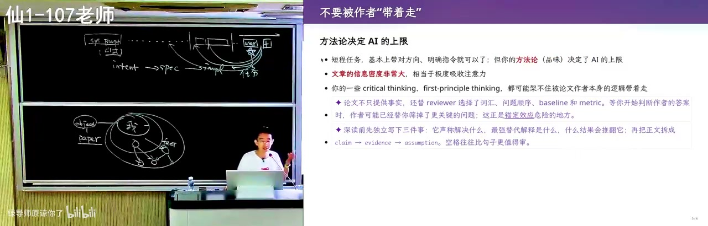

**[01:14:23]** 在一个混沌状态下面经历了若干次三观尽毁，对吧？我觉得每个同学可能都会在这个年纪的时候，你们这现在就是你们的世界观可以重塑的时候，然后再在看了某一本书以后，你就突然间就觉得三观尽阔。过去所有的东西你都都就就重新组织了，你以前知道的所有的fact都会都不会变的。但是他们以一个重新的方式链接起来，然后你下一次的时候就会带上这个新的理解。

**[01:14:53]** 所以我觉得这是一个很有意思的事情。你们有无限的时间，你们有无限的可能性，可以把自己蒸馏成一个skill，对吧？我说我失败很重要，然后从从你失败的过程当中，可以蒸馏出那个慢慢越来越成功的skill。这个就是我我自己蒸馏出来的，关于我自己的skill。对，好，那这是用好大模型，遵循指令的能力。好，那么现在已经知道咨询指令了，我们就可以看怎么样去怎么样去处理真正这种low horizon的认为。就是说像什么计算机系统基础的PA作业，可能这种有明确WiFi的都不能算是这种真正龙ori的东西，然多多少少就是带一点未知，对吧？

## 11 长期任务与可维护的软件系统

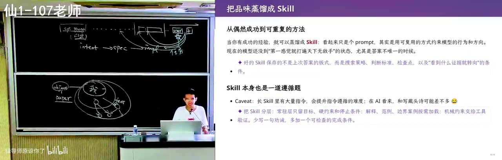

**[01:15:56]** 你从一个初始的状态出发，你大概可能有一个in但是你的specification和你的implementation。其实都不太清楚的时候，你最终的目标是交付一个高质量的implementation。那你就不应该让AI去画一下子一下子向后做。这个因为我们的模型它的self attention，它的反馈信号是强化学习给的。所以它有一种着急的执念是赶快通过verify满足你的要求就结束，对吧？他其实有一个平衡，因为如果他做的planning太多太长，他会做不完上下文，买了仍会不满意。所以在目前阶段，它最好还是一个就帮我把P2做了，对吧？这个是他最能力最擅长的事情。

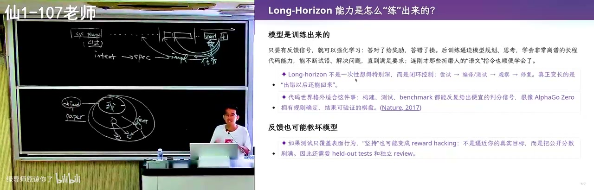

**[01:16:50]** 好，你你你也是你也是你也是非常开心的。所以这就导致了一个什么呢？很有意思的观察。你们会就像我刚才在codex里面跑一把，从零开始做产品看起来是不难的。就你做一个小的proof ofconcept AI马上就能给你一个，对吧？你说做一个不管是个人主页还是一个产品，就是你们应该都试过，就做一个极品飞车，就这么说，刚才那个极品飞车one shot说给我一个极品飞车，然后我就能跑，我就真的能跑了。

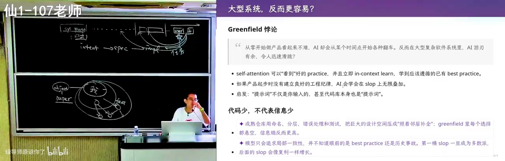

**[01:17:24]** 但是在你把它往后维护的时候，加一个功能的时候，你会观察到AI从某个时间点开始翻车。就随着某个时间点开始，它的cos就会越来越大。这个在软件工程里面已经是就无数次了。人类神话里面就是讲的讲的讲讲的这件事情。

**[01:17:46]** 但是有里面有个悖论，反而你在一个大型的复杂软件系统里面，这个AI就像砍瓜切菜。就我我我觉得我们hack这种比较大的系统，像Linux内核这种对吧？现在的内核已经不比我那个时候的那个了。我觉得我以前上操心课我都说我很幸运。

**[01:18:05]** 我在0几年的时候，00还2.6的时代。而甚至是2.6.2G的时代接触了Linux内核，那个时候源代码我还看得懂。今天如果你打开一个Linux内核，源代码立马就是劝退，为什么我想要看这样一个函数？比如说你要学文件了，你想看文件是怎么打开的。然后第一个就是一个函数调用，点进去又是以函数调用，点进去又是以函数调用，然后点点了十层，最后是一个X等于Y你马上就崩溃了。

**[01:18:35]** 因为这个大型的软件系统被经过了长时间的演化，他被迫为了能够维护下去，他变成了现在这个样子。结果恰好导致的是在大型复杂的软件系统里面，AI游刃有余，为什么呢？跟刚才我们说这个上下文污染正好是反过来的。我们说一个论文放进去以后，他就把上下文就就整个就扭过去了，就就整个就扭过去了。而如果是一个由人类维护的特别高质量的代码，这个上下文会迅速的看到里面那些好的东西，他会照着写，他会照着学，对吧？

**[01:19:13]** 他的注意能注意到比如说如果我要写一个功能，这个功能很有可能在内核里面已经有几个地方实现过类似的了。他无敌的注意力机制能够马上就找到那几个地方是怎么实现的，他应该调哪个helper，按照什么样的顺序上锁，这些对人类来说都是巨大的心智负担。尤其是你在不了解那个subsystem的时候，那个该上什么锁你根本就不知道，但是self attention可以。在加载了几十个文件以后，那不就是这三个都是这样写的，我就把这三个加起来就可以了。所以越强的项内核，我们前面在hack这个android runtime的时候，改那个Justin time的编译器，这个是一个非常痛苦的事情。在在我手上为了改编译器死掉的同学，就最终决定不再做这个方向的同学都不在少数。这实在是太恐怖了，放弃了，不愿意再再写代码了。但家就特别擅长让他做一个小游戏，就可以就会翻车，非常有意思。

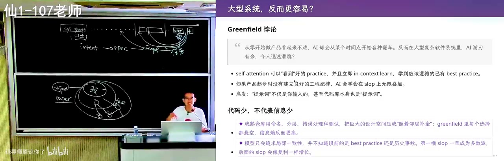

**[01:20:14]** 你可以看到这就是我所以我今天讲proengineering上下文工程，这都是上下文和今天的模型结构带来的，它是有一个逻辑的推理的关系的。然后随着模新一代模型的发布，我今天上课所有东西可能都又没有用了。那我们再去想新的模型它是怎么训练的，它是它的personality是什么？我们应该怎么样更好的和它相处。但是基本上我觉得这点不会变，就是它不会套开倒车。

**[01:20:43]** 在大型在无论是什么模型，在大型复杂的维护的好的软件系统里面，他永远可以看到他该看到的东西并且做对。因为我们的模型永远是可以满足指令的对吧？听指令是不可能的开倒车的，所以这点它还是可以很好的很好相信他们。所以我觉得我有一个歪招，但我没有实验过，我觉得这可能是一个比较好的research对吧？

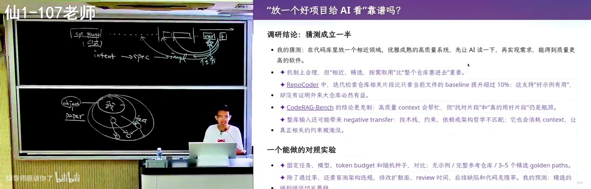

**[01:21:10]** 我们有没有可能去收集一个人类经验。比如说人类历史上面的，比如说最好的20个项目，或者在在每每一每一个领域找到最好的十个或者20个项目，然后把他的经验，就是好的设计经验全部都提取出来。你就想到不就是我第一节课拿的那个the philosophy of software design，那里面就针对着人提炼出来的，你这个类结构应该怎么写，什么时候应该封装，什么时候应该把它做成继承关系，就都是这种碎碎念的这这些从他说这个系统里面这样写的，所以他他符合这个需求是好的。然后如果我们的把这些切片切出来，甚至是你直接就以污染上下文的形式。你先把一个相近的和你相近的一个好的代码放进来，然后你再把你的需求放进来，然后因为你就赌这个self attention还是可以终于在某一个token的时候能够看到你我实际上满足这个需求，而不是做这个。虽然它会污染双下文，但是它会把他会把你的这个东西给好的经验给带过来。

**[01:22:21]** 然后这样是不是可以可能可以让AI slo延缓一点？能够更大概率做出一个可以长期维护的东西，我不知道，但是也许也也也许需要一些比较好的微调。比如说这个项目不要把所有代码都放进去，而是我们能够能不能把它作为一个像这个philosopc of software design那样做一个精简？做一个总结，把里面好的模式提取出来，以文档的形式放进来等等。

**[01:22:51]** 然后但这也其实没有那么容易，因为不同的设计是会打架的。你的软件我的软件可以设计成是一个完全松耦合的方式来发消息。但我也可以设计成另外的一种，比如说就是有一个统一的gateway，然后我把所有的函数的全部都统一在里面，然后查表就这两种是不能不能同时有的，它只能选一个。也许我们要有一个更好的方法，比如说把好几个软件的设计都放进来，然后由AI多轮的迭代收敛到一个好的结构，放到我们的代码库里。这样对吧？但我觉得这就是一个可能还不错的方向，而且这个是新的对吧？比比刚才我们看的那种说我有A问题，然后分成A一和A2，然我A二里面做一个什么排列组合的东西，看起来有要要要有趣一些。对，好，所以核心的观点就是这节课的观点。

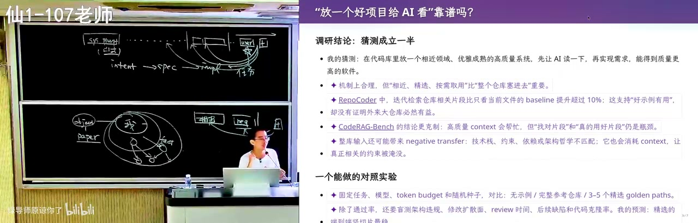

**[01:23:57]** 我们今天还没有这种超能力的AI你还是需要有概念，知道上下文里面有什么，上下文里面的每一个东西都会对AI产生什么样的结果。这唯一的途径就是第一你要对你玩的东西有概念，你还是得学处理器、操作系统、编译器、数据库。这里有很多设计的智慧，只是你学的方法会变好，你会用我们更高效的方法方法来学。然后你理解了上下文以后，我们会用一个学期来解释怎么样用软件工程里面的各种各样的方法去给出一个正确的指令去监控AI运行？

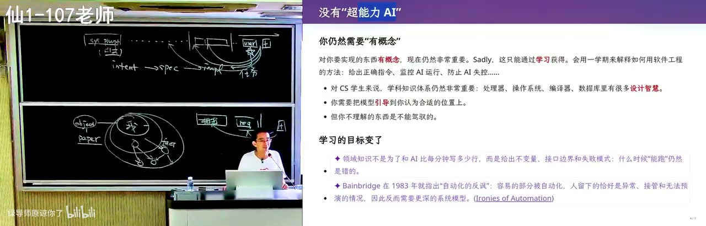

**[01:24:37]** 怎么样给AI好的，什么叫好的verify？今天我只是提到ok你要在上下文里面放进verify。那什么是好的办法？你们可以自己你们自己有自己的想法，对吧？

**[01:24:48]** 我今天有一些比较松散的想法，今天我们还是需要把模型引导到你认为合适的位置上。但是这已经比我组一个工程团队对吧？我要我要雇很多的人，然后我要和他们拉通对齐这种互联网黑化对吧？对。你不需要模型很聪明，他见过。你只需要用正确的提示词，简练的提示词放在这个上下文里面，让这个提示词一直能被看到。能把模型往那个方向引导就可以。

## 12 研究失败、人的投入与工作方式

**[01:25:19]** 然后我这儿有一个很好玩的故事，就是一个一个没有超能力AI的一个非常典型的案例。我们要做一个研究项目，然后这个研究项目大概是做一个符号执行引擎的优化，你不需要知道这是什么。大概大家就是说我要写一个程序，可以分析一个程序自动分析或者证明一个验证一个不算很大的程序的证正确性。这也是一种一种玩尔法。然后我们现在这个东西提的执行效率比较低，所以我们希望提出一些比较有效的优化。当然这也是一个非常合理的incremental的适合学生做的做的题目。

**[01:25:55]** 然后为一个原始的idea，大概是我们我们用这样的方式可能可以有效。但有些东西是open的，比如说这个东西到底怎么做，什么东西有效，那可以写一个写一个research，然这个同学很开心，有道理对吧？他认为这个idea有道理，然后gp t5.6扫也认为这个idea有道理，那确实就看起来确实这个然后好然后他又开始跑，然后就跑了非常多的token。然后按照那个同学的说法是GPT不断的在给我反馈，我无法验证他给我的反馈是正确还是不正确。当他给我negative的时候，它的negative对我也不知道应该怎么样怎样打破。然后好这个原汤化原石这个就是gp t5.6生成的，然后它的他的错误犯在这句话上，就是因为他他就是在上下文里面有一个地方没有做好，就把整个方向就我刚才说我们需要把模型引导到你认为合适的位置上。然后这个引导错了，他因为模型成了一个reward hacker，这里有一个需求说我要我要这个同学说我想证明这个A方法是有用的。好gt看到了这句话他就忘记了。

**[01:27:22]** 我们有一个更大的研究的big picture。我就是我我我作为审稿人的时候，我是站在人类的角度上立场上去评审这篇论文的。然后我们站在这个构建者的立场上，我们是没有办法这样反过来的对吧？反过来。所以我们只能从一点一点从小的开始做，证明这个方法有用。

**[01:27:44]** 然后他走他做错了这一步，他太想要去证明这个idea有用了。是因为有这样的一句prompt，然后他就构造了很多小的benchmark，然后在小的benchmark上做一些微小的东西，试图去给一些正面或者负面的结论，但然这些结论对这个是没有用的。然后他这里面犯了一个方法上的错误，当然我们纠正了就是我告诉你P说我们应该从一些真实的工具和state of art的算法开始这个benchmark哪怕要跑几个小时都time out。这个time out里面产生的这个搜索路径对我们来说是非常有价值的。它揭示了什么样的程序结构，对于现有的探索方法是不好的对吧？然后这还挺好玩的，一个一个的。所以他它他告诉你今天人还是有用的，今天人还是有用的。Ok我们没有办法把所有的所有的事情都带来给这个AAI。

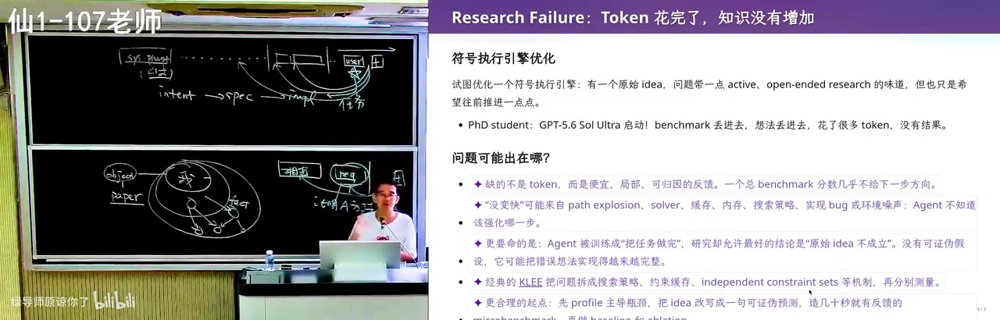

**[01:28:49]** 但是与此同时，我们工作的方式可能也要发生变化。第一这些知识很重要，对吧？什么操作系统，编译器。如果你没有概念，你提不出那个正确的问题，找不到引导的正确的方向。你对人类的知识没有概念，你也很难去引导他解决一个open的question。但我也发现有些就在和AI合作的时候发生了变化。一般来说我发现如果我盯着那个codex的session，然后他一旦跑偏我就立即纠正它，我可以更快的完成任务。

**[01:29:28]** 就如果是一个比如说就实现一个什么东西，比如说我今天就要上交互系统干个什么事儿，他如果我纠正他，给他指把我的领域知识注入进去，可能总时间会完成的更快。但是如果我浪费更多的token给他更多时间，它一般来说也能完成。这时候就有一个吹到对吧？

**[01:29:48]** 我到底是我花我的劲，就是你的人力是有你们每一个同学的精力都是有限的有有限的。每个同学都应该去思考，你要把你宝贵的那些精力放到怎么处理AI上。因为是这样，我自己发现这是我自己的问题。纠正AI是一个有多巴胺的事情，它给我一种什么感觉呢？虽然AI很强，我好像还是比AI有点用的。就它会产生这种非常微妙的心理安慰，而不是我就一个游乐目的，然后就等我回来，我也不我我也不会看历史，对吧？我他反正搞定了，我验收一下，他真的搞定了，我就不会看了。

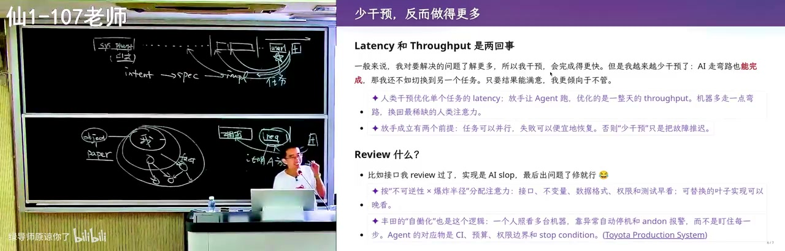

**[01:30:32]** 但这个可能很在非常长的时间里面都会成为同学们工作的一个常态，你们只有把AI用在就是把自己的时间留在这些收益最大的事情上，这个时间是不能生的。就你有一个东西不知道这些东西不知道你想要把它弄知道，这是你几乎百分之百的时间都要作为学生要做的事情。剩下比如说这件事情你知道应该怎么干了，把它干好，AI能把它干好，你就放手让它让他干这样就有一种是好像在pr的时代大家就已经说了，说要不要假努力对吧？你自我自己感动自己的努力是没有用的，你要有效的努力。在AI时代可能这个效果会差距拉的更大。就是你你的每一秒钟的假努力，如果有一个你的peer是在真努力，你都是损失非常大的对，这是一个这是一个自己的一个小小心得。

**[01:31:33]** 然后以及最后你们也会发现在随着指令上下文的增长，指令遵循的能力确实会。会下降的。但是现在模型有一很有意思的特点，一般来讲最后的prompt就留在最后的那个指令还是可以遵循的。到前面之后，尤其是到中间的时候，它上下文指令不遵循，所以干活还是很好用的。因为一般最后一个短窗口就是一个具体的任务，是你的prompt帮我把什么东西修了。他就真的还是可以把这个事情给做完，所以模型还是非常值得值得使用的。

## 13 开放问题：用算力换智力

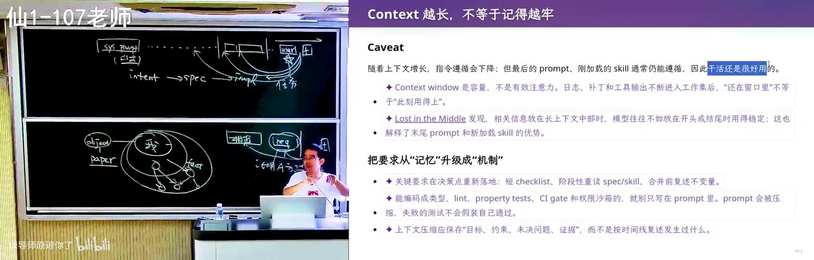

**[01:32:11]** 好，到最后如果你真正想要做一个真正龙horizon的非常难的任务，它不是解决一个问题，而是在一个不确定性当中探索。那么soft其实就是解决不了的了。能够解决的是一个有法它确定的一直往后就能解决的问题。但是如果你让他去解决一个，帮我考虑一下几种方案，哪个方案最好，他很有可能会给你一个不是最好的方案，为什么呢？

**[01:32:52]** 虽然模型已经被训练成舔狗了，他完成任务才有奖励，对吧？他完成他不完成任务他是没有奖励的，所以他会给你一个有限的方案，就像P和NP就是你大家都知道P和np它有两个complacy class，甚至有更大的complclass。有个整个的朋友np问题说你想要验证一个解是比较容易的，是P的。但是你想要找到那个满足条件的解是很难的对吧？要找一个hamelpass，你给你个路径是不是Hamel你很容易。但是你想要找到一个满足条件的话，就是mp p complete它是一个完全问题。所以set这样的这样这样的问题。而就是因为这个搜索是困难的，这个验证是容易的，模型为了完成任务，它势必只能做有限的搜索。

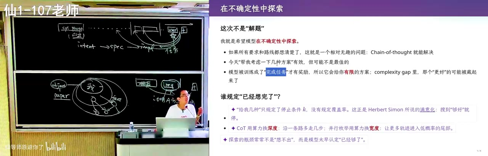

**[01:33:52]** 这样想一想，有一种是你在考试场上花点时间，一定要把这个考试题写完。无论如何马上要交卷了，你写你的分数就比不写要高。所以你一定要写点写写点什么，这个时候你就可以用一个算力换智力的循环。

**[01:34:13]** 我举一个例子我举个例子。你们这一代人是子涵吗？你们有很多同学是子涵吗？没有你们还没有你们你们可能你们比你们再小五岁的那个班上，一个班上就有五个甚至10个子涵，对吧？然后现在子涵就少了，现在现子还少多了。

**[01:34:43]** 然后你看AI给我的这个给我还是很好的对吧？你看他知道要去诗经里面找一个，对吧？还是还还是可以的，就是它的品味肯定现在模型提升了，但是你还是不敢用的，为什么呢？因为你用deeppk起名字，别人也用deep p起名字，然后你你就会你就会成为一个AI时代的子涵。对，这个因为大家都是用deep起名字，然后di一就起了同样的名字。

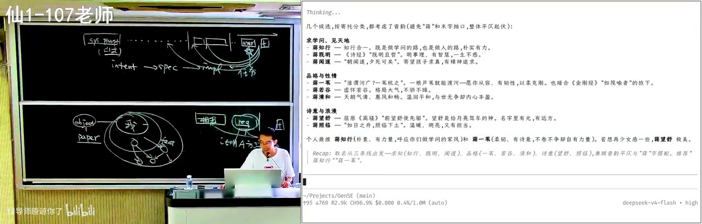

**[01:35:20]** 我的经验是，如果你真的需要一个非常low horizon的任务，你就需要一个系统性的调研过程。你们可能做比如说上什么科研实践课，学的那套就很像了。你们进入一个科研领域第一件事情做什么文献调研，穷尽解决和这个问题相关的所有的文献这件事情。在AI想要快速完成任务的时候，AI暂时还不会去花这个大代价。但是你可以做名字是可以枚举的。你可以先选音，然后把不好的音给筛掉，选完音你再去用subabent一个一个去检查字，对吧？然后你可以给他，比如说你喜欢诗镜，你可以选一个诗镜里的一一的词，那么你就实现了算力换指力。

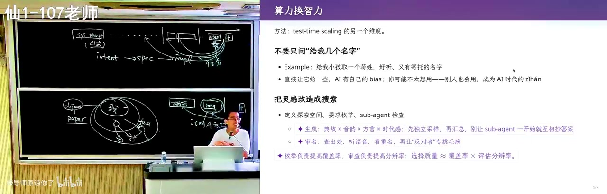

**[01:36:16]** 你把一个你有个开放问题，一个非常大空间里面的开放问题。你如果直接让AI去用next token的方式，它会给你一个它的偏见带来的这个东西。但是如果你可以把这个空间分割成很多个destroint的部分，然后你的每一个部分就可以变成一个有verify的更明确的东西。

**[01:36:43]** 你有更多的算力，你就有更大的智力。但这个有一个缺点，token烧头根。所以这就涉及到我对人类社会的一个我觉得很有趣的理解。世界很大人很小，我们人类的品味就每一个人都是不一样的。因为我们带了太大的bi我们，在不同的城市，不同的教育背景生活圈长大。对Richard sat有一个bigworld hy我们就是学不到这个世界上面所有的东西，但就是因为我们带着这个bias，才有这个一加一大于2，我们就是一个最大的群体智能对吧？

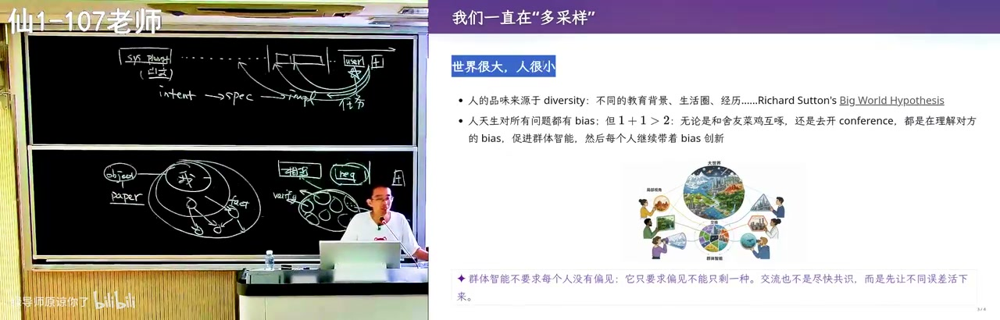

**[01:37:24]** 我们在一起实现智能，但这会带来一个未来的危机。我不知道，我先要把这个问题先抛出来。如果如果这种真正龙活来讲，就真正有价，世界上真正有价值的问题，可以用算力换智力，会可能发生一个什么样残酷的现实呢？

**[01:37:43]** 有一类人可以获得无限的计算资源，他就有无限的智力，他就可以砌堵墙。在这个墙里面的人有智力，是我的朋友，在墙外面的人是普通人。因为假设计算机AI模型比人类的智力更高效，那我们外面的人就变成动物园里的猴子，就是让他们自生自灭，他们也无论如何也不可能赶上里面人产生智力的这个速度。那么就墙里面是超人，墙外面是动物世界。我们大家已经在AI的关键的七点快要到的时候了，我们可能需要思考，怎么样防止这件事情到来。

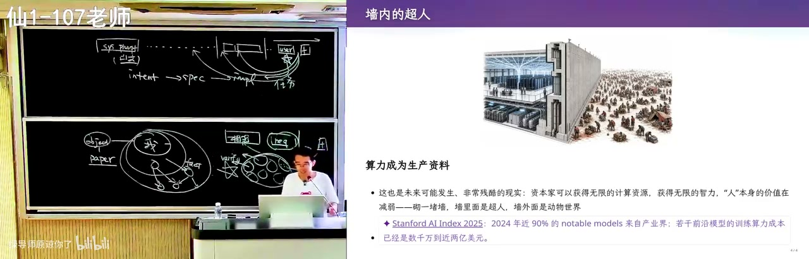

