第 6 讲 · 需求和架构（一）

!!! quote "本讲信息"
    **课程**：南京大学《生成式软件工程》（蒋炎岩）
    **原视频**：[B 站 BV1Rch76WEfQ](https://www.bilibili.com/video/BV1Rch76WEfQ/) · **时长**：01:36:50
    **说明**：非官方 fan-made 转录，仅作学习用途；内容版权归原讲者所有。转录错误以原视频为准。

---

**[00:00:00]** 上一节课的时候，我们讲了软件工程的来龙去脉，对吧？说在什么时候碰到了软件危机。然后大家发现那个时候软件开发不下去了，我们需要一个工程化的方法来解决软件里面的问题。然后也看了那个Royce的那个老paper，他说我们希望的大概虽然是大概是希望有一个intent，然后能够走向 spec 然后最后走向implementation，后最终可以产出一个软件。当然有了implementation以后，你还需要维护它软件的生命周期没有结束。所以很自然的一路向下就有一个瀑布一样的过程，对吧？

**[00:00:42]** 我在in在设计的或者需求的阶段，可能会得到我对这个软件的一些认识。然后这些认识逐渐的会进入这个specification的space，它会形成这个依赖的关系。然后在系统实现的时候，你又会有各种模块，函数代码、测试，各种各样的这个软件里面的artifact。然后这又会跟其实当然这是直接和间接的这种data dependency，然后就形成了一个错综复杂的交错的网络，然后这就是软件工程的一个起点，对吧？所以说斯批判了这样的一个模式。

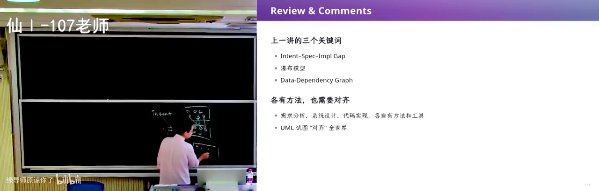

**[00:01:17]** 他说ok如果你按照这样开发的话，很可能你在后面对吧？它的分析其实就来自于这个data dependency。如果我在后面这个时候发现有一个东西错了，然后这个错一直会反推回溯到前面的某一个东西错了。而前面的某一个东西如果在事后被证明是错的？

**[00:01:37]** 一个设计不合理，实现达不到预期，然后你的需求或者设计做错了，那它会导致后面一个很大的部分，它会污染到的部分，看到的部分都会失效。然后你可能会需要重做，会带来大量的成本。然后在这样的一个背景下，软件工程就诞生了。所以软件工程研究的是在各个的做需求分析、做系统设计、做系统实现的时候，我们有什么样的方法。不管是有人文关怀的方法，对吧？你需要用checklist，然后说这个产品经理应该怎么管人所这其实也是软件工程的一部分。到比如说你写代码的时候应该怎么写测试，我们有没有可能做自动化的测试，自动化的分析，然后展开了一整个软件工程里面的故事。

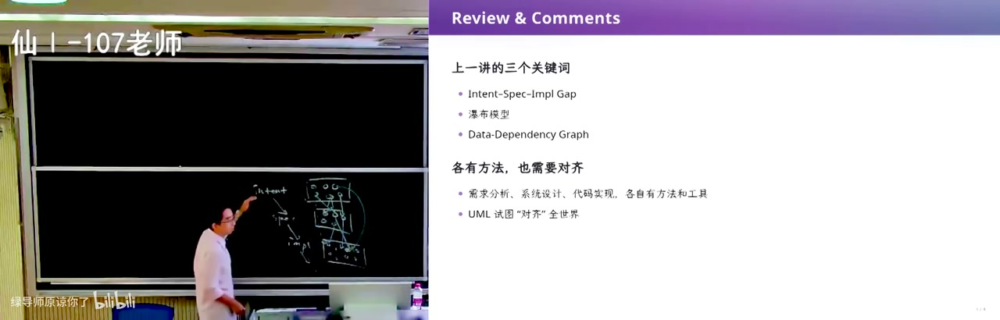

**[00:02:21]** 然其中一个比较有趣的，一个在pre-AI 时代的尝试。因为人很难对齐，人和人很难对齐。而且我如果不写文档的话，很有可能如果只剩一份代码，你甚至比如说出错了都不知道应该去追溯到过去的什么时候，对吧？

**[00:02:37]** 所以在那个时候，软件工程里面提出了很多重要的概念，比如说traceability？可追踪性。我们的每一个最理想情况下，每一个测试用例或者每一个代码的片段，它都能够关联到对吧？可以trace到一个过去发生的事情，做过的设计上，这样整个系里面到底发生了什么，我改它会影响谁？我改设计会影响哪些测试用例，都能维护起来。然后如果我们有一个语言，一个结构化的有语义的语言来表示它，那显然是更好的。所以就有了他试图去对齐整个世界上面的软件工程的实践，这当然都是都是有有智回的。

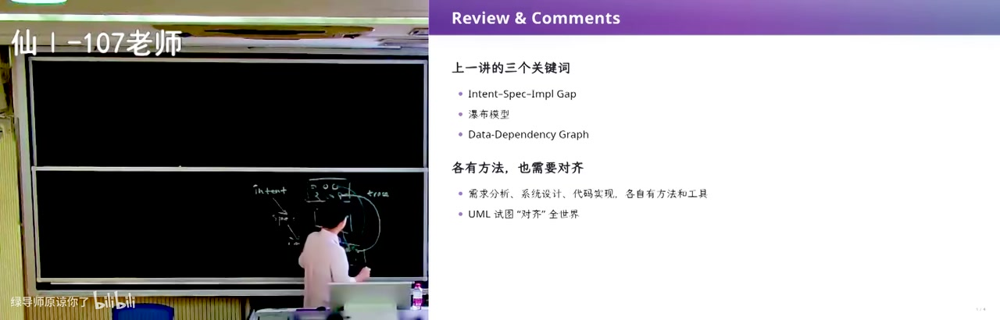

**[00:03:19]** 然后我们回过头来再想一下这个过程。实际上软件工程它困难的还有一个本质的原因，其实叫软件它不软。那就我们觉得什么东西是软的呢？你们现在坐在教室里面的这个椅背，它就是软的对吧？它软的。然后你你当你们说软的时候，它有一个就是什么东西是软的，它有弹性。它你当你对它施加一个这个，比如说你把它按摁下去，你一一靠它就瘪下去了。但是你做起来以后，它又弹回来了，你下次做的时候它还是好的。但软件和这样的就是物理世界里面的这些，比如说你的椅背很不一样，它是一个纯粹的逻辑制品。这个逻辑制品是容不下任何细微的差错的对吧？

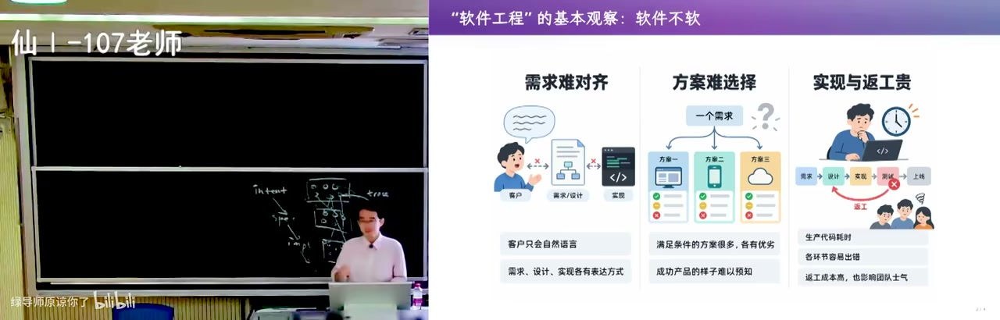

**[00:04:07]** 作为一个程序，它有形式语义。你可以想象你们在写代码的时候，从来没有考虑过如果你的程序里面的内存可能会发生一个bit的翻转。你的程序还对吗？对吧？肯定不对了。你想你你的你你你有写了一个什么程序，从S点输入一个N然后现在输很好，输入N 等于1，然后N 等于1，我就接下来循环就会从数组里面读一个元素到数组里。好，这个时候如果你的软件是已经在卫星上的，然后有一个宇宙射线击中你的内存，然后那个一它的on的integer的最高位变成了一。好，它突然就变成了一个巨大无比的数，然后你整个程序就彻底的collapse了，对吧？它它会无限制的去从输入里面读数，然后如果没有的话，他可能会等然后你的程序表现出来就是 hang 了也可能在读了比如说100 1000个数字以后，产生一个memory对吧？所以软件其实一点都不软。

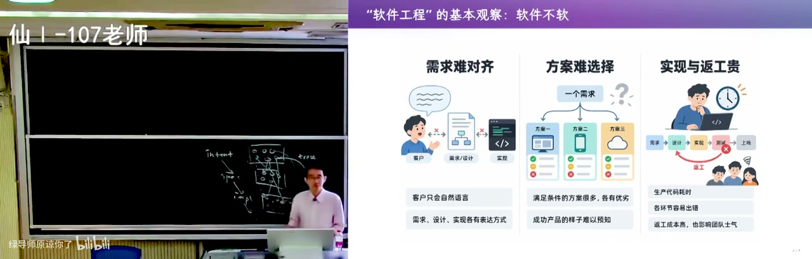

**[00:05:04]** 刚才我说的是一个比较极端例子，就是它运行的环境可能是你你不可预见。但其实大家是在data center里面会观察到，比如说你的处理器随着制程越来越先进，它在这个热噪声下有些指令，就它那个密度特别大的指令，它可能会产生这种silent的L就这条指令你在这台机器上执行或在那台机器上执行，它结果就不一样。而且甚至是可能要这个服务器运行一段时间以后，才会出现这样的缺陷，就制造时候的缺陷。所以软件本身就是一个大家认为是集成了人类智慧的一个东西。然后同时它又要承载？从客户来的这些需求，就比如说教务系统，我今天会花时间来讲教务系统应该怎么样设计，应该怎么样防止它堆积成屎山。

**[00:05:59]** 好，这是软件工程。然后在这个背景下，我发现尤其你们学习，比如说可能有听课的是软件工程的同学，然后学计算机专业的同学，肯定要上软件工程工程的课程。软件工程是一个关乎整个软件生命周期的学科，但是你们被迫只能从底下这个地方开始学。因为如果你不理解代码是什么，对吧？如果你写不出代码，没有体会过码农开发软件的痛苦。那你是不可能做好一个产品经理的对吧？你你你设想的话这个事情应该可以办到，这个事情花多少成本可能可以办到。如果你没有一手的经验，你确实是做不到。

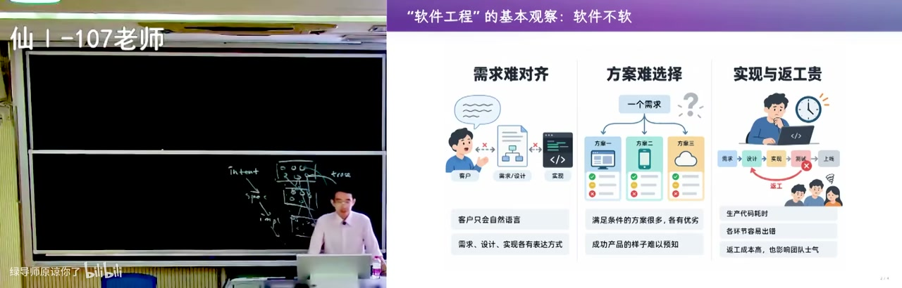

**[00:06:43]** 所以你们上来以后就先学习语言，先选一个最基础的，老的已经过时了，没有人用的，也还算有一些人用的编程语言。然后在这个基础上，你不断的产生新的知识，知道世界是怎么失败的，然后新的语言是怎么创造出来的，为什么要有有它，然后一点一点去往上走对吧？免免去去往上走。然后你今天看到的是像需求产品架构对吧？这是我今天要讲的主题。在在这个软件的设计的阶段到spec从intent到spec的阶段。然后这其实是软件决定了一个软件系统从零开始走向的最关键的部分，对吧？

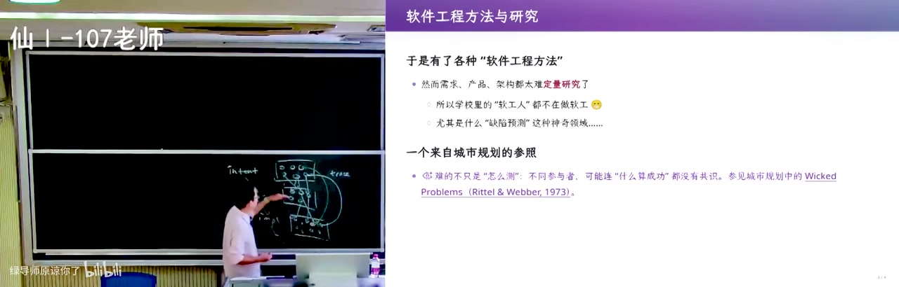

**[00:07:22]** 我们前面上课的时候先讲了版本管理，为什么先讲版本管理呢？因为你你总是要从一个空的软件项目出发，你做一的时候总是从一个空的出发。那我们先讲一下，如果从空的出这个软件怎么样往后走。然后接下来下一步我们就要把控软件执行的方向，对吧？软件的走向，你的船到底是往东南西北哪一个方向开？那你你一开始的方向选了以后，对后面的影响是非常大的。但是像虚建的需求，产品价格都很难做定要要么就是案例说你也没办法，我只能这样案例，要么就是就打门科学及概念，它会然后说一个我需求量做一BC价格要做1BBC产品要满足什么好，然后大最让你看到的是我们的学校里面有很多做软件工程的人，对吧？我们号称南京大学的软件工程世界第一对吧？

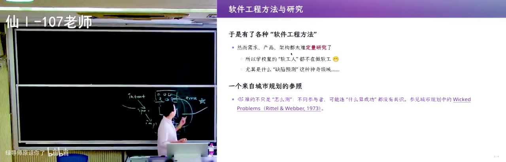

**[00:08:19]** 在C上面如果你属一的那个文章的话，然后，其实他们大部分都集中在和编码相关，implementation相关的东西，可能有些比如说做这种nlp的对吧。他说他会说好traceability在软件世界里面是非常重要的。这个correct好，那我们能不能训练一个神经网络模型来直接从数据当中推导出这个对吧？那它变成ok那可能也许用GPT-6就可以做到做到。对那我今天还是要讲一讲，所以我今天就要讲一讲这个里面最重要，或者说我觉得对于尤其在AI时代你生产一个目标明确的代码已经变得非常便宜了。而且现在比如说对我来说，我现在让AI生成代码，我只要把它的边界划定清楚，我其实真的已经不看它的实现了。一会儿我会给大家看到那个GPT-6昨天写的那个那个代码，那个那个实现已经超越人类能够理解的范畴了。但是三号它是对的，我我还能我还能比较好的信任他。

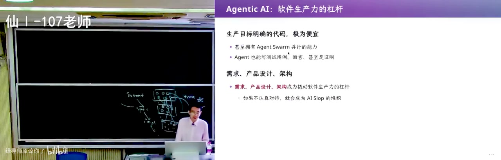

**[00:09:24]** 如果我把它边界划定的清楚，然后并且我能够知道他怎么样做一个好的validation的话，那么我可以把agent铺开去帮我实现这个还是有一定质量保证的，软件的那剩下的其实我觉得我们做软件系统的压力，或者说能够决定这个软件系统最后能走多远。比如说我们说一总是做一个minimum viable product对吧？个这个没有问题，因为做minimal .

**[00:09:55]** MVP可以让你快速的找到一个从intent到specification implementation的一个切片。然后在这个切片上你可以走完整个软件完整的流程，但是它不完备。那你在做这个 MVP 的时候，你一定想的是先做最重要的工程，对吧？

**[00:10:12]** 你一定不会想着你在做P的时候，就是想那个按钮的那个样式应该长什么模样。这也是pen的你的按钮是你的按钮样式。你看到你整个界面的设计，然后整个界面的设计就激判到整个你的所有功能的实现。如果他们不确定的话，就是望如果你现在就调那个按钮的样式，当上面的设计发生了改变，你说你觉得这个按钮的样式很有可能就不可能是了。所以你会做一个你会有一个倾向，你不要做无用功，不要去研究一个你即将会扔掉的东西，对吧？每个人都有这个本，如果你确实有这个本能，那么你就应该知道在做 MVP 的时候选哪些最重要的功能。

**[00:10:56]** 你会得到一个可以运行的版本。好，没问题，AI会给你一个，但是AI就在今天，至少今天的AI他没有去从需求产品设计架构的角度，除非你去显式地，用prompt去告诉他，甚至哪怕可能是几个字告诉他，你都会能够？在你从一个零开始项目的零开始。然后如果你要让他用，比如说这个client server的架构，或者你就是一个你要他做一个CLI的架构，你同样的一个MVP的需求，需求定下来，它加上几个字的prompt，你都会得到完全不同的MVP他们可能功能上都差不多，看起来就都是实现了你的一个好。比如说我要做一个codingagent，或者做一个你的lab一的个随身的agent，但是你的这几个字的prompt都会形成一个带有这个都会膨胀。比如说如果你有 CLI 那你离这里面可能就有点Y？或者是depend on一个JavaScript里面的这种像colorcode用的这种命令行的库。然如果你你先要求这个server，那它可能就会先设计这个数据的存储，然后他会给你选一个数据库，他就然后你一旦这个东西，比如说DB你他一旦这个文件写了，它就会进入a ent的上下文。然后每当你继续想要做，继续向后做这个需求下一个需求的时候。

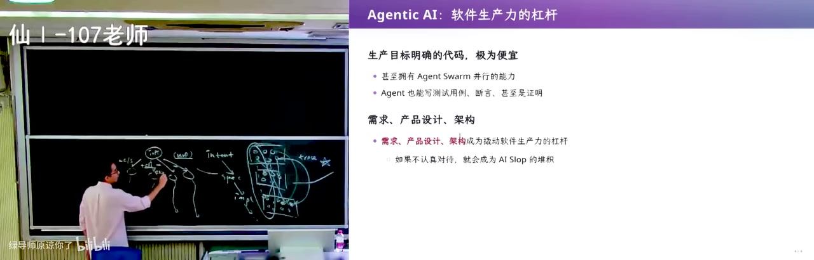

**[00:12:30]** 都会带上之前的所有的历史。在软件工程里面也有一个术语叫做技术栈 technical。是债务，就是说你你你在你在做任何决定的时候，你就背上了这个债务，因为这个决定你在做是是好是不好，对吧？那你的决定性来自据需求，比如说这个对我来说，我到底要一个是什么功能？我显然是写了需求，那这个需求有一个自己的你个需，那你就是想做一个比如说帮助你学习的，或者说你已经进入了科技组。你对读研究论文这件事情，那你看到在不同的这个需求下，你的软件的增强可能力是不同的，然后再加上你的产品。是面向你直最终的一个产品里，那比你的想象中这个产品是只有你自己用的。比如说我自己有很多自己用的一个非常顺，但是我相信另外一个人因他就不那么舒服了，因为我我自己有一些我自己的知识，还有我自己的偏好。对别人来说可能是受不习惯这种喜欢的命运，喜欢工作的普通人肯定是不要不要想。

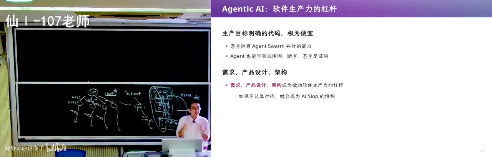

**[00:13:44]** 除此之外还有一个隐藏的东西，其是假格中，就是这个软件会变成什么样。而这会成为套的软件，是生产真正的杠杆。也就是说你可能是极短的对你的A真正的老的走向，技术债的累积带来了一个非常大的影响。所以我会花两年多的时间来讲这个需求和需求和架构。

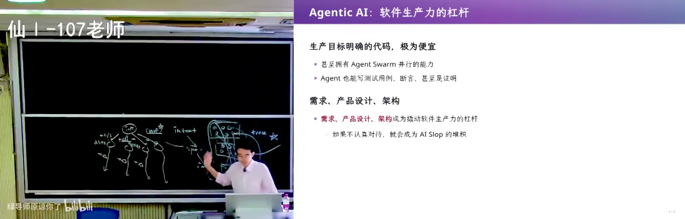

**[00:14:13]** 我可以让他诊断一下，曾经对吧曾经这个是我刚才翻车了，对吧？我的系统ui还在正常工作，然后我的OBS还在正常的推流。但是我不知道不知道发生什么，因为我的所有的设备都不能用了，我鼠标键盘都没有用了，我插上一个新的鼠标也没有也没有用。所以以前，当然这也是一个软件工程实践，对吧？出了问题你要去看日志，这in你在写软件的时候需要输出足够多的日志，这个好像AI就如果你不告诉AI的话，AI也不会主动做，它会生成一个没有任何日志的软件系统。大都会留下这样的技术债。然后我不确定我不确定能不能找到这个问题。

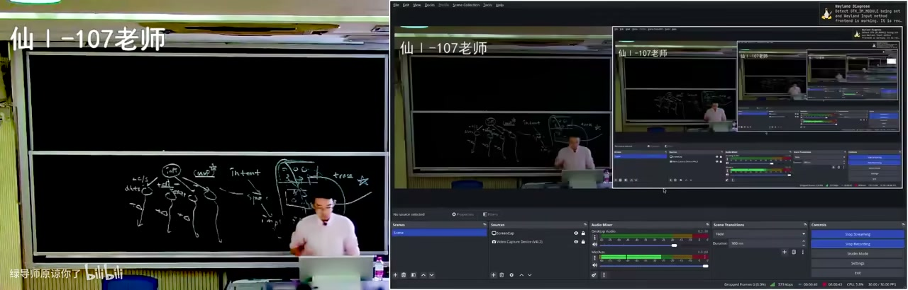

**[00:14:58]** 但是我们回到今天，我们要讲的内容是需求工程。我们说曾经需求工程很难讲，因为学生不会去见真正的客户，也做不了需求级的软件系统，对吧？你们从刚才说从最刚开始的时候学学编程语言，到你毕业的时候，你你你的能力的增长不足以让你去面对一个真正的软件的客户。当然现在这个事情有点变了，你看在AI之前，我们有很少量的精英独立开发者，你们经历了几年的开源社区的洗礼和终于觉得自己可以独立了做做开发者了，然后会有一些付费用户。然后现在变了，现在这个独立开发者就爆炸了，然后付费用户瑟瑟瑟瑟发抖。

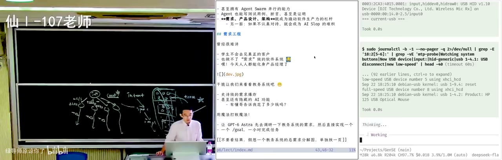

**[00:15:44]** 然后我们今天要讲的软件系统的例子，是我比较喜欢的这个教务系统、教务系统，我可以称它是史诗级的需求爆炸，我昨天就趁机看了一下，然后我发现我登录还在吗？好，我的登录不在了，让我扫码登录一下。我需要扫码登录。好好，我发现教务系统这几年一直都在进步，虽然这是我的界面，我稍微放大一点点。好好，我最近发现史诗级的更新，我可以问仙林教学楼的灯一直没有解决，我应该打电话给谁？Shape我可以直接。

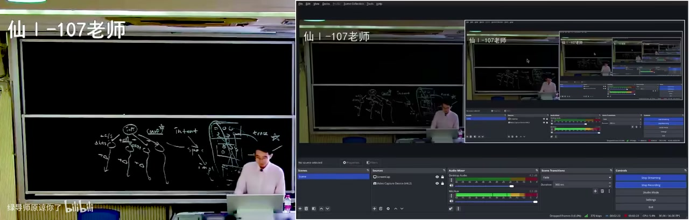

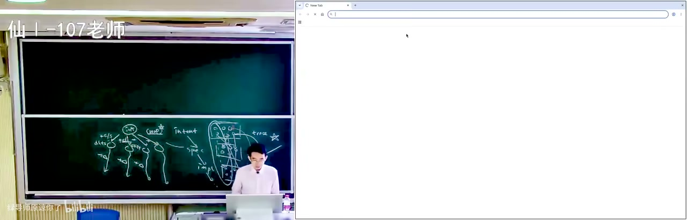

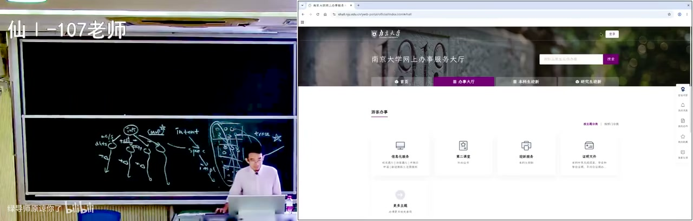

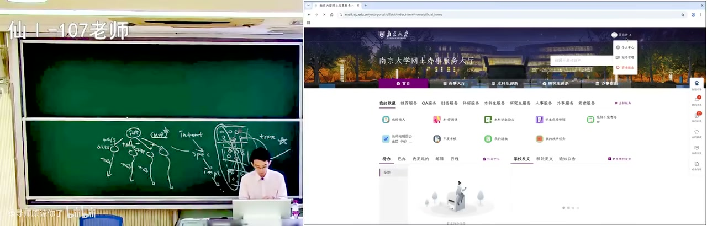

**[00:16:53]** 搜索。

**[00:16:55]** 我正在理解您的问题。我不知道，他这就是基建处，基建处。但是我在那个系统上面，平台上面提了，然后基建处就把我打回来了，说这个事情不归我们管。回回头再再给他打电话。好，那我现在在上什么课？我不知道这。

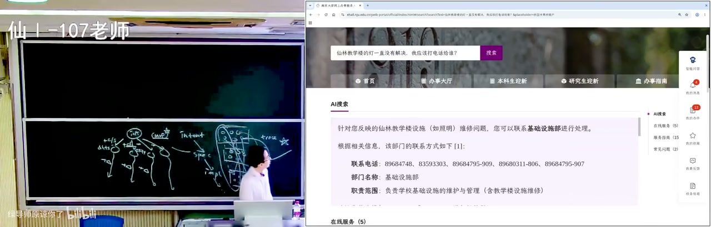

**[00:17:19]** 个行不行。

**[00:17:23]** 我现在在上什么课，我不确定他有没有载入我的我我我的上下文，我猜是可以的，因为我我登录了。他还是教师课表本科，这是我的我的课感，还是这是一个史诗级的更新，你们竟然对吧？不知道。对我相信大家应该不知道突然有有这个功能了，我不知道什么时候加上的，曾经肯定是肯定是没有的。因为好像我不会去搜索，我因为我总是在那个快捷搜索栏里，直接等到它下一个界面弹出的时候，我就点它。所以这是一个非常典型的需求爆炸的系统。

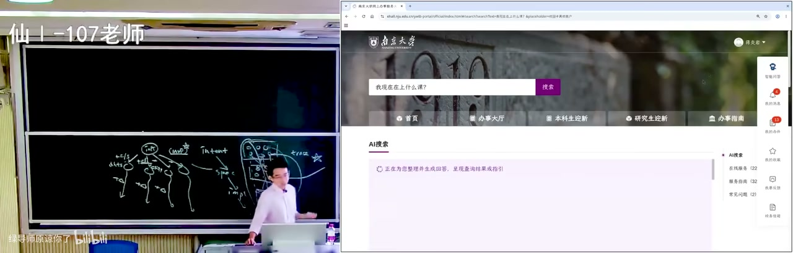

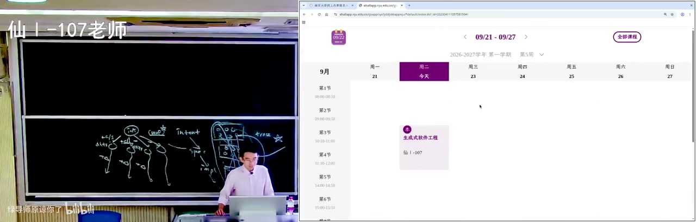

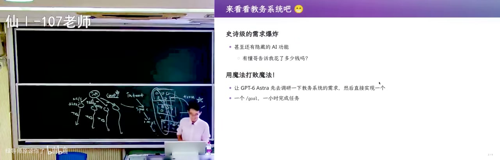

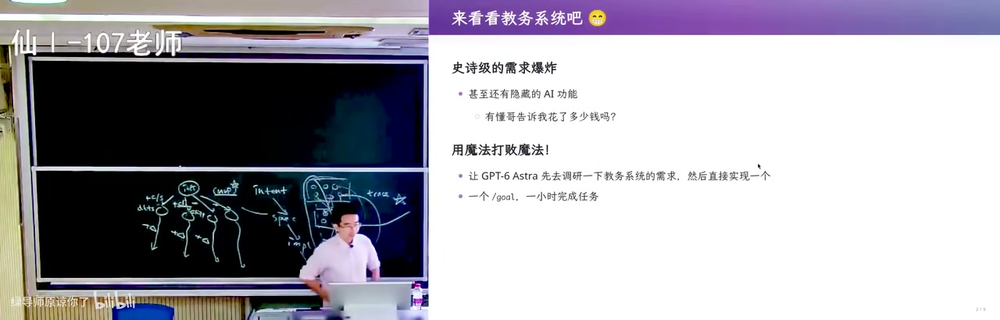

**[00:18:12]** 这个系统肯定是花了很多钱的。然后这个钱我觉得某种程度上还不如变成token的补贴给大家对吧？因为他要购买算力，他要购买开发，然后他不如我我刚才如果我用派agent去找一下的话，可能就一毛钱两毛钱对吧？所以把token送给大家，然后不要实现任何的功能，可能是可能是更便宜的。

**[00:18:36]** 好，需求我是讲需求，这样的一个系统就是一个非常典型的业务系统。比如说我除了找到我的课表以外，我应该还可以找。对我我收藏了sorry，比如说我的教学任务，对，我的教学任务，你在这里可以看到大家的信息，我就不点了，因为点开以后好像会显示电话号码还是什么的。这显然是一个比较糟糕的糟糕的feature，在学生名单里面可以看到看到电话号码。

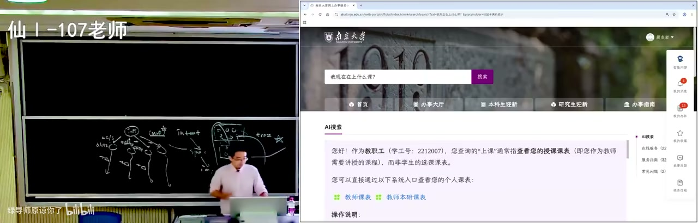

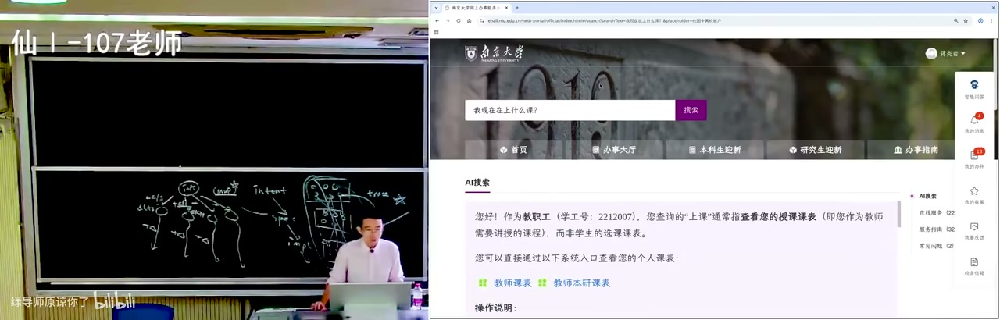

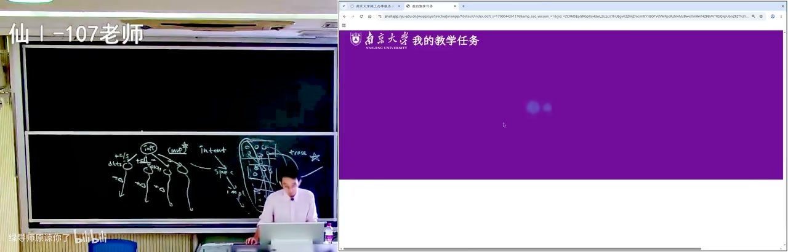

**[00:19:12]** 然后在这里上一次给大家演示过，直接用AI来来用 slop 来填满教学周底你看没有人管我，对吧？我没有任何人来审计我填的任任何的任何的内容，至少至至少还没有我觉得他们更更应该把这个教室的灯给都给修好好，然后你就看到在这个界面里面有无穷多的功能，你看比如说有编辑联系方式，然后我在这里有当前教学学习最新排课学习历史授课信息。然后在这个历史授课信息里面我要选择学年学期，选择学年学期。不太好用对吧？你的感觉是不太好用，又还蛮好用的。他还是做了需求需求分析的对吧？

**[00:19:59]** 比如说期末考试签到表，这也是一个需求功能点对吧？他在期末考试期间允许你点击这个按钮，在没有到期末考试发布的时候，你要弹出一个窗口告诉你无法打印。然后再比如说编辑教材，编辑教材进入了另外一个页面，有一个弹出窗口。

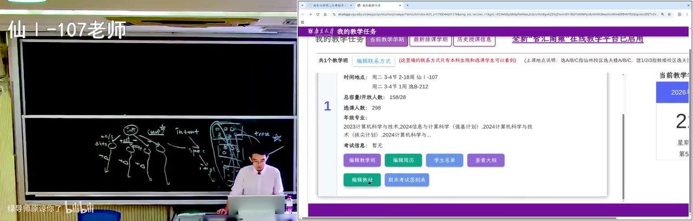

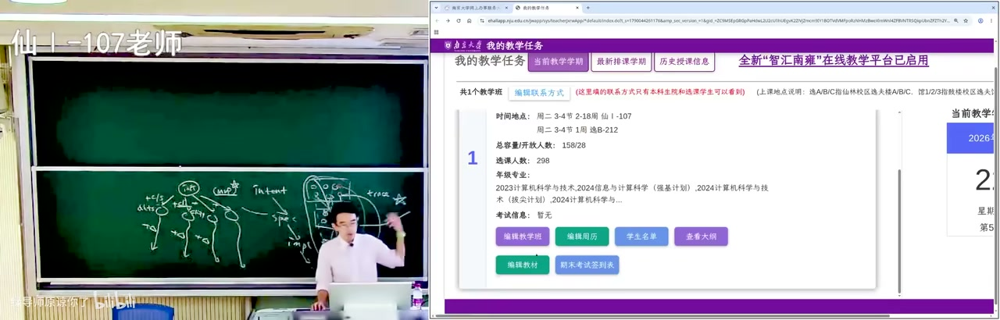

**[00:20:21]** 再试一下。

**[00:20:24]** 编辑教材曾经好像是可以的。好，我们已经成功发现了一个bug查看大纲，大纲是大纲的教学安排景展示最新一个教学班。他等了很久才把这个页面刷新出来，这个可能不满足它的功能性需求的要求。

**[00:20:48]** 状态正常，还有没有别的可以点的？我就不用agent的点，我还是用古法方式来点好。没问题，这是我的教学任务。然后和本科生相关的还有很多功能，助教。比如说我的助教，我这门课好像对我这门课没有助教，我能搜我的名字吗？不对，这是学号，这个是学，这是我班上的助教，找不到课表，内教学班没有助教。

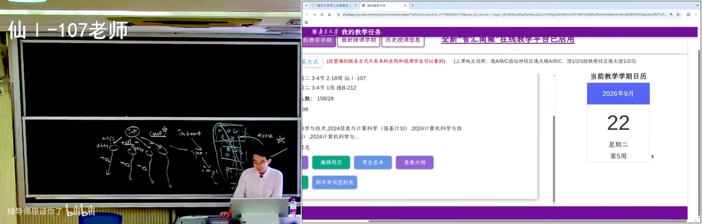

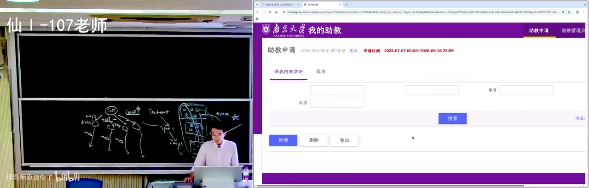

**[00:21:25]** 这是一这是什么？我这是这是什么？这是什么？让让我。

**[00:21:36]** 瞧。

**[00:21:36]** 一瞧。在这里我看到了一些JX太厉害了，教学班名称堪比agent对吧？搜索就看到这个需求是不断叠加的，因为曾经是没有慕课这样的功能的。毫无疑问在比如说在疫情之前是没有课功能的。然后在疫情的时候，领导说我们要我们需要为老师添加慕课，然后添加完慕课以后需要慕课的助教。然后在慕课的助教不要把它当成普通教学班的助教，要把它当成慕课的助教，然后就有了这个。

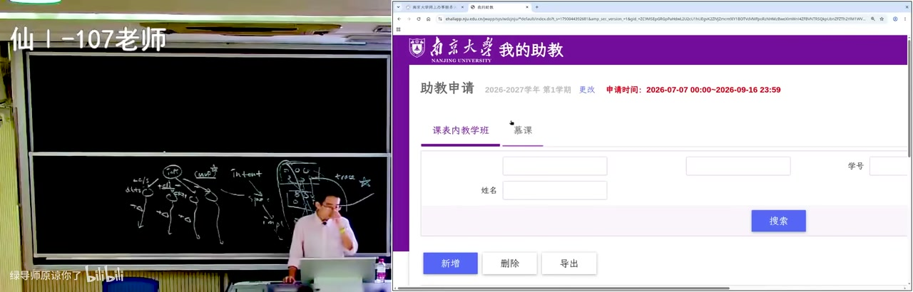

**[00:22:13]** 哎，这个是史诗级的bug，我我不知道我我不知道为什么，但是这是一个史诗级的bug。然后我点删除可以吗？好，点新增可以吗？请在可维护时段内操作课内教学班可以吗？新增请在可维护。

**[00:22:30]** 现在不能已经不能申请助教了anyway，这就是你看到的教务系统。所以你就理解上演。我说曾经很难讲你们不会去见真正的客户的，你们可能也不敢拍拍胸脯说给我20万，我找几个同学，我们把南大的教务系统给包了，你承担不了这个责任对吧？他到时候跟你签一个合同，然后你说你如果逾期交付的时候，达不到功能要求，达不到非功能要求的时候怎么办的时候，你你你就你就傻眼了，对吧？你当然你们作为一个成年人，你们是可以去成立自己公司，然后去和学校签订这样的协议。但是你们你们也不敢，我你们不敢不要紧，agent敢就行。

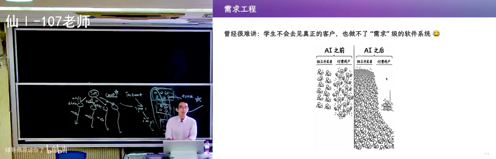

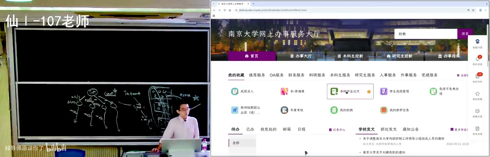

**[00:23:17]** 所以我干了这样的一件事儿，我让GPT帮我就跟我在这儿用派agent说我去爬一下，去帮我去生成一个什么笑不信箱的投稿一样。我让GPT去探索一下这个教务系统里面和教师相关，注意只是校教师相关的功能，然后得到一个需求说明书。好，我们来看一。

**[00:23:44]** 看这个需。

**[00:23:45]** 求说明书还是很不错的。南京大学本科教学服务平台需求说明书，这就是一个真实的需求报告的案例。你们可以在软件工程的课上看到这样的案例，然后软件工程也可能会给你们看一些来自比如说真实企业的，需求说明书的一部分。但这个就是真的，所以AI真的是很好用。

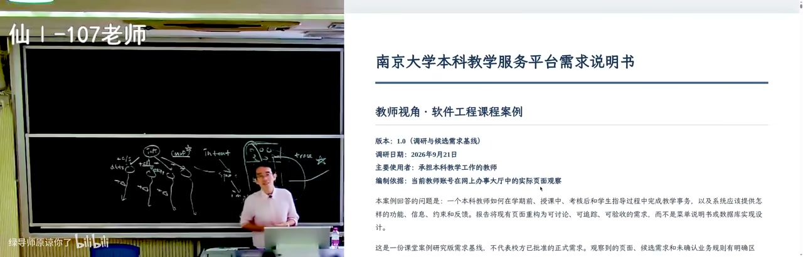

**[00:24:07]** 你要学东西的时候，我就想如果要教需求工程的时候，我可以当时可以找一个经典的案例，那我也可以把身边那里直接变成需求说明书。好，你马好像就发现这个目录里面有这么多项，从调研方法、证据边界到业务目标、成功标准，到各种各样的对吧？详细用例、规约功能需求目录，最后还有术语文档与与配套文件。所以你看GPT-6是懂软件工程的，他为什么要写这么多？

**[00:24:40]** 对，在我们看来这已经是一个做好的系统，这就完全的slop，对吧？就突然间写了好多好多的东西。但他懂得如果你要做一个真正的工程，当你面对的是客户的时候，一个术语就很重要。在他看不懂的时候，他可以去查一下术语，他就对齐了。虽然你不是U对吧？不是一个还在早期的意图沟通的阶段，但是这些东西显然是有一定用处的。

**[00:25:06]** 好，我就随便看一看需求功能的目录，你看它是有traceability的，每一个它遵循了一个比较好的软件工程的规范里面的每一个需求。比如说需求点和比如说前面是不是有叫角色？角色参与者或。

**[00:25:27]** 者业。

**[00:25:27]** 务目标，他都有一个语义上的有一个形式语义，然后这个形式语可以帮你建立traceability，而不是说我我我这个教学班是和学生管理是有关的。你自然语言肯定是说了这样的一句话的，但是他用有编号一个ID有形式语义的ID他就一定程度上的帮助你做了traceability。我们来看一看看一看功能需求，门户与身份提供分类服务检索和应用入口。当一个服务支持多种已分配身份时，提供身份选择并显示当前身份。你看当你真正做软件的时候，这复杂的就来了。你可以不说这些对吧？这些你都不说，但是有和到底有还是没有呢？对吧？我们看一下，他应该是观察到了，身份选择，我就不登录了。刚才在本科生，在我选择教师课表还是哪一个界面的时候，确实看到了他让我选是，反正我选了底下那个本科生教师对吧？

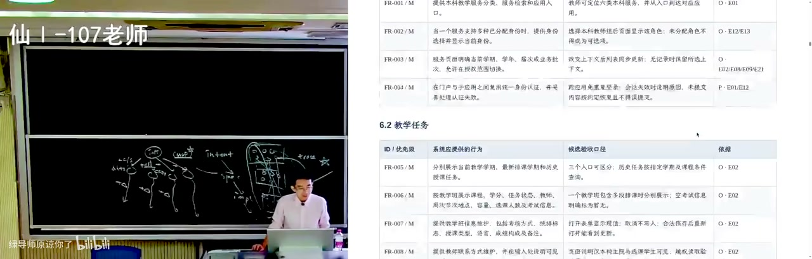

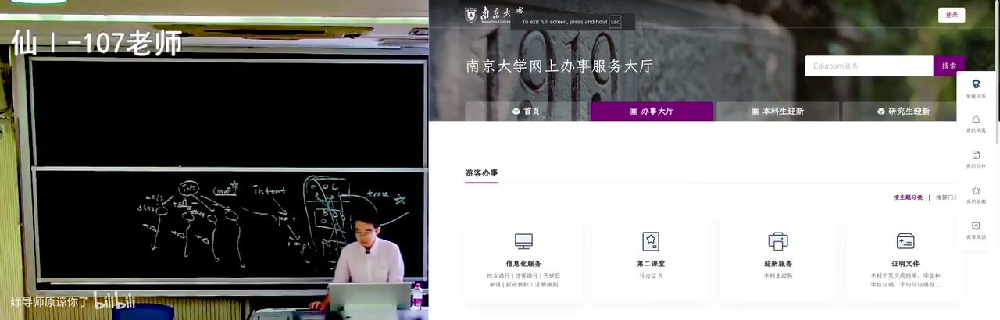

**[00:26:44]** 但在多种身份的时候，服务页面明确却当年学期学年届词或业务批次允许在授权范围内切换，这也是一个一个设计。就在在意图阶段，你的领导想要？领导说这个或者说不光是领导的，还是一线的教师说我打开这个页面以后，什么样的界面对我来说是比较舒适的对吧？所以刚才你看到教务系统还是有一定的设计的设计感的。他他他认为你在做，他会想你做这件事情的时候会想要做什么。然后他会留一个招box在那，你可以选那个job box，选一个学期或者选一个选一个什么东西，教学周历课程与大纲教材选用对吧？

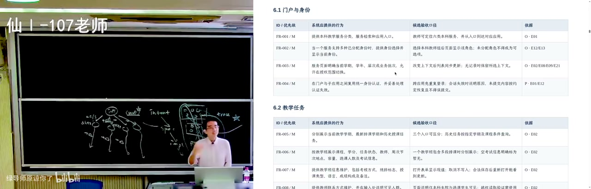

**[00:27:29]** 好，这里就知道了，这就是一个非常tedious的事情。然后这个事情tedious到你根本就不想干。因为你做这些事情对你获得学分计获得长进。看起来没有什么本质的好处，对吧？你还不如去做一个你没有之前没有想过的算法题，这样可以使你解决算法问题的能力高一点，使得你在最后保研机制的时候可以比别人多拿一点分数。而你在这里面一个条目往后写是非常无nonsense？你自己不会想去写，想写，但是就是量变引起质变。

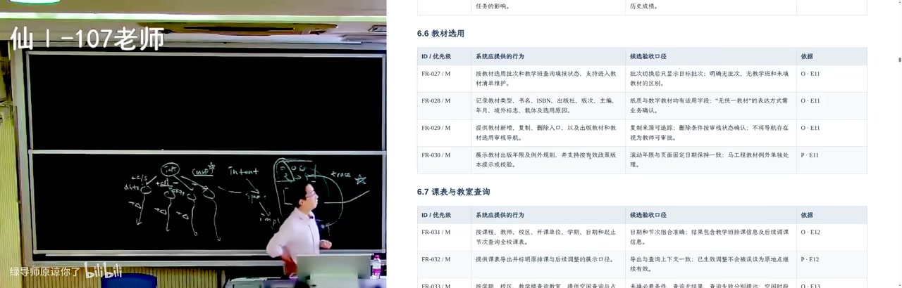

**[00:28:09]** 如果你这个需求文档，比如说你的课程的作业也给你一个需求文档，你的数字逻辑电路课的作业，计算机系统基础课的作业。系统基础课你们写那个full system的时候，挺好玩的。这是一个你们见到的第一个比较长的需求文档。我们在设计这门课的时候，在那之前OJ都是一个非常短的需求文档，明确给你输入接口是什么，输出接口是什么。而且那个输入输出的接口都很简单，一般都是少输入一个整数，对吧？还是空格分隔的整数，你只要用C就可以输入了。

**[00:28:43]** 而你们在计算机系统基础课上，第一次见到一个比较长的specification的guide。它的你我们首先需求的要求是你要实现一个NEMU，然后这个 NEMU你的第一个 lab可能实现一个调试器，然后这个调试器你不需要实现解释指令。第二个实验你需要实现解指令的解释，这也是一句话。但是到底什么是指令呢？指令的行为写在文档里，你就得到了另外的一个更大的需求文档。所以其实当系统走到大到一定程度的时候，你们做的训练都是相通的。你在学这个计算机系统基础这门课的时候，其实一定程度上学了软件工程。

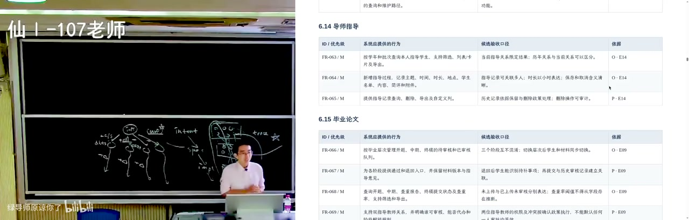

**[00:29:23]** 好，然后就是AI的魅力时刻了。我就不展开了，就是这是需求工程里面，你为了挣钱对吧？你看这是验收场景，它验收的场景，然后还有需求清单？

**[00:29:37]** 一个非常好的一个结构化的一个需求清单，这个checklist最终你就可以把它分成？前20个需求分给这个团队，后20个需求分给这个团队，然后就可以track每一个人的进度。你就知道哪一个团队落后于实现需求，落后于进度了。这个traceability有了以后，你作为一个管理者，你就可以把团队管起来了。当然这是我们本科上课的时候不怎么学的。

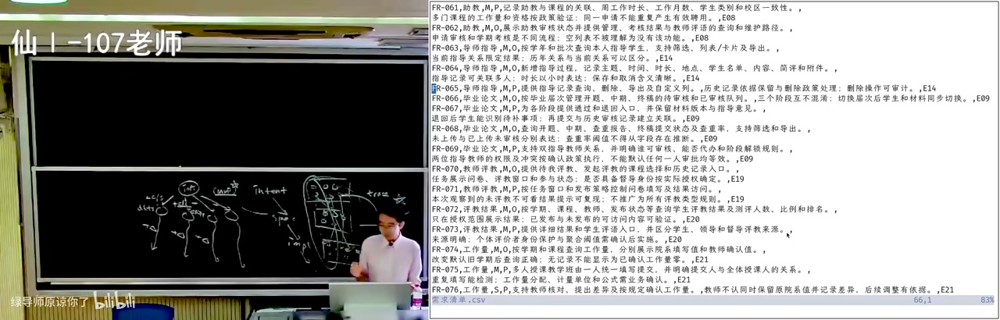

**[00:30:08]** AI的魅力时刻就在于你真的我又干了这样的一件事，我让GPT起一个sub-agent，然后这个sub-agent不要看任何的其他的交付系统，只根据这个需求说明书来实现一个假的教务系统。然后就得到了一个，我觉得突然你又有信心了对吧，突然你又有信心了，觉得好像我也可以，20万跟学校谈一个合同了对吧？还真的还就是还跟我刚才看的那个挺像的，对吧？

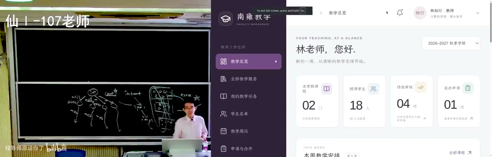

**[00:30:58]** 返回到全部教学任务，我的教学任务，本科教材管理软件工程实践者的研究项方法。编辑记录，我看这能不能编辑，也是数目一保存记录，记录已保存，成功的保存了学生名单。这是这GPT起名字的偏好对吧？就他认为在我的教务系统里面这些对大家其实其其其实挺挺文雅的对吧？然后你又觉得他有自己的这个偏好在在里面，这是什么意思？记录缺课。

**[00:31:40]** 负一词。

**[00:31:42]** 他不给我输入负一，那就保存记录。这个还是他没有阻止我，我记录一个这个其实也不合理，对吧？因为这个数字已经超过了所有的这个学期上课次数的总和。但你可以看到的是软件工程的魅力时刻。

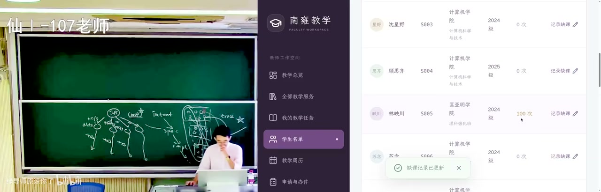

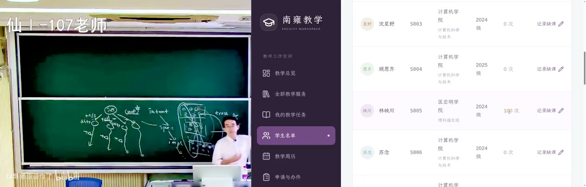

**[00:32:10]** 当你的需求是清楚的时候，对吧？当你的需求文档已经写到那个程度的时候，那么编码的事情、traceability的事情，测试的事情，其实A都能帮你搞定了。你只需要一份需求就行了，所以这是需求工程。

**[00:32:30]** 我们回一会儿还会回到再会回到这里先给大家看一下这个一个从入学到毕业的一个教务系统。它包括了权限、规则、版本、数据、同步操作、留痕各种各样的这样的一个功能。你就知道了需求无非就是通过无尽的和客户的沟通，把客户想要什么给想清楚，对吧？小到包括你要在界面上面放，要不要放一个当前学期和学年，要不要在哪一个地方有一个修改的按钮，这些都要跟用户对齐。因为你的用户不是你自己，对吧？

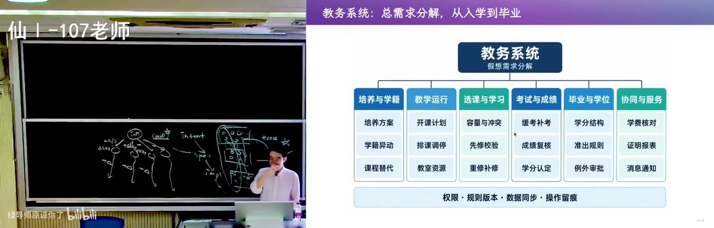

**[00:33:11]** 在你设计尤其是做需求的时候，这个是普遍的。我们可能computer science同学缺乏的那种软技能，你要有同理心。你不是说我是一个geek，我就假设所有人都会写程序。然后你你你考虑的是那个教务员对吧？那个教务员可能是本科学历，然后今年已经53岁，还有两年就要退休了，对吧？

**[00:33:35]** 一个优雅的女士，她在她上大学的时候，可能甚至都没有？没有操作过电脑。然后我要我们要设计一个教务系统，要为他设计，也要为同样为我设计，为年轻人设计。这个时候怎么得到那一张表，对吧？这是完全是另外的一个问题。当然不是这课的不是你这门课的课的重点。这门课重点是说当你的教务系统已经像刚才那样一个那么长的需求列表来做的话，其实就已经进入了泥潭了。就你刚才这里就是说当你第一步的时候，或者这么讲，应该这么说，如果你真的要做一个交互系统，那你就是被迫的，你被迫要从零开始。

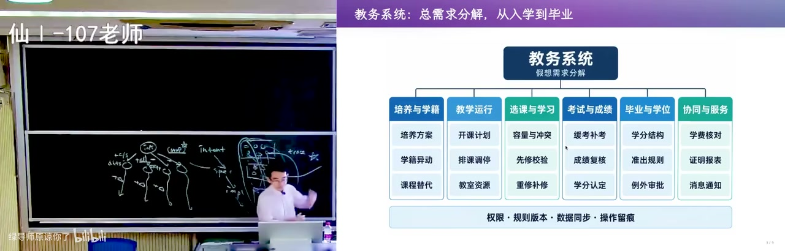

**[00:34:29]** 当然你这就是行业的壁垒和经验。如果如果我是一个行有行业资质，或者说在这个行业已经摸爬滚打20年的公司，我有很多这个领域知识，我知道教务员想要什么。你作为一个毛头小伙子本科生，你不知道这个教务员到底想要什么。所以你设计出来的那个软件，你做的那个需求很有可能就是有偏差的。但我有这个行业的经验，我设计出来的东西可能就我对学位授予的流程比你清楚，我就知道这个流程应该怎么样变成这一个需求的文档列表。但某种程度上我做软件都是被迫的？在刚开始的时候，一个空项目的时候，没有任何东西是漂移的。但当你一旦写出了一个需求。

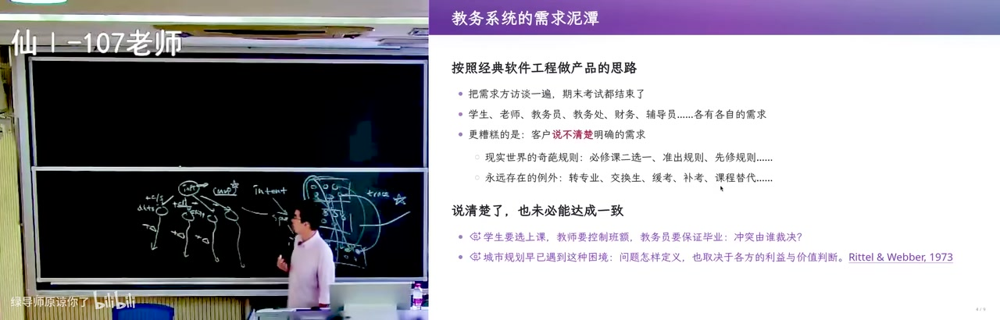

**[00:35:11]** 列表的时候。

**[00:35:13]** 马上AI不管是AI还是人类就给你实现了一版。就像刚才我们看到的那个教务系统一样。实现一版以后，你就背上了技术债。因为我们的定律是需求永远不可能说清楚。第一就是你永远不可能真的把用户的需求说清楚。其次需求不是一成不变的。我这边AI帮我虚构了一个案例，我大概我能体会这个案例的实际可能会发生，就真的是可能在学校里发生的。

**[00:35:51]** 比如说我们干了这样的一件事儿，我们把离散数学课拆开了，这是你们知道的。我们觉得大家就第一门课的那个离散数学没有教会大家那个数学的语言，所以我把它拆开了。然后拆开以后就带来一个非常糟糕的后果。我们的准出结果变了，我们的保研要求也变了，然后新旧是衔接不上的。因为以前的系统里面，比如说我们要求在以前系统里面定义，我们要求计算机系的学生或者计算机学院的学生，如果要毕业，那就必须要选修离散数学合理。好，这个离散数学现在从上学期一门课变成了上下学期两门课，那怎么办呢？我是不是要在系统里面增加一个规则，说我允许毕业，要么选修了离散数学，要么选修了离散数学一对吧？这一个或的关系。然后最早的时候，第一版本在沟通这个需求的时候，肯定没有想过这件事儿。好，系统里没有的时候，当他写这个需求的checklist的时候，他会做什么呢？

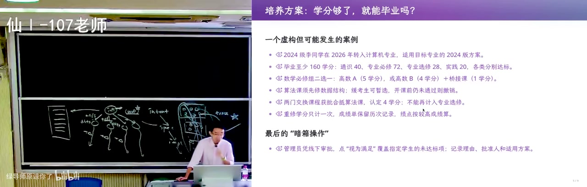

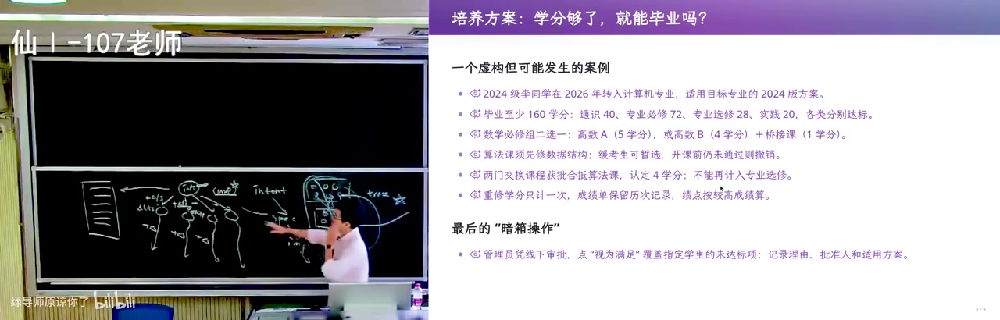

**[00:37:11]** 好，我们要在一个界面上面有一个叫毕业要求，就毕业要求好，然后在毕业要求上面我们要给教务员，这个可能是要应该是教务员对，教务员有一个下拉框，一个增加一条的按钮。然后这个增加一条的按钮可以选一个课程，对吧？选一个课程好，这是一个非常在那个时候就在在固定到刚开始做需求的那个时间点，这个当然是非常合理的需求，但是一旦这个需求固定下来，当我们的离散数学课拆成两份了，好，完蛋了，这个东西不能适应我们新家的需求。好，那就对不起，重构。我们再把这个需求的文档调出来，这个地方不能这样了，我要在这里加一个或下拉框里加一个货。然后每当你叠加一个这个东西的时候，这个屎山就开始累计了，你们写过软件的都有这个都懂这个你不要紧，你让我做个东西好办，改需求真的受不了，因为改需求它会破坏，对吧？你你你做了一个整体上一致的设计，但是一旦这个需求中间产生了一个裂缝以后，它会传递到系统里的各个部分。然后当你一个看似很小的需求要改的时候，牵动了整个系统的各个各个部分的时候，你就一团乱码。

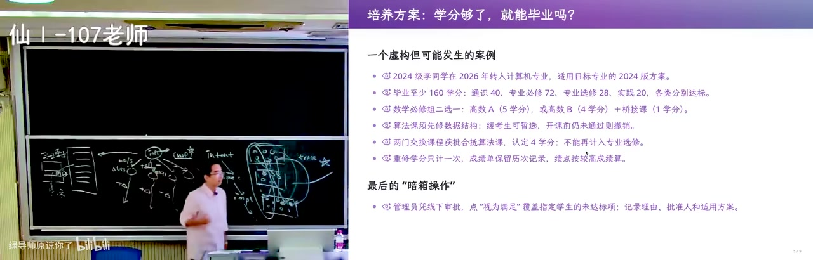

**[00:38:43]** 这里面举了更多的例子？什么重修，然后还可以交换，可以抵扣，就有些课程可以抵扣，然后这里面带来的。如果有一个有一个同学从别的院系转过来，然后别的院系又有一个离散数学课，软院好像还是一门的离散数学课。然后这时候这门课能不能抵扣计算机学院的离散数学呢？他应该抵扣计算机学院的离散数学一和2，还是我要求我抵扣计算机学院的离散数学一，你还要再上一个离散数学2，对吧？这就就无穷多。你一旦面对这个开放的物理世界的时候，你就没办法了。而且1万个1万最后到最后你的系统里没有的东西还是可以暗箱操作的，就最终还是有个override的。

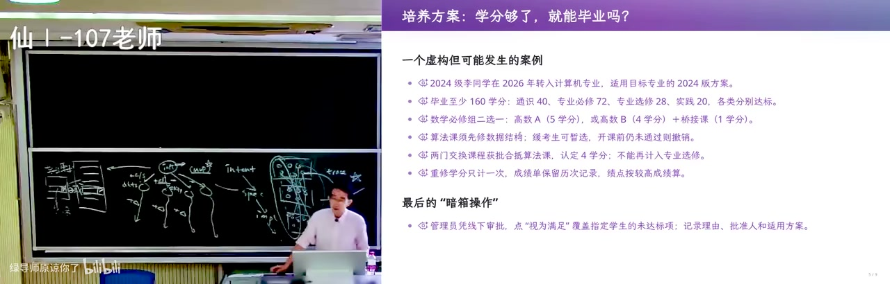

**[00:39:38]** 因为比如说你今年六年了，拿不到本科学位了，就是因为离散数学这门课，然后刚好你在这个时候碰到了，我把离散数学课拆成两门，那怎么办呢？你也没有办法，就现在已经是秋季学期了，你或者说现在已经春季学期了，马上要毕业了，你已经没有不可能再去修春季学期那个课了。他不开，他在春季学期开，那怎么办呢？最后领导说我认为这个教学主任说我认为这两门课之间是存可以存在替代关系的。

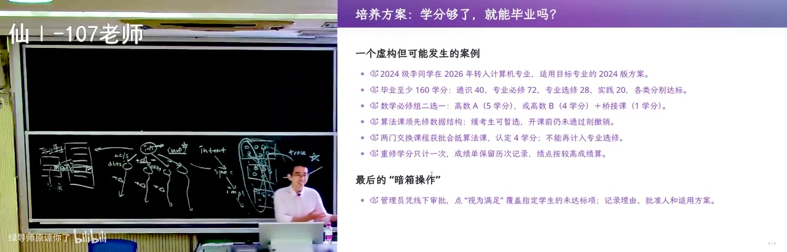

**[00:40:10]** 好，那这个系统里面最终怎么办呢？最终怎么办？最终好打电话给工程师这个数据库里面好这个同学他的毕业条件你把他改成满足，然后这个就过去了，最后还是档案可查的。

**[00:40:29]** 最终这个层层的审批流程都会在，最终是教学院长认为这个同学学了这个旧的理想数学，还是可以抵扣这个新的离散数学的。也合理，就是在人类世界意义上有一个合理的解释。所以这就是软件系统的复杂，你任何时候实现需求就做了，一旦你做了需求分析，你就背上了技术债。

**[00:40:50]** 我记得我开始上课的第一天，应该是2018年的时候，好多年以前了。那个时候还是一个老版的教务系统，好像是和和我上学的时候教务系统差不多。然后上课的第一天我就发现这个系统我没有用过。因为我以前都是学生端，我第一次用老师端，然后还很很好玩，可以给同学设置缺课次数，然后我不知道为什么要做这个需求，如果是我来做这个需求的话，我我就我就我就不要把缺课次数这个feature放在我的教务系统里面。

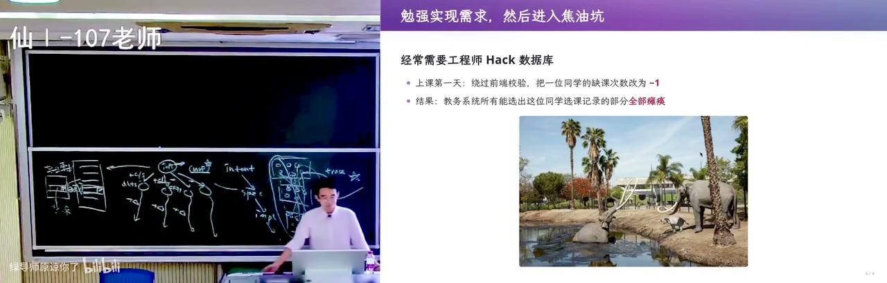

**[00:41:21]** 同学缺课就缺课，对吧？缺课你留任何一个证据，就你不需要在系统里留证据。只要老师比如说有一个签到表，点名表留证据，然后扫扫描一下，我就可以把你开除了对吧？你们学生手册里面有写的，你们缺课达到多少个，对吧？无故缺课达到多少次就可以出以这个开开出来？

**[00:41:41]** 然后我就试着绕过了那个前端的校验，就像刚才你看那个GPT实现那个质量还是不错的，我相信前端后端也都会做校验，对吧？我我要我要输入一个非常大的缺课次数，他直接拒绝我了。我把一位同学的缺课次数从零改成了负一，这好像也不是什么有害的操作。但是立马所有的就我发现所有的只要能够选出这位同学这个选课记录的这个页面就全部crash了。直接500就你就crash了。然后我就只好打电话给教务说，这个教务系统崩溃了，然后我不知道他怎么解决，反正第二天可能工程师登录到了那个数据库里面，然后把那个负一的条目给修复了，然后我就知道再也就就这就是软件系统，对吧？

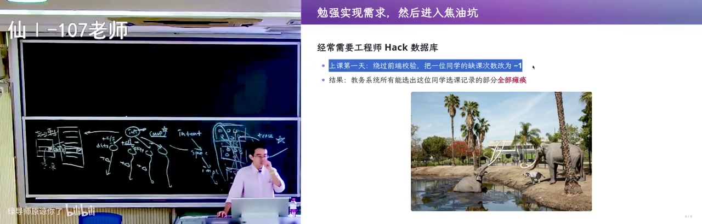

**[00:42:26]** 你们真实面临的软件系统的的需求，所以这意味着什么呢？这意味着就是需求只是一个lesson，因为我其实没有办法在这门课上面讲需求和和和产品设设计，这个可能应该是另外一门产品课。我这门课讲软件工程课不适合，可能就这样带过比较合适。

**[00:42:48]** 就这AI时代你做MVP没问题，正确对吧？而且是前所未有的容易，你需优先实现那个最重要的功能。你看到一个产品，你马上就知道哪个地方设计错了，你这个时候推导的成本是比较比较低的。但是这也给你产生了一个驾驭AI的错觉，因为AI确实可以往后修，就是你迭代三个版本，AI都是可以往后修的。但一旦你在一个真实的系统里面运行足够长的时间，对吧？比如说计算机系改成了计算机学院。

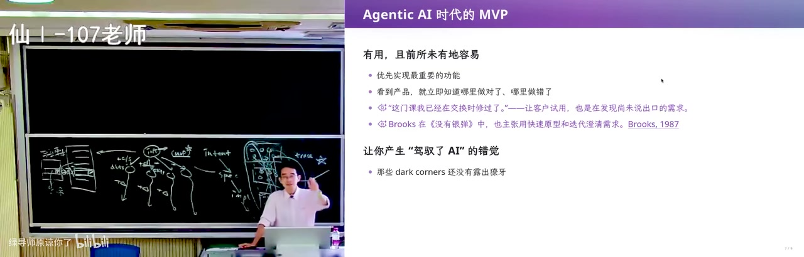

**[00:43:22]** 当你一开始面对这些事的时候，你原来的设计不起作用的时候，好你就你就面临麻烦了，这也是所有的软件工程都面临的问题。叫dear no ver bullet，没有银弹，所谓的银弹是吸血鬼和狼人是没有办法普通杀死的。但是要有一个不但是没没有没有赢的这个软件工程里，随着软件的增长，你在最早的时候你制定下来的那些，就在第一个时刻制定下来那些决策会不断的。因为你的软件要生存，你要挣钱。就假设这个软件不是你你你课程上面好，我随时可以把它清0，从头再做一遍。你这个软件一旦上线，他就开始和物理世界产生交互，那你就必须持续的背着这个technical debt维护维护下去。那它的成本就会因为你前面做的不够前瞻，不断的变得更糟糕。对，这是需求。

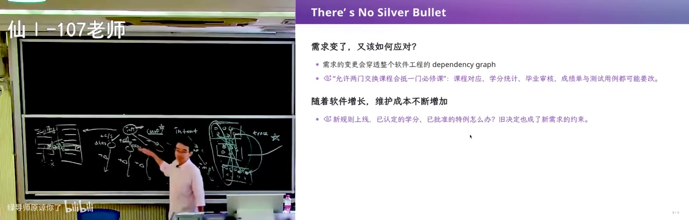

**[00:44:23]** 那解决这个问题的方式是是是什么呢？是什么呢？是架构。

**[00:44:30]** 其实刚才我已经有一点点透露了我们怎么怎么应对这个问应对这个问题。当你刚开始的时候，你你你可能有一个需求，或者是在MVP的阶段，你还没有试图把所有要做的事情都放进来。你可以想一想我们的软件第一步迈向哪里，是对这个软件的长期生存有最好的效果的对吧？我们的第一步，而第一步你要做的实际上是软件的架构，不仅仅是一个MVP对吧？MVP就就刚才我们看的那个slope对吧？那个AI生成的那个MVP那已经不能算MVP了，这已经算是一个小型的产品原型原型了。

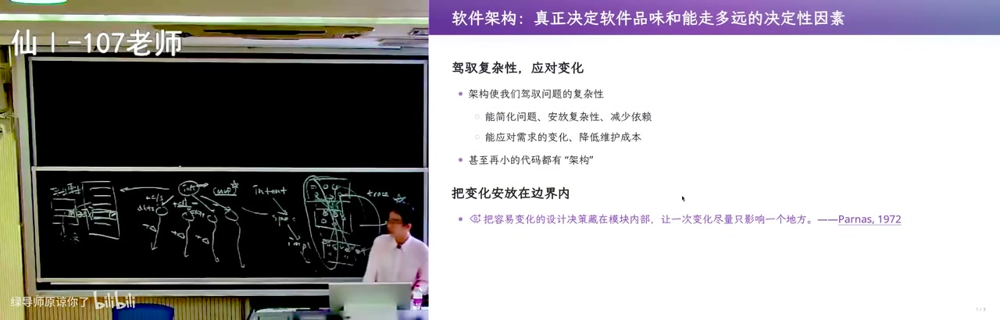

**[00:45:15]** 维护它会变得非常困难，你想要驾驭这个软件系统的复杂性。你在一开始的时候要想我怎么样做一个最小的软件，使得这个软件能够随着需求的膨胀和改变，它依然能够一定程度上有一点韧性。实际上是最哪怕是最小的代码，它都是有软件的架构的。然后这里面说白了就一个把耦合解开，就是你你你不要用。比如说就是说一开始我用一个数据库来存放所有的需求。如果你在一开始的时候就立即做这个决定，你可以快速得到一个能work的原型，AI能很快给你做出来。但是如果你不去仔细思好这个系统里面到底哪些概念是可以分开的，确实很容易进入软件维护的泥潭。

**[00:46:09]** 讲到架构，大家都觉得有玄学，对吧？好像很高大上，但其实不是的。架构从你在第一次开始设计任何的代码，任何的系统的时候，无论它多小，它里面都有一种这种架构的思维。因为架构本质上就是怎么样去控制一个东西的复杂性。而当你的代码开始稍微哪怕有一点点的规模，你都可以去考虑这个复杂性应该怎么样去分解。

**[00:46:41]** 比如说我不知道你们写O的时候会不会这样写，对吧？写一个main，然后read input part inpRoycess input上write output，你们会这样写吗？不知道对吧？

**[00:46:54]** 然后你们会看到，如果你要做一个命令行的程序，比如说你要写一个，然后这个main是有argc和argv的对吧？这是操作系统和进程之间的约定。它会传一个vector of arguments，把参数以字符串的形式传过来。

**[00:47:15]** 那你们怎么处理参数呢？一个strcmp吗？对吧？你就想想如果你今天在保研的那个机试的现场那个题目要求你处理这个2V你会string compare吗？然后你们就会回想起这个世界上有一个东西叫叫getopt。然后你在课上看过这样的代码，你在做实验的时候写过这样的代码。然后你在别人的实际的项目里面，比如说你们感兴趣是怎么实现的对吧？这LS这些东西是怎么实现的，你会看到这样的一个代码，它也是一个架构，它也是一个分解复杂性的方法。

**[00:47:58]** 因为有复杂性，这个argv是argv本身就是一个非常复杂的东西，比如说我npm的help，刚才我是npm run dev。好，它本身就有很多，然后有些还是支持这个长参数？有unix风格的长参数，短短参数。然后在C的时代，你要写一个pas是很复杂的，这里就有一个价格，你在这里可以getopt，然后他就把这个复杂性给隔开了，对吧？

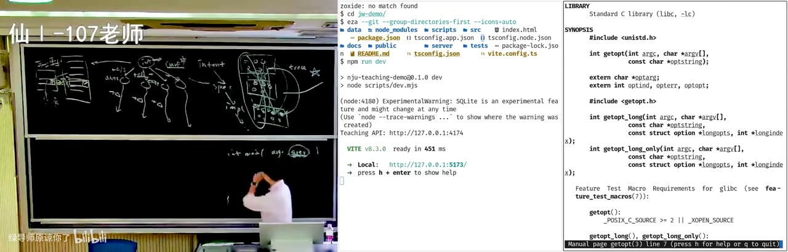

**[00:48:35]** 这个argv它有一组约定的对吧？实际上是这个约定是有标准，只有一叫posix标准的。然后在这个posi标准上它就可以用getopt来来处理。后最后你只要写一个switch case，然后一个外循环好，你就可以解析这里的参数了。你就学会了一种这种pas的这样的一个架构的模式。

**[00:48:57]** 后当然这只是一个非常非常常小的小小的例子。你在看到任何一个好的符合best practice的代码的时候，它背后都有架构的设计，然后背后都映射到需求。所以我说需求，虽然需求刚才我讲那个教务系统有点过度了。你在做任何事的时候，做任何软件工程行为的时候，其实都有intent的specification和implementation，不是要一个教务系统那种monoli的一个这样的在随时随地对吧？在一个模块里你都可以谈需求，都可以谈架构，都可以谈优雅。所以我很讨厌那种老登的那种语言律师的授课方式。

**[00:49:37]** 曾经曾经我和这个学院的老教师有比较大的分歧。然后比如说我们说我们要讲这个呃C++相对来说至少在11 14时期里面的一些。如果你要讲C++的话，可能是这是pr时代了，这些特性以及他们应该怎么用。然后这个老登的回应是说我讲了，我怎么没讲呢？然后他讲什么呢？他讲好lambda这个ab等于返回return a加B没有了。然后这个讲了和没讲有什么区别呢？对吧？

**[00:50:10]** 其实你在学这个，就你们在学习的时候，你看到的每一个东西。我说不管是你在GitHub上面找到一个好的项目的README，还是你就看到getopt。如果你再往后想一想，这确实是一种模式。这个模式这种parsing的模式就把一个复杂的一个字符串，最后变成一个简单的一个状一个一个parsing state。

**[00:50:36]** 它就是一种抵抗需求变化的方式，对吧？因为你的argv是可以变化的，argv各种各样的变化，但是他用这个party state把这个问题给给解决了。所以我们可以看几个比较典型的架构我从最小的十行代码的架构来开始讲。

**[00:50:56]** 然后架构就为什么我们现在说好大模型对架构掌控的还不是很好，或者说架构是一种品味，其实是因为架构和需求其实是连在一起的对吧？你你你没有需求就不用谈谈架构了当你当你谈需求和架构的时候，你的需求面对的是一个开放的，是为未来的需求做的一个架构。那你什么样的时候能设计出好的架构呢？就是你对需求掌握到什么程度。举个例子，就是我最喜欢的Hanoi非递归的Hanoi呃。我曾经也是在我以前开始上课的时候，我先问我的研究生，保研的研究生说你让你写个非递归的这个top行，那你能写出来吗？然后研究生摇头所以最后就变成了我上课的时候的一个一个例子。然后其实就这个实行的代码，它背后的架构联系到大家为什么写不出来，对吧？

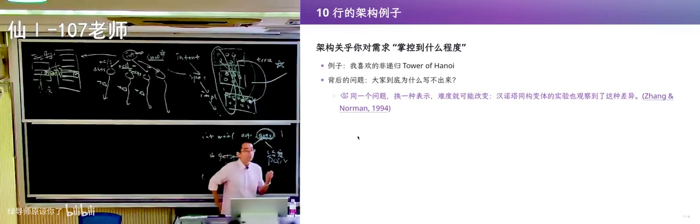

**[00:51:58]** 为什么写一个对的汉诺塔？好，那么困难。我们来看一看现在的人和就人和模型对这个架构，就比如说我要做一个飞，我就给他一个prompt说我要写飞他。好，你们来猜一猜GPT-6又写了什么？这个GPT-6说我不做人类了，我就你写不出来是因为你的数学不如我好。

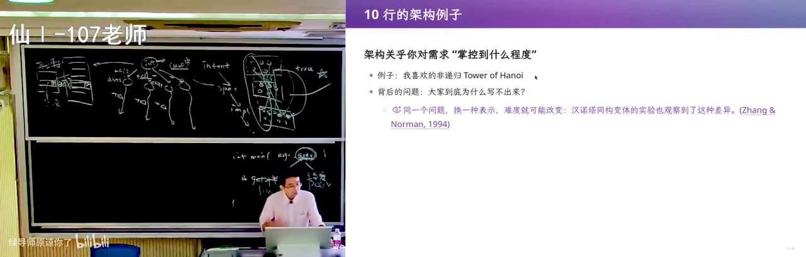

**[00:52:21]** 然后他找到了这个top hun的这个数学性质。所以很明显的GPT-6是一个对数学，他也就I在数学道路上狂奔，然后希望他在数学上面的能力能够拯救人类世界的一切，然后他就开始写这个。反正这是对的。他说盘号等于1加上不号二进制末尾零的个数，每个盘子的移动方向还是一个移动方向固定。We don't know, 反正anyway他这个应该是对的，反正你看不明白。但是highly opti极度最优对吧？但是我没有，除非我叫他模拟站好。

**[00:52:54]** 同样的prompt，这个DeepSeek V4 Flash就更有人感。他写了一个非常优雅的代码，就是标准答案。基本上如果你要写一个非递归的汉诺塔的话，这是一个非常干净的架构，对吧？因为他知道我们的recursion递归。当我说要把一些盘子移过去的时候，那我要把这个剩下的任务一定要留在这就还要继续执行的任务留在栈里，这样我总是执行栈顶的任务。往前，所以非常优雅的事情。

**[00:53:26]** 然后我特意试了一下豆包，然后豆包写了一个错的，然后我就不展示了。豆包就豆包选了这个方案，但是写了一个有瑕疵的代码，跟这个基本差不多，我就不展示了。然后我就不一样，我我我作为一个架构师，架构关乎的是你对需求掌握到什么程度。所以我要写一个非递归的Hanoi，想的是为什么大家写不出来？

**[00:53:55]** 大家写不出来的时候，是因为你对递归这件事理解的不够深。所以我故意的把上过我课的同学都都见过这个代码。我故意说我们的程序实际上是一个状态机。你回头可以回头你们可以去看我曹心勇讲这个课。

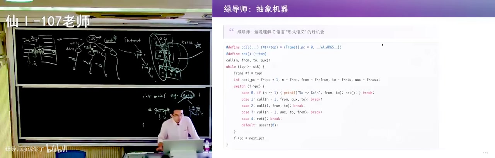

**[00:54:13]** 然后任何一个C语言是一个我花了一整节课来讲这个C 语言，是有一个C 语言的状态的。然后这个状态一个singlestep是它的这个operational semantics叫操作语义。然后它的一个小步语义，比如说一个Hanoi n减1，它是一个well defined的，在程序语言世界上是well defined的一步操作。所以我们只需要模拟这个，我可以写一个C语言的解释器。

**[00:54:40]** 当你理解了C语言的解释器的时候，你很容易写出把任何代码，我当时讲的其实是两个函数互相的F调去G掉F的，你非常容易，没有任何难度。因为你就是把这个C语言的形式语义小步语义翻译成一个状态机的表示，所以这是这个，然后你可以把它翻译成它就如果你觉得如果你觉得这个如果你觉得这个代码不够优雅，对吧？对于top来说overkill了。因为我可以把任意的程序翻译，你还可以把它变成这个，它们俩是等价的对对，做一个simplification，做个优化就可以从它变成它。所以我从我来看，我作为我的架构师，这是理解C 语言形式语义的好机会。所以看到不同的人，就我现在我还可以守住我的品位。

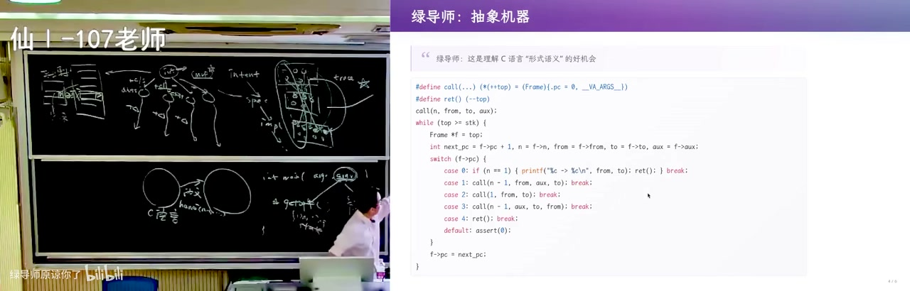

**[00:55:22]** 我说这个GPT可能他其实他懂，但是他可能不会往这个方向去想。所以我觉得我有比较强的信心，认为强化学习可以把这个GPT往这个方向去引导他一旦学会他也能做出在适当的时候会做出这样的事。现当然最后有一个搞笑的，我在百度上搜索了非递归汉诺塔，然后找到了第一个这个而且百度很搞笑，百度百度第一个条目还是递归汉诺塔。然后我往下找到CSDN的第一个非递归汉诺塔，然后我看到了这样的一个代码。我我甚至比AI slop，就它甚至比AI slop还要问题还要严重。就这里有一个move，但是std是。

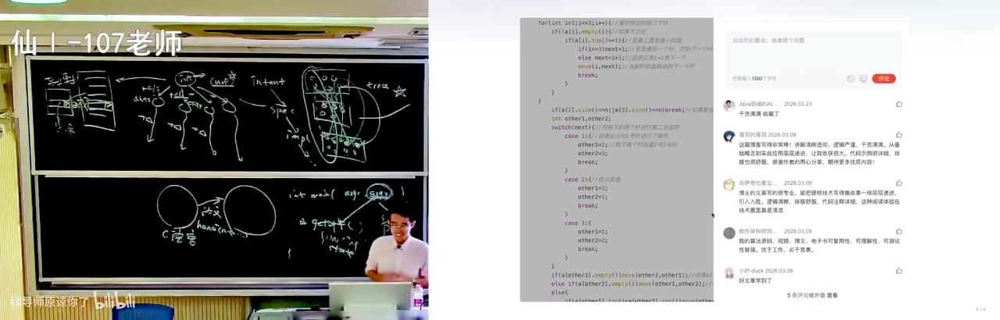

**[00:56:12]** 有move的。

**[00:56:14]** 他然后在右边，我不知道是不是AI是不是评论，那是不是是A要给你营造一种CSDN的博客质量很高的感觉。但如果你们在上学的时候被这种slo污染了，就是你还不如跟AI学吧？跟DeepSeek学都很好。不要GPT-6已经不当人了。

**[00:56:42]** 所以看同一个汉诺塔4种表达，我们说我们要控制的是复杂性，对吧？它这个架构也关乎抽象。然后我们站在不同的层面上考虑这个问题，叫跳出问题看问题。那跳集体也跳出问题看问题了，对吧？一切都是数学规律，我只要把这个里面程序世界里面的数学规律理解清楚，那没有任何问题是我解决不了的，我服。

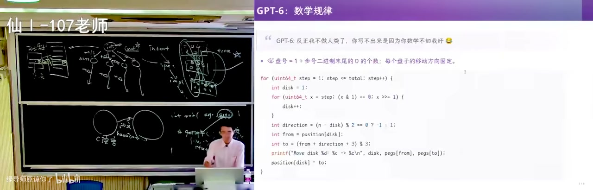

**[00:57:10]** 然后DeepSeek做了一个？这是一个人类反复说地归是战。他在语料里面学到了这一点，做了一个正确的事情。然后我往外走了一步，对吧？是你们对编程语言是世界的理解，投射成了递归和非递归的区别，然后再投射成。这样的一份代码，这个不知道是什么，这个就属于是训练还没有收敛。我觉得就训练还没有收敛的，这个没有意思，就是你在任何一个小的地方都能看出架构水平的高低，这是十行的价格。

**[00:57:46]** 然后如果我们要再再大一点，比如说两千行的架构，对吧？我们暂时跳出问题看问题。代码之外有客户的规律，客户之外有社会的规律，社会之外有宇宙的规律。你们肯定想问架构的能力从哪儿来？

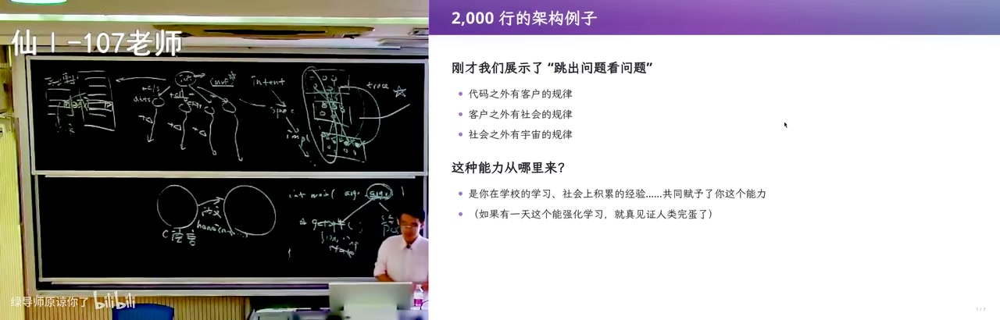

**[00:58:03]** 从你学过的每一个东西上来。如果它是好的，它是优雅的，它促使了你对这个问题的思考，对吧？压缩就是智能，你把它压缩了，连你的那个1st principle，你总是从1st principle去推导，应该怎么样。所以其实这些能力就是你在学校里面学习，社会上面的积累，共同赋予了你的能力。比如说你必须要和除了教科书，除了做题之外的人打交道，你才能知道一个马上就要退休了，一个优雅的教务导师，他是怎么看待教务系统的？他的想法可能和你的想法不一样，你的想法总是最好的数据库，最高的性能whatserever但他来说他只是想要那个字大一点，他能够点鼠标的时候不要手滑到按边上那个按钮上，对吧？共情别人的能力。

**[00:58:56]** 然后两千行我讲一个我上课时候讲过的例子，qr code generator就是二维码生成。我上课的时候讲了一个excel生成二维码的例子，我要打开它一下吗？我可以打开它看一下，应该是第一次课的时候，对。

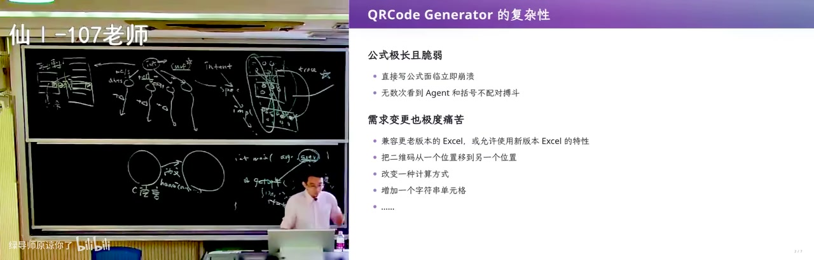

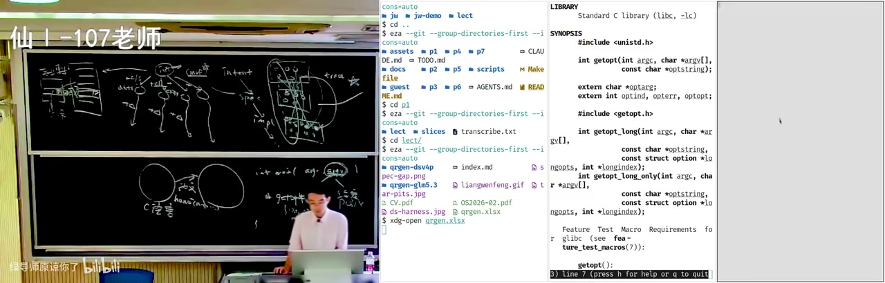

**[00:59:27]** 对，就生成这样的一个可以扫描的二维码。然后它可以把任何一个长的字符串，然后编码成一个你能够直接扫描的。

**[00:59:38]** 二维码。

**[00:59:39]** 然后你回头再用软件工程的，就用我们今天讲过的概念去理解这个问题。我们的需求，这是一个和交互系统不太一样的例子，它的需求是非常明确的？需求因为需求就是excel的一个单元格，我希望在这个excel里面，有生成一个零一序列的单元格，然后它有一个输入的单元格，它有一些输出的单元格，就非常determining的任务。但是这里面是有架构的考虑的。你的excel的公式就我当然agent其实还挺好玩的，agent对自己的能力到底到什么程度是有估计的。所以agent会就当这个任务足够困难的时候，他就会不做了。

**[01:00:34]** 如果你让agent出来给我生成一个，比如说你有两个sheet，然后你要有一个第二个工作表里面是我的学生的实验成绩。然后第一个工作表里面是我腾好了的学生的期末考试成绩。然后我说给我写个公式，把学号对应的实验成绩给我拉过来，这个是在他能力范围内他就会一把出。然后这个事情显然超过超出他的能力范围，他还是会分成，就试图去分解这个问题。他也会做架构。但你看到至少今天的模型在做架构这件事上，稍稍是有一些落后的。

**[01:01:12]** 然后这里你就面对一个问题，如果如果你直接把它写成一个公式，你会得到一个有对，笑话说我们偷到了一个list程，国防部的这个list程序，然后看到最后一页，是是是这个。对，因为这个公式实在是太长了，因为excel的计算比较有限。它你只能用就就好比是让你们用那种什么bring ****去实现一个一个trivial的程序，什么毁灭战士的什么游戏，那那你最写出来程序就会是这样的那这个时候你就需要一个抽象。

**[01:01:54]** 而且我觉得AI之前我看到那两个版本，他没有考虑到的是这个需求看起来明确，但其实有很多坑。比如说excel是有版本的，我们知道excel从2019、2023，它不断的都在增加新的功能。比如说我刚才讲的那个需求叫去查找学号对应的成绩。以前是一个叫wicu的函数，你们有同学知道吗？没有同学知道，说明你们都不是excel power user。太好了，你们是agent时代的第一类人，你要干什么？只要跟agent说就行了，永远永远不需要再学一个像吃屎一样的语言了。

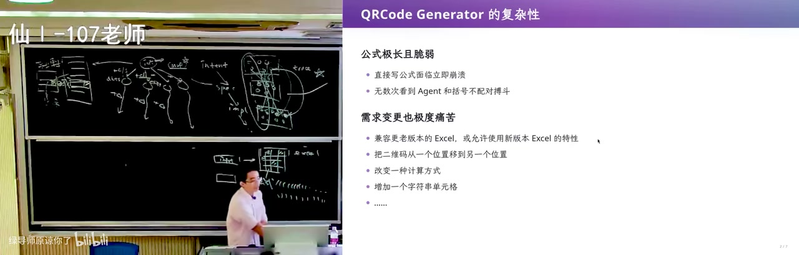

**[01:02:35]** 然后微软大概终于在20，可能是一九还2，反正在某一年的时候终于受不了了。然后说我们推出了一个新的叫XLOOKUP extended的VLOOKUP，然后可以更方便的查找查找，这个excel是在演化的，那么马上这个需求就会变得模糊不清。我到底是应该兼容一个旧版本的标准，使得我在各种人身上都能打开，对吧？我发给那个教务老师，教务老师也能打开这个二维码。还是我要做一个就是我自己本我自己用一用即抛的那我就可以用最新的语法实现最简单的公式，那到底是哪个呢？

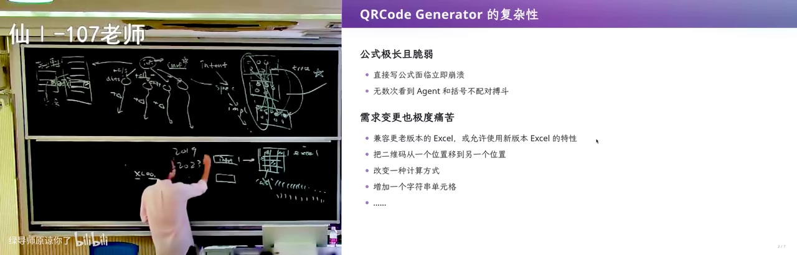

**[01:03:17]** 然后你看到的是如果需求变了，你的代码维护是极度痛苦的。你想如果AI给你外部扩了一个用2023 excel2023公式的代码。好，你突然说不行，2023不行，要改成2019，要改成2003，好，全完蛋。对吧？就是你这是摧毁性的，你你你的设计和实现就会从头回到原点，然后重新再做一遍。

**[01:03:47]** 那对于一个两千行的项目来说，这个是ok的，你可以重做。但是如果这个2000毫的项目已经嵌入到了一个巨大无比的需求，嵌入到教务系统的时候，它和其他的部分产生关联的时候，加钱对不对？那你作为这个项目技术，我要加人我要加钱，然后这样子你这是现实的。对我没办法，我只能用这个方式来满足你的需求，但这显然就是一个架构没有设计好的，还有很多，比如说我的需求可能等我最后出来以后，我对它放的位置不满意，我要把它整体往右移一格。如果你所有的单元格都是这个硬编码的，就直接立即崩溃，对吧？你看到他对需求的变更抵抗是很糟糕的。

**[01:04:37]** 所以如果我们跳出问题看问题，其实这是一个编译的问题。我要开个一整堂，是这样的，先把这个关掉，我可以给我一个从字符串到二维码的伪代码。这个问题本身是是是清楚的，他想让这个over re就是我给他了一个非常明确的问题，他还要去读文件对吧？二维码是完全有规范的。

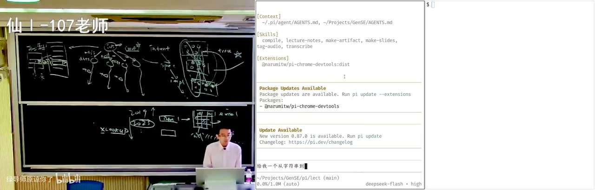

**[01:05:26]** 好，他给了一个这个你看非常短对吧？非常短，而且这个就是一个代码。他说有什么版本纠错等级掩码，然后他有一个大小，然后他有数据编码。它现在有0100，然后有一个八进制字节怎么然后有一个纠错码一个纠错码，它是一个什么data乘以X的26次方模具，然后134个码字，最后加上一个ECC最后直接放到这个空间里。

**[01:05:58]** 那为什么这么简单的东西在excel里面实现这么困难呢？这个gap到底是在哪里呢？如果你跳到问题外面，你就很明显能看到二维码，容易用算法来描述对吧？就这个过程我用一个点PY？QR点PR那就再容易不过了。这就是明年保研机制，我就出一个这个题对吧？让你让让你去实现。最后打一个00101矩阵，好像是一个ok的来测试大家是不是有一定的，如果要拖网的话，还必须要脱网的话，是一个不错的测试大家的题目。

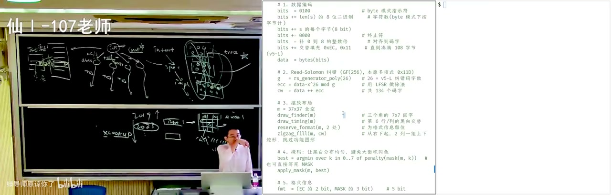

**[01:06:43]** 但是我们的要求是excel，我们不存在任何一个翻译器，一个编译器可以把一个Python编译成excel对吧？这显然也是做不到的。Excel它本质上是为了这个财务报表这些而设计的对吧？管理学生的成绩是一个小的数据库，它本身就不是为了做Turing complete计算来做的。所以没有一个PY to excel的编译器叫PYXRC这个东西不存在好，然后如果我们直接把它变成比如说伪代码或者是自然语言，然后我们用LM去编译，那我们也看到了这个LM的这个问题，对吧？他他就直接上手就做，做到需求漂移的时候，就会遇到很大的问题。

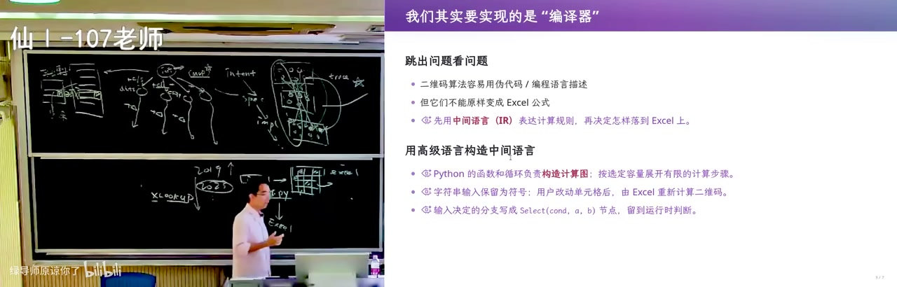

**[01:07:39]** 所以我们你马上就知道，如果我有个好的架构，我是不是可以在Python和excel中间构造另外一个语言。然后这个语言它既可以很容易的翻译成excel，又可以继承一定的Python的功能，就是刚才那个伪代码。我希望我要的东西其实是一个中间的编程语言，然后这个编程语言能够支持描述这些东西，描述这些运算中需要的东西。然后他们又语言又可以翻译成我做的这样的一个设计。

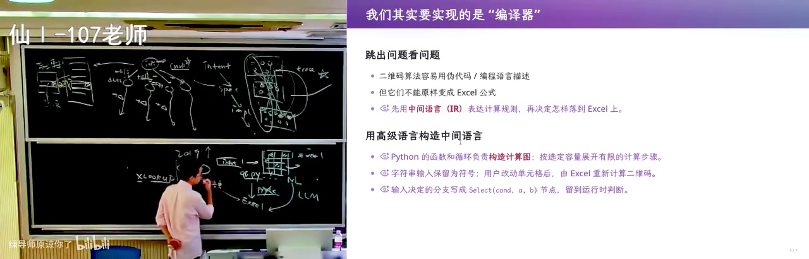

**[01:08:22]** 我这样的语言是可以翻译成Python的。就比如说你们都写过那种表达式求值的程序，对吧？都写过表达式求值的程序，我就是做一个表达式树，比如说我就说比如说异或加什么AB对吧？然后或者是x of 1，这可以取出一个字符串里面的某一个，这就是一个小的编程语言。然后这个编程语言显然很容易翻译成Python对吧？你直接把它打包就行了，它递归的翻译你把一个数对吧？

**[01:09:00]** 你把任何一个表达式树du出来，你就是递归的左子树右子树，然后把它根据这个节点拼起来，所以这个语言可以翻译成Python，这个语言也可以翻译成excel。我只要要求每一个节点都有一个翻译成excel的规则，对吧？我可以把这个东西放到一个格子里，任意的格子都可以。然后把这个结果放到一个格子里，然后我就可以在这里做出一个这两个格子拼起来的。

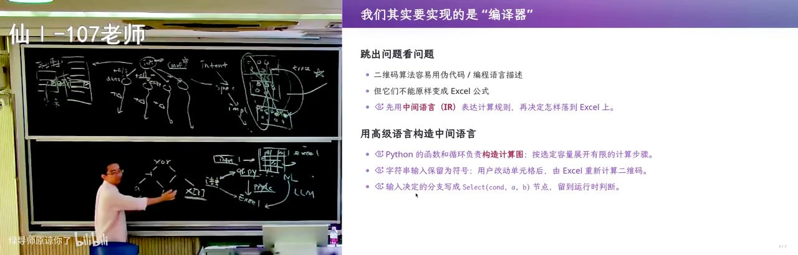

**[01:09:28]** 好，那我就好办了。我让大语言模型生成这个语言的二维码计算的逻辑。然后我用把这个语言翻译成Python去验证，看我的这个公式写的对不对，然后这个公式写的对不对。等我公式写对了，我再去写excel。然后你看到这样的架构不就是我们刚才在第一个最小的例子里，我讲那个getopt。你说我们要做要写一个程序，写一个命令行的工具。我们第一件事情先getopt得到一个parsing state，再从那个parsing state出发去做下一步一样的设计，所以你们作为一个on supervised learner，你们作为神经网络？

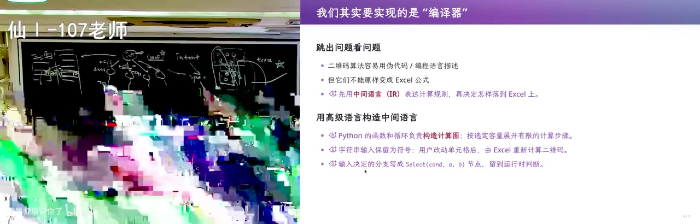

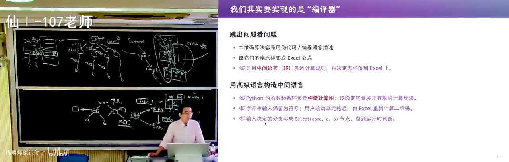

**[01:10:14]** 当然神经网络你就是看好的东西，你看的多了你自然就能泛化了。当然你看的多的时候，你要有意识去？意识去看好这个东西，为什么要这样？你回头突然有一天你会想通，对不对？看到某一个blog的时候，或者有一天听我上课的时候，你突然就想通了一件事。你就知道原来这个世界上做的？

**[01:10:33]** 大家做的事情都是差不多的，就是在做这样的事情对吧？一份中间语言两种执行方式，所以我就可以做构造一次我我我的架构就是我做这样的一个架构，这个架构是从LM翻译成中间语言，用来验证，这个用来交付好一个？就是一个这样的假这些是AI给我生成的slop也不重要了，而且这个架构在这个架构上我还可以发展出，比如说优化，什么是优化呢？

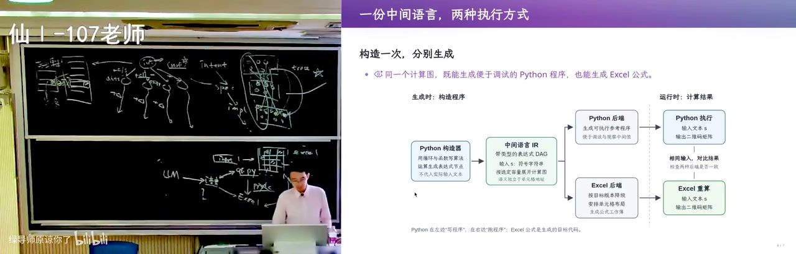

**[01:11:12]** 我不是一个语言吗？我一个语言，我如果觉得性能不好，哪个地方生成太长的代码，我就有一些改写的规则。我可以把一个但一个程序从一个形态改写成另一个形态。比如说你们都知道，如果我有一个变量在循环里面，每次都计算，但它们的值都一样，我就可以把这个变量的计算提到循环的外面。编译器可以自动做这件事儿，语言模型就你自己也可以手动把这个计算给移出去，你可以做手工的优化。而如果我有个中间语言，我就可以让大语言模型去优化它，对吧？然后你在这个计算机系统里面学到的，比如说profiling guided的optimization，你可以先要去知道性能瓶颈在哪里，然后再用这个profile性能的profile再去指导你代码应该写成什么样更好。

**[01:11:57]** 你的概念又用上了，所以一个好的架构可以承载这个需求的变化，未来excel如果excel的版本要excel版本改了没问题，我无非就是把一些算子用另外一个方式去实现，然后讲算计的时候，你发现今天这个AI in人也在干这个事儿，类似的事人类就就是这样。你会当然他们因为他们有很多领域的支持，所以在他们领域里面有非常多好的设计，这些都是值非常值得大家来学习的。好，那么终于到我们最后一个对吧？十行的讲完了，两千行的讲完了，50万行的架构应该怎么设计？当然我觉得架构就一件事儿，跳出问题看问题。因为当我们就当我们谈架构师的时候，你想到了什么？想到那些架构师都是在那框图数据库、微服务、流式数据处理应用框架，然后选这个应用框架。这几用框架搭起来，我就解决这个教务教教务系统的问题了。

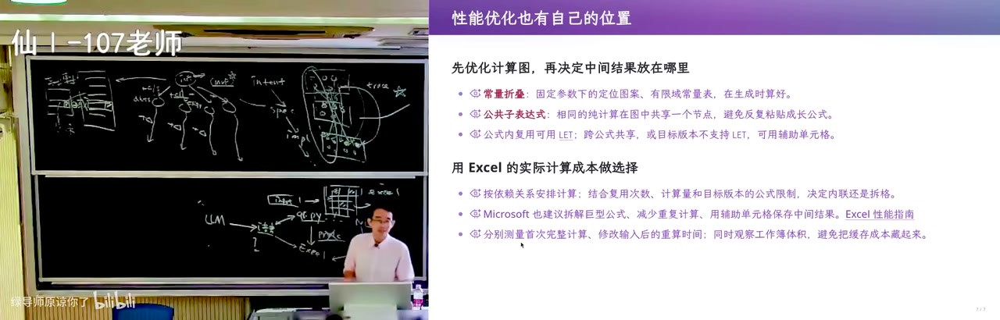

**[01:13:05]** 在我们开始看架构之前，我们先来看一下这个AI实现了一个什么样的架构。很好玩，这是我在它生成中间的时候看到的结果。所以我就当场我就发了一个小红书说继接的说这个我不当我不做人了，就看刚才那个汉诺塔，就是我在数学上我能想清楚，数学上就是对的那我那我不就是对的吗？就毫无对吧，毫无破绽。然后他写的时候，他一个方，你看它叫function appli括号，然后***。

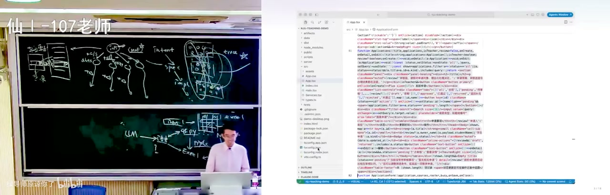

**[01:13:44]** 后来后来我发现GPT还很贴心的用那个代码的这个格式化工具帮我把它格式化。你你如果现在看这个。现在看ja的.

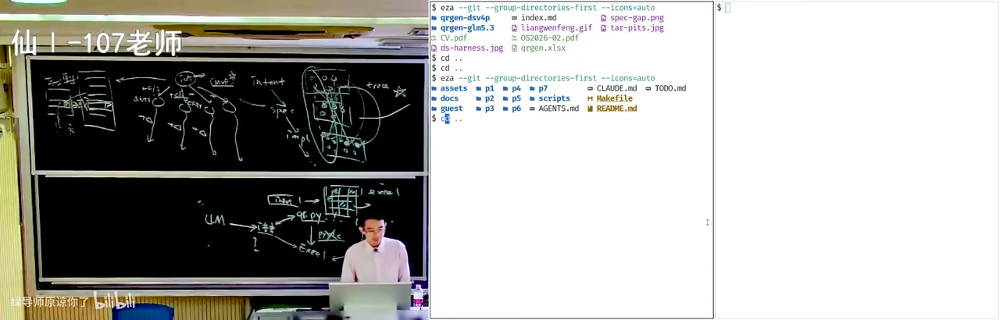

**[01:14:01]** demo的话。

**[01:14:03]** 它还是一个mono这，还一个。

**[01:14:09]** 五十四。

**[01:14:10]** 一个83KKB的TSX，一个38KB的这个service还是很有水准的。就是它格式化了，格式化以后你看起来这个东西就正常一些了。虽然我真的觉得他还蛮厉害的，他真的真真的真的真的真的蛮厉害的，这个东西能能做对，我我们也可以问他。这个教务系统使用了怎样的架构？

**[01:14:56]** 我们让来让D老师来评价一下G生成的东西。然后当时我就惊了，惊了以后我就启动了一个独立的session。然后问那就那个那个GPT在跑，问说这个软件能维护吗？害怕的问，他说能现在只不过是把这个业务逻辑挤在几个大文件里，但是这个东西维护是完全没有问题的，所以我越来越觉得这个好。他说你看经典三层单体前后端分离，而且有几个生产级横切设计乐观锁item po啊这是我肯定会在某一次课的时候来讲讲这些事物审计统一统统一错误。所以你看就是他觉得很有自信，他确实做了工程上就是你们做不来的，这个至少要摸爬过那几年才理解的。

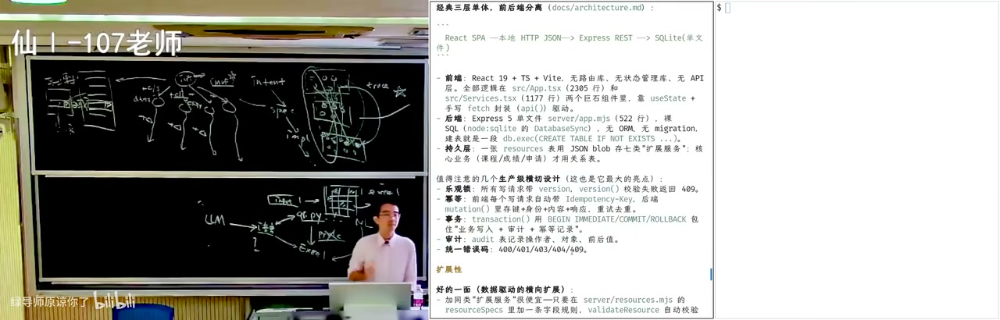

**[01:16:02]** 这个设计它它有这个软件工程的知觉，然后你看它有数据驱动横向扩展，扩展性很好。当然也有也也也也有也有差差的一面，ok挺好玩的，这个很有趣。就很快AI生产软件的方式就要超过人类了。但是我觉得如果我跳出问题看问题，我觉得这还不是一个非常好的架构，因为本质上这是一个CRUD的架构，就是增删改查的架构。然后这样的一个架构来自于一个什么样的基本的原理呢？基本原理是我们的软件是物理世界过程在信息世界里面的投影，对吧？然后我们的物理世界是有状态的，everything is a state machine, 我自己也是一个state machine。

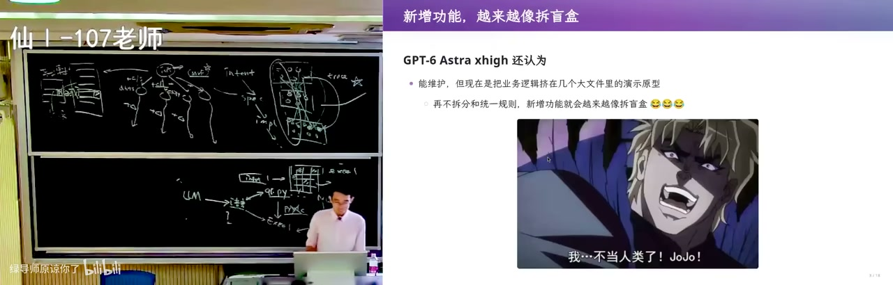

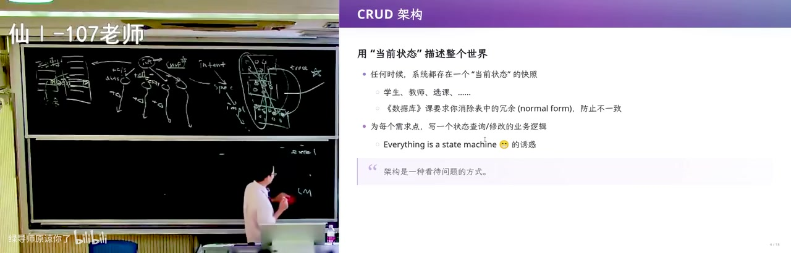

**[01:17:02]** 所以软件系统它很容易会建模成一个state transition system，也就是说它有一个状态，然后这个状态一般来说是用数据，就persion的状态是用数据库。比如说我可以用一张表来表示学生，对吧？学生有学号、姓名、院系等等等等等。然后我还有一张表，表示学院，表示选课表示，反正各种各样的东西都可以用二维的表来表示。这是你们在数据库课上面学过的，然后数据库要求你消除这个表里面所有的冗余，要把这个数据库factor成normal form。

**[01:17:37]** 什么意思呢？你最好不要学生里面有一个课程，比如说学生有一个学号，学号对吧？学号是唯一的，比如说1234好，那学生学校学生有个姓名，那你在另外一张表里面，如果要引用一个学生，尽量不要用姓名来引用。因为姓名学生可能会重名，然后就算不重名，这个也会带来一些麻烦。你更好的是不要用姓名，就把这一列从这个表里面去掉。而是这里面放一个学生的ID比如说1234，这个ID就相当于一个链接，这个链接指向了学生的这个信息，然后这个学生还可以再指向别的表里面的某一些信息，这样把信息给最小原则，就不会其实去铲除冗余的dependency？

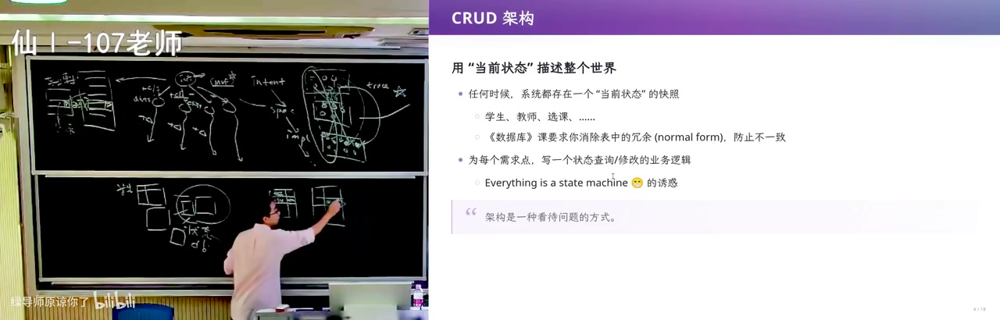

**[01:18:23]** 我一个地方改了以后，我不会需要改另外一个地方。因为如果这个学生真的改名字了，不要笑，这件事情在中国是合法的对吧？你就你在这个表上，如果你用这个方式来，如果用分解的方式来，那你学生改了名字，这个名字改掉就行了，你就记一个曾用名。但如果你是这样的两份就存了两份名字，那对不起，你要知道这两个地方都要修改，对吧？这就是一个很大的代价。

**[01:18:50]** 然后我们一般来说会把这样的世界建模成这个状态。然后在任何时候这个状态就代表了比如说在现在这个时间点上，南京大学有哪些学生，然后有哪些学生选了哪些课，有哪些老师等等。然后每当我的信息系统就前后端分离，这也是一个非常经典的刚才说的前后端分离的架构。如果比如说今天我选择退学，我没有买到token，然后我选择退学，然后最绝的就是一个update的这个数据库的过程，然后它就从一个状态迁移到了下一个状态。然后这个状态这里就比如说我现在A现在还在，那在下一个状态里面A就没有了，A这个记录就不存在了，那这就是一个始终是consistent的视图。你你永远是你永远我在交互系统里面打开那个网页就看到这个东西的一个投影，对吧？好的，就是非常经典的架构，没有任何的错误。但是如果我们想。

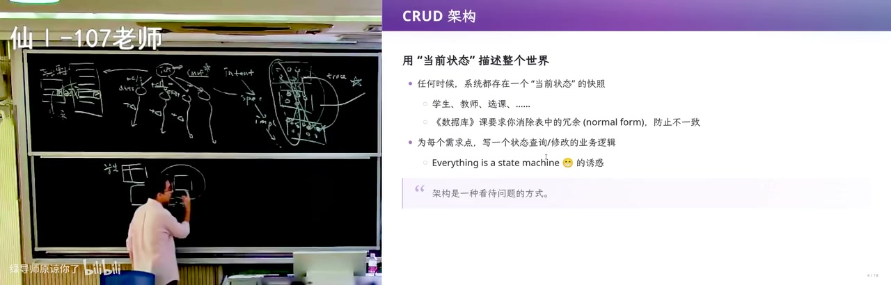

**[01:19:55]** 一想。

**[01:19:56]** 教务系统为什么不适合这样的一个CRUD的架构？就是因为当前的状态里面，就是当我看这个当前状态的时候，我看到的是一片祥和的景象。但是这个当前状态所有的历史他丢掉了。

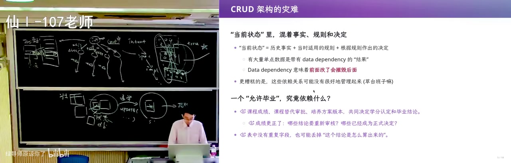

**[01:20:17]** 比如说如果我真的在某一个地方里面，学生的姓名存了两次，这是非常正常的对吧？在在某一个表里面姓名选两字，因为这可能是一个字符串对吧？这可能是一个字符串，然后这个字符串就是什么加当时加学号对吧？授予谁谁谁什么什么的一个这个东西。对，他没有用关联的方式认为字符厂家他写到数据库里了，那这个时候数据库内部就发生不一致了。

**[01:20:51]** 所以比如说GPT-6给了我一个例子，他说学生学生在学生字段里面，对吧？学在这个学生表里面，比如说学生那有student ID然后比如说有一个coln它就叫是否允许毕业。那比如说你们现在比如说学分，你在上我的课应该学分还不够，所以应该都不允许毕业对吧？然后有有的同学这个呃学分修够了，他就允许毕业。而迎许毕业的这个一是由很多其他的状态算出来的，是因为之前有触发，对吧？比如说每当你修了一个学分，或者你的毕业设计状态改变等等的时候，他都要重新计算一个你的这个毕业是否毕业的逻辑。这样因为这个东西对信息系统来说很重要。这个教务员老师需要能够辅导员老师能够在教务系统里面导出。

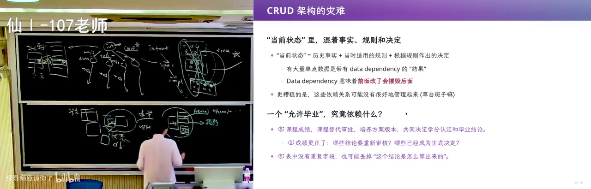

**[01:21:53]** 现在还到现在还避不了业的学生要找你一个一个谈话，对吧？他必须要在教务系统里才能，这是一个很典型的需求点，才能做到。但是这样的东西是历史上面的计算的dependency，然后他们随着当前的状态都没有了。你知道这个学生可以毕业，但是你不知道他为什么可以毕业。你知道他这个不能毕业，你不知道他为什么不能毕业。这个计算的过程丢掉了。而计算的过程丢掉这个软件又是现实世界物理过程的一个有损的投影。最后导致的是物理世界里面我建模不了的，全部都需要通过其他的途径来解决，对吧？

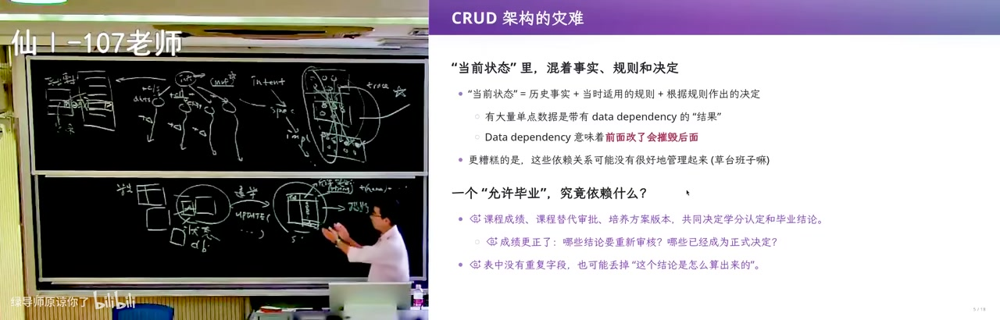

**[01:22:40]** 今天政策更新了，领导批准了，但是这个培养计划、新的方案、新的数据还没有导入到教务系统。你们经常遇到这个问题，对吧？不一致就物理世界已经发生了，这个培养计划已经通过了，学期已经开始了，我已经上课了，这个没有灯对吧？就物理世界已经发生的事实。在系统里面没有建模。然后在系统里没有建模的时候，比如说这个教室还不能用。就第一周很典型的第一周整个这个仙一这一片都还在修，教室不能用。然后不能用的时候，显然教务系统没有建模这一点，没有建模这一点，最后就靠他们手改重新安排教室，然后再再把那个教室安排到另一个对吧？

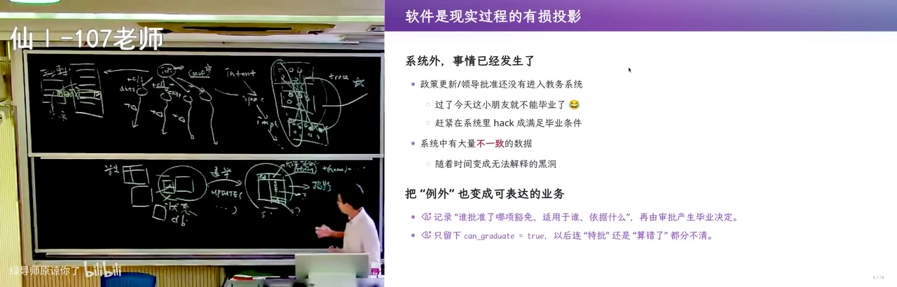

**[01:23:26]** 我第一周就去另外一个教室上课了，然后这样慢慢随着时间的积累，你的系统里面会有大量不一致的数据，随着时间变成无法解释的黑洞。嘿，明明这个同学不该能毕业的，他为什么毕业了呢？突然想起回想起来的时候，明明这个同学没有交学费，应该毕不了业的。为什么为什么他能毕业呢？系统里面就无数，这样你想都不能想的不一致。好。

**[01:23:56]** 所以。

**[01:23:58]** 你们在面对这种需求的时候，CRUD 就会死。

**[01:24:03]** 比如说南大。

**[01:24:04]** 没戏了，当前环境异常，我知道他对Linux很害怕，Linux的这个对吧？南大没戏了。最我们是最后一批系，然后现在成为了计算机学院。好，在南大院系发生调整的时候，这个教务系统就瑟瑟发抖了。因为还是台是这样的CRUD它是一个single source of truth，就所有的事实都在这。那那好，那你我们的这个department变了，那我应该是把旧的这个department，就我这个世界里面实际上是有一个对象，虽然是表，它还是对象，这个表就叫计算机。那我要把它的name从计算机系改成计算机学院吗？要。

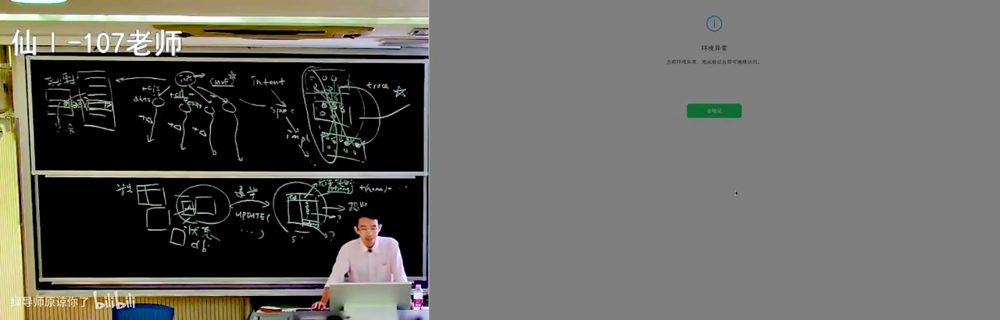

**[01:25:02]** 吗？

**[01:25:04]** 要也不对，不要也不对。你想首先如果要这个就你把这个object改了。计算机系现在确实是变成计算机学院了。但是这意味着我的毕业的记录，对吧？如果我select我到系统里面查询，我就变成了2011年毕业于南京大学计算机学院，这个就与我事实不符了。因为我在2011年的时候对吧这个前没有计算机学院，他生成了一个对系统里面给我生成打印什么证明的时候，给我生成了这个东西，好糟糕。

**[01:25:44]** 然后如果不变也很麻烦，对吧？因为你的你现在所有的这个department ID都指向这个学生的这个department，都指向计算机系。还是得把它改过来。你需要对它做一个数据库的迁移，你要创建一个新的对象，然后新的对象和旧的对象之间的这个关联关系，你还要把它考虑清楚。所以你看到如果你假设这个世界就是这样的，这个投影不变了，CRUD当然是一个完美的架构，但是只要你假设这个需求会发生摧毁性的变化，那么这个数据库你每次你要这样想你每次都会涉及一个数据库的迁移，对吧？

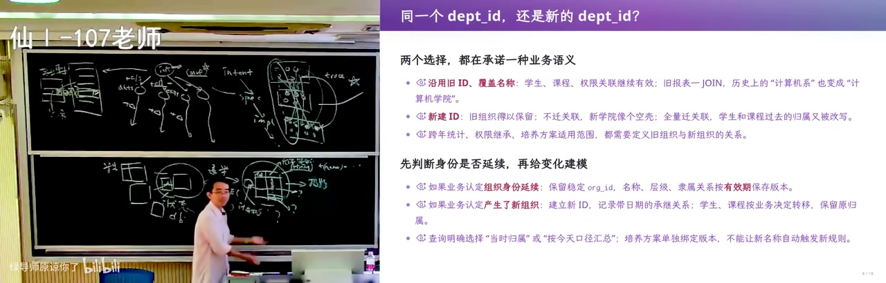

**[01:26:29]** 业务逻辑的重写，你代码是可以重写，但是你的历史，因为历史消失了，我们说这个因为这是一个database的transaction，对它update完了以后，就从这个状态彻底的挪到了新的状态。你做一次数据库的迁移，你就要考虑历史上所有可能发生的情况。而且何况这个数据库里面已经有很多的不一致了，你很难写出一个规则来来来迁移。你还要冒着数据库迁移完了以后，这个数据库就坏掉了。你就像我把选课改成负一一样，因为你在你的测试环境里面做一次迁移，和你把一个真的学校里面所有的数据都做一次迁移，这个难度是完全不一样的。所以你们就理解了为什么现在就或者说到今天之前，软件的设计实现ERP这类的系统，不管是教务系统，它的设计实现维护都是手艺活。

**[01:27:30]** 我们就你看我调侃这个教务系统做的不好，它确实就确实有做的好的这一面。但是或者不好意思说错了，他确实有做的不好的一面。但是你反过头来想，他作为一个软件工程的实践者，对吧？他可能在这公司在2000年的时候成立了。然后在2000年成立的时候，他他做的唯一的选择就是为就参考一个已有的企业架构来做一个叫叫来抢占这个教育市场的第一桶金。然后他把这个东西做出来了，然后做出来以后他就是一个CRUD的系统。那他一旦背上这个技术债，他就要在中国大学教育改革几十年的时间里面不断的扛下所有。所以这是一门手艺手手艺活。

**[01:28:19]** 这里面还有一些有意思的故事。我读PD的时候，我们的软工软件工程组。对，我们我是软件所的。然后我们软隔壁的软件工程组接了学校研究生院的教务系统的这个订单，那可能就二三十万，可能这是一个在大家来看可能是一个比较大订单。实际上在软件这种定制化软件里面是比较小的订单。因为你你要不停的维护这个事，维护这个屎山，但后来这个故事是这个屎山维护不下去了。

**[01:28:54]** 我记得我我我们当时刚读PHD那是我的室友。然后我就经常跟他抬杠，然后就跟就说你你就我会跟他聊研究生院这个系统是怎么那个时候对，叫研究生院，研究生院的这个系统怎么设计，然后我就经常喷它，因为它它是一个非常典型的CRUD架构。我说你你你最后会会面临各种各样的问题。果然就在那几年，我们的研究生发生了巨大的扩招。然后很多管理，然后又多了很多研究生的类型，培养的类型。而且研究生又有大家知道压力很大，然后经常会有这种调整，这都是他们在做需求设计的时候始料未及的。然后最后那个系统就彻底变成了13，然后最后进入了，反正就不存在了，就现在统一变成公司维护的这个系统，他们还是有一些就是有一些领域知识，知道这些系统应该怎么把市场给扶起来。但是如果我要重做一个。

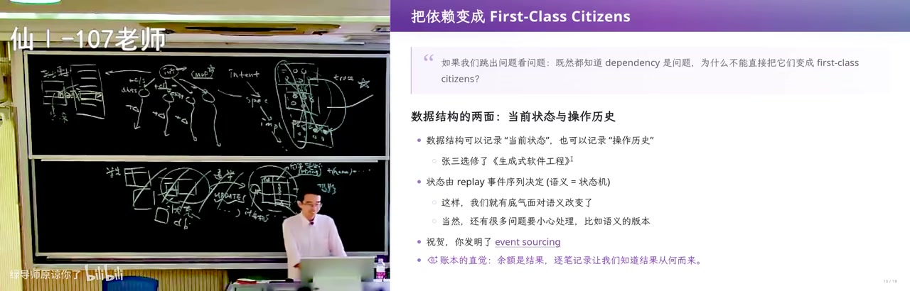

**[01:29:58]** 教务系统的架构。

**[01:30:00]** 我会怎么做呢？我就会看到这个single source of truth太危险了对吧？它一旦你有任何的不一致，你都不不应不知道应该怎么样把它拿出来。然后你就想到数据结构课上讲过一种非常神奇的东西，叫persistent的datastructure，它可以得到这个数据结构所有的历史，也就是你你存一个数据结构对吧？你存一个一棵树。好，这就是CRUD。你看数据库也是一个数据结构，所以你当前就是存一个库，然后你你你对它做一个操作，它就到下一个状态，这就是典经典的CRUD。

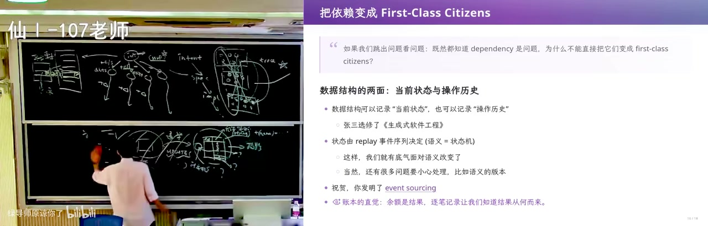

**[01:30:47]** 但我还有另外一种，我可以一开始只有一个节点，然后有一个节点以后我可以创建。下一次它是不变了，那我就可以这个节点还在，我把这个节点放过来。然后如果我到有一天，比如说这个数变了，它比如说我的这个要在这个节点上向上新建一个，那我就把它从到根的路径上面长出来一个，然后它它的左子树可以指向它，这个数无论多大我其实都是可以存得下来的。然后当然我我我可以这这是这个我可以存，就是我我可以存状态，也可以存操作，也可以存操作。对状态的delta这三种视图是等价的，你对吧？

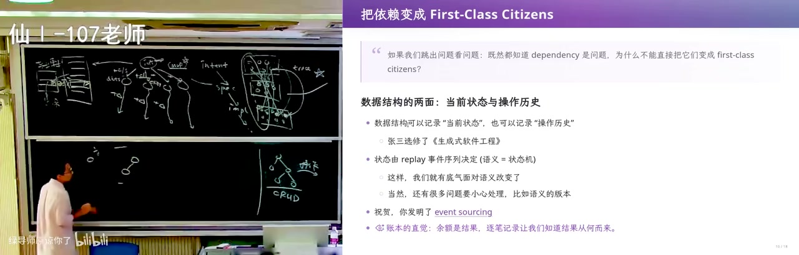

**[01:31:49]** 你看我存它的日志就是一个lo的，这个right的Journal，你们在数据库操前课程都学过，然后你存他们的这个delta存他们的就是get SVN这样的版本管理里面的思想，然后你存这个状态，当前的状态就是CRUD，但是他们都可以帮你回放历史，得到当前的状态。所以如果你想要设计一个更好的架构，最好是先把干的所有的事情都先记下来。今天张三退学了，今天张三又复学了，对吧？你你你可以假想，就比如说这个世界是之前没有复学这个操作。然后你说张三退学，就是把张三从这个数据库里面抹掉。好，抹掉了它就抹掉了，对吧？它可能有一些记录就删掉了。你要把这些和它它和其他部分的关联重新给建起来，那你就要付很大的代价。你要加上复学这个操作对吧？他又买到token了。

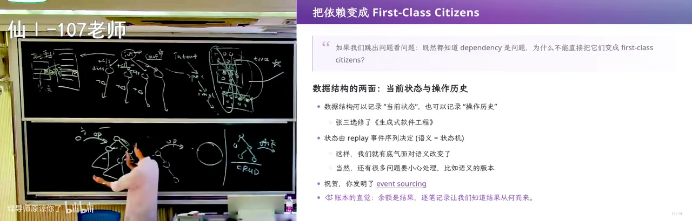

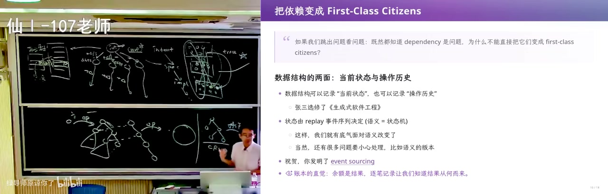

**[01:33:03]** 然而如果你是用比如说记录所有的操作的方式，你就可以知道通过replay可以知道张三复学前的状态是什么。然后你再把这个状态拿过来，他没有丢，就是你就你的逻辑是不能减少的。就是你你你即便使用记录日志记录历史的方式，你比如说复学这个事情之前没有考虑过，依然是要为他写一个逻辑。但是因为事实是不可篡改的，你世界里面所有的东西都是对事实的投影，事实投影出来的，那你好像就有底气了一些，你就不怕错了，你就不会像刚才那样说我要做一个数据库迁移的时候，我手在抖。因为你总知道你你你任何一个做错了，你都可以很快的回到退回到过去的一个快照。

**[01:33:53]** 然后我把这个逻辑怎么做修复，再来然后你也可以看到，计算机系计算机学院的问题相对来说也好解决一些了，对吧？我可以在某一个时刻发生一个事件叫这个院系调整。调整对吧？然后你查询一个过去的人的时候，你会查询到他过去的版本。并且你知道他经历了这个，就是说说他经如果你要查询他过去，比如说毕业时候发生的事情，你直接查他毕业时候就可以。

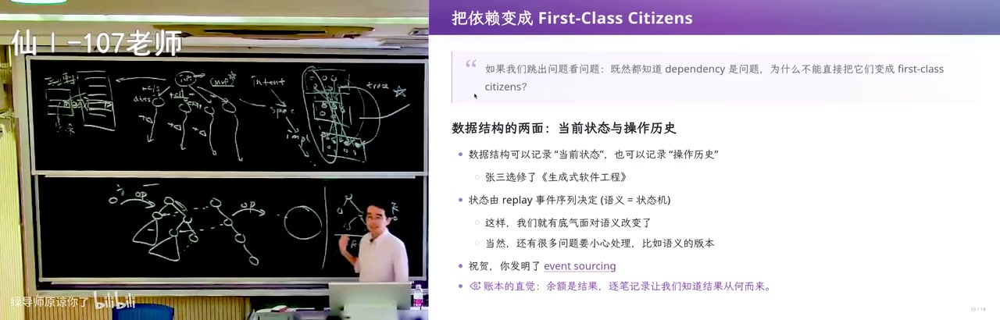

**[01:34:26]** 然后如果你你想要得到一个它比较新的信息，你可以看到比如说投影出和这个人相关的，这个同学这个同学在比如说2007年入学，2011年毕业，然后到这个都是计算机系，然后计算机系在2024年改为了计算机学院。你看到我可以裁出一个，对吧？就总是你总是可以只要得到一个事实，当前的事实，你可以裁出一个和事实相关的历史，然后把这个相关历史replay得到我现在的状态。

**[01:35:00]** 我可以查询过去，也可以查询现在，这就是一个好的架构设计。然后你祝贺你，你就发明了一个叫event sourcing的一个非常经典的设计模式。他可以从就想法很简单，从历史事件生成状态，而不是直接维护这个CRUD的状态。

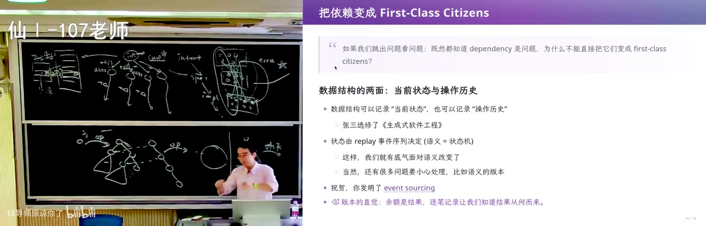

**[01:35:20]** 你们可以回去可以在这个agent的带领下去了解一下。比如说如果用。然后一它有就你马上会反应过来，是不是会有性能问题，因为要大量的replay，但这都不是很大的问题。我们总可以比如说用快照缓存各种各样的。对它会有一些优化的技巧，然后这是一个是吹到比如说你已经在屎山上了，你把它变成是一个一的设计就会变得很困难。但是如果你从一开始就做一般的设计，很多事情就问题都不会发生，你就能比较好的解决。然后这样就有了很多这种fancy的软件工程概念，什么CQRS，这种on的query responsibility segregation，那这和这个event般sour是独立的一般sour是独立，还有这种什么domain driven design这种buzzwords。

**[01:36:31]** 然后其实你们都不需要，就是你们可以去看。但是你只要回到这个最初的1st principle，你要设计一个50万行教务系统的时候，我们跳出这个问题，看到教系统根源的问题在哪里，你就能做一个正确的架构设计。哪怕你没有听说过这些，你也能做一个正确的架构设计。

